# Opinion Poll by ZRI Závecz Research, 6–14 November 2017

<a href="#voting-intentions">Voting Intentions</a> | <a href="#seats">Seats</a> | <a href="#coalitions">Coalitions</a> | <a href="#technical-information">Technical Information</a>

## Voting Intentions

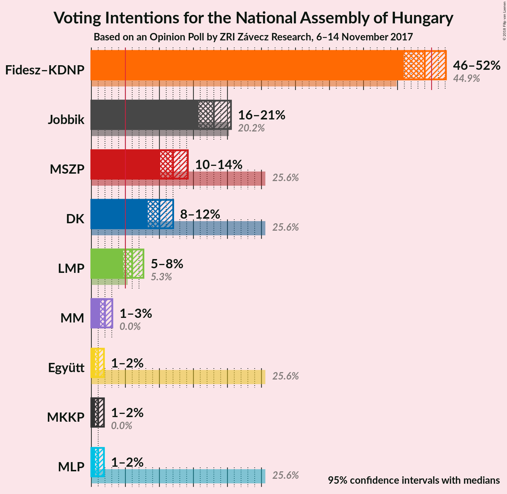

### Confidence Intervals

| Party | Last Result | Poll Result | 80% Confidence Interval | 90% Confidence Interval | 95% Confidence Interval | 99% Confidence Interval |
|:-----:|:-----------:|:-----------:|:-----------------------:|:-----------------------:|:-----------------------:|:-----------------------:|
| Fidesz–KDNP | 44.9% | 49.0% | 47.0–51.0% |46.4–51.6% |45.9–52.1% |44.9–53.1% |
| Jobbik | 20.2% | 18.0% | 16.5–19.6% |16.1–20.1% |15.7–20.5% |15.0–21.3% |
| MSZP | 25.6% | 12.0% | 10.8–13.4% |10.4–13.8% |10.1–14.2% |9.6–14.9% |
| DK | 25.6% | 10.0% | 8.9–11.3% |8.6–11.7% |8.3–12.0% |7.8–12.7% |
| LMP | 5.3% | 6.0% | 5.1–7.1% |4.9–7.4% |4.7–7.7% |4.3–8.2% |
| MM | 0.0% | 2.0% | 1.5–2.7% |1.4–2.9% |1.3–3.1% |1.1–3.4% |
| Együtt | 25.6% | 1.0% | 0.7–1.5% |0.6–1.7% |0.5–1.8% |0.4–2.1% |
| MLP | 25.6% | 1.0% | 0.7–1.5% |0.6–1.7% |0.5–1.8% |0.4–2.1% |
| MKKP | 0.0% | 1.0% | 0.7–1.5% |0.6–1.7% |0.5–1.8% |0.4–2.1% |

*Note:* The poll result column reflects the actual value used in the calculations. Published results may vary slightly, and in addition be rounded to fewer digits.

## Seats

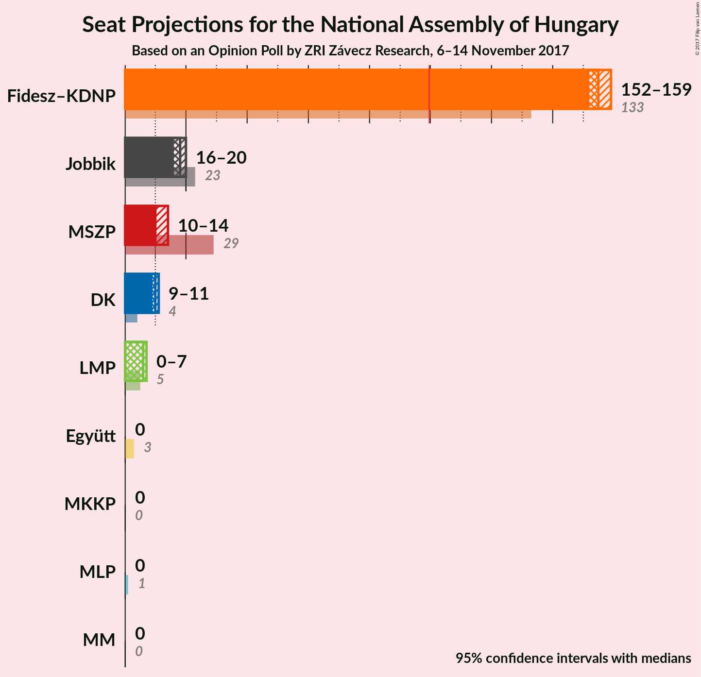

### Confidence Intervals

| Party | Last Result | Median | 80% Confidence Interval | 90% Confidence Interval | 95% Confidence Interval | 99% Confidence Interval |
|:-----:|:-----------:|:------:|:-----------------------:|:-----------------------:|:-----------------------:|:-----------------------:|
| <a href="#fidesz–kdnp">Fidesz–KDNP</a> | 133 | 155 | 153–156 |153–158 |152–159 |151–160 |
| <a href="#jobbik">Jobbik</a> | 23 | 18 | 17–20 |16–20 |16–20 |15–21 |
| <a href="#mszp">MSZP</a> | 29 | 10 | 10–11 |10–13 |10–14 |10–14 |
| <a href="#dk">DK</a> | 4 | 10 | 9–10 |9–10 |9–11 |7–13 |
| <a href="#lmp">LMP</a> | 5 | 6 | 5–7 |5–7 |0–7 |0–8 |
| <a href="#mm">MM</a> | 0 | 0 | 0 |0 |0 |0 |
| <a href="#együtt">Együtt</a> | 3 | 0 | 0 |0 |0 |0 |
| <a href="#mlp">MLP</a> | 1 | 0 | 0 |0 |0 |0 |
| <a href="#mkkp">MKKP</a> | 0 | 0 | 0 |0 |0 |0 |

### Fidesz–KDNP

*For a full overview of the results for this party, see the [Fidesz–KDNP](party-fidesz–kdnp.html) page.*

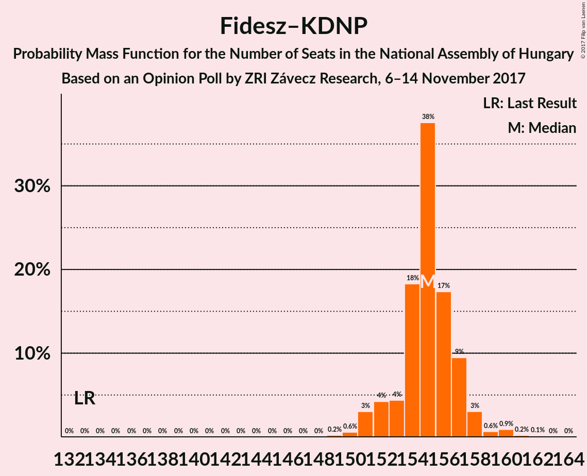

| Number of Seats | Probability | Accumulated | Special Marks |
|:---------------:|:-----------:|:-----------:|:-------------:|
| 133 | 0% | 100% | Last Result |
| 134 | 0% | 100% |  |
| 135 | 0% | 100% |  |
| 136 | 0% | 100% |  |
| 137 | 0% | 100% |  |
| 138 | 0% | 100% |  |
| 139 | 0% | 100% |  |
| 140 | 0% | 100% |  |
| 141 | 0% | 100% |  |
| 142 | 0% | 100% |  |
| 143 | 0% | 100% |  |
| 144 | 0% | 100% |  |
| 145 | 0% | 100% |  |
| 146 | 0% | 100% |  |
| 147 | 0% | 100% |  |
| 148 | 0% | 100% |  |
| 149 | 0% | 100% |  |
| 150 | 0.2% | 100% |  |
| 151 | 2% | 99.7% |  |
| 152 | 3% | 98% |  |
| 153 | 6% | 95% |  |
| 154 | 29% | 89% |  |
| 155 | 47% | 60% | Median |
| 156 | 4% | 13% |  |
| 157 | 4% | 9% |  |
| 158 | 2% | 5% |  |
| 159 | 0.9% | 3% |  |
| 160 | 2% | 2% |  |
| 161 | 0.1% | 0.2% |  |
| 162 | 0% | 0% |  |

### Jobbik

*For a full overview of the results for this party, see the [Jobbik](party-jobbik.html) page.*

| Number of Seats | Probability | Accumulated | Special Marks |
|:---------------:|:-----------:|:-----------:|:-------------:|
| 14 | 0.2% | 100% |  |
| 15 | 2% | 99.8% |  |
| 16 | 5% | 98% |  |
| 17 | 9% | 93% |  |
| 18 | 49% | 84% | Median |
| 19 | 9% | 35% |  |
| 20 | 24% | 25% |  |
| 21 | 1.1% | 1.3% |  |
| 22 | 0.1% | 0.2% |  |
| 23 | 0% | 0.1% | Last Result |
| 24 | 0% | 0% |  |

### MSZP

*For a full overview of the results for this party, see the [MSZP](party-mszp.html) page.*

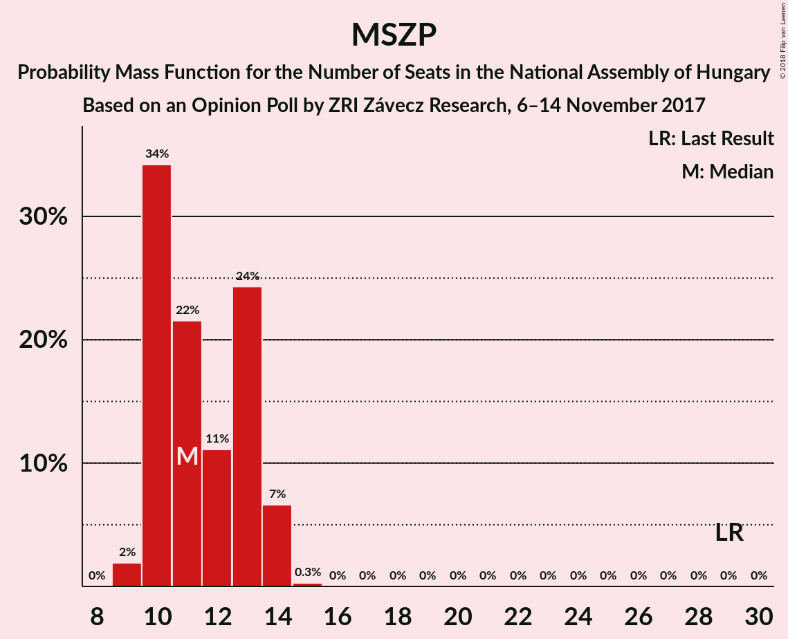

| Number of Seats | Probability | Accumulated | Special Marks |
|:---------------:|:-----------:|:-----------:|:-------------:|
| 9 | 0.1% | 100% |  |
| 10 | 74% | 99.9% | Median |
| 11 | 18% | 26% |  |
| 12 | 2% | 8% |  |
| 13 | 2% | 5% |  |
| 14 | 2% | 3% |  |
| 15 | 0.5% | 0.5% |  |
| 16 | 0% | 0% |  |
| 17 | 0% | 0% |  |
| 18 | 0% | 0% |  |
| 19 | 0% | 0% |  |
| 20 | 0% | 0% |  |
| 21 | 0% | 0% |  |
| 22 | 0% | 0% |  |
| 23 | 0% | 0% |  |
| 24 | 0% | 0% |  |
| 25 | 0% | 0% |  |
| 26 | 0% | 0% |  |
| 27 | 0% | 0% |  |
| 28 | 0% | 0% |  |
| 29 | 0% | 0% | Last Result |

### DK

*For a full overview of the results for this party, see the [DK](party-dk.html) page.*

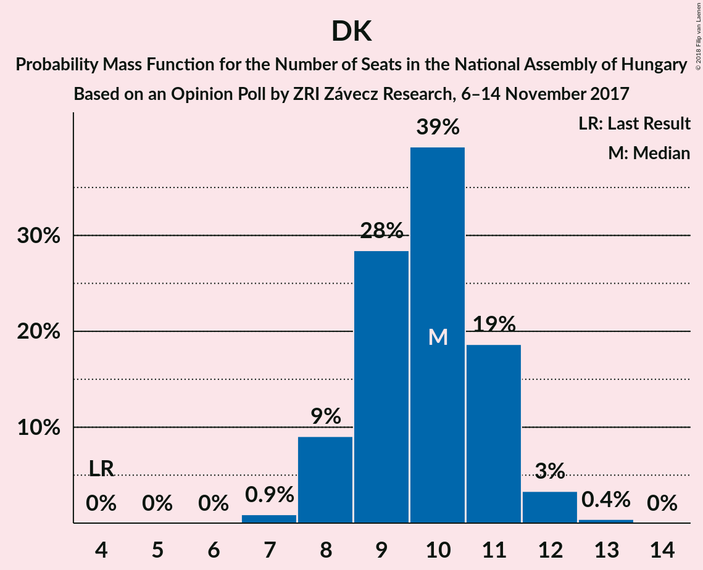

| Number of Seats | Probability | Accumulated | Special Marks |
|:---------------:|:-----------:|:-----------:|:-------------:|
| 4 | 0% | 100% | Last Result |
| 5 | 0% | 100% |  |
| 6 | 0.1% | 100% |  |
| 7 | 0.9% | 99.9% |  |
| 8 | 0.7% | 99.0% |  |
| 9 | 40% | 98% |  |
| 10 | 54% | 59% | Median |
| 11 | 4% | 5% |  |
| 12 | 0.6% | 1.3% |  |
| 13 | 0.6% | 0.7% |  |
| 14 | 0.1% | 0.1% |  |
| 15 | 0% | 0% |  |

### LMP

*For a full overview of the results for this party, see the [LMP](party-lmp.html) page.*

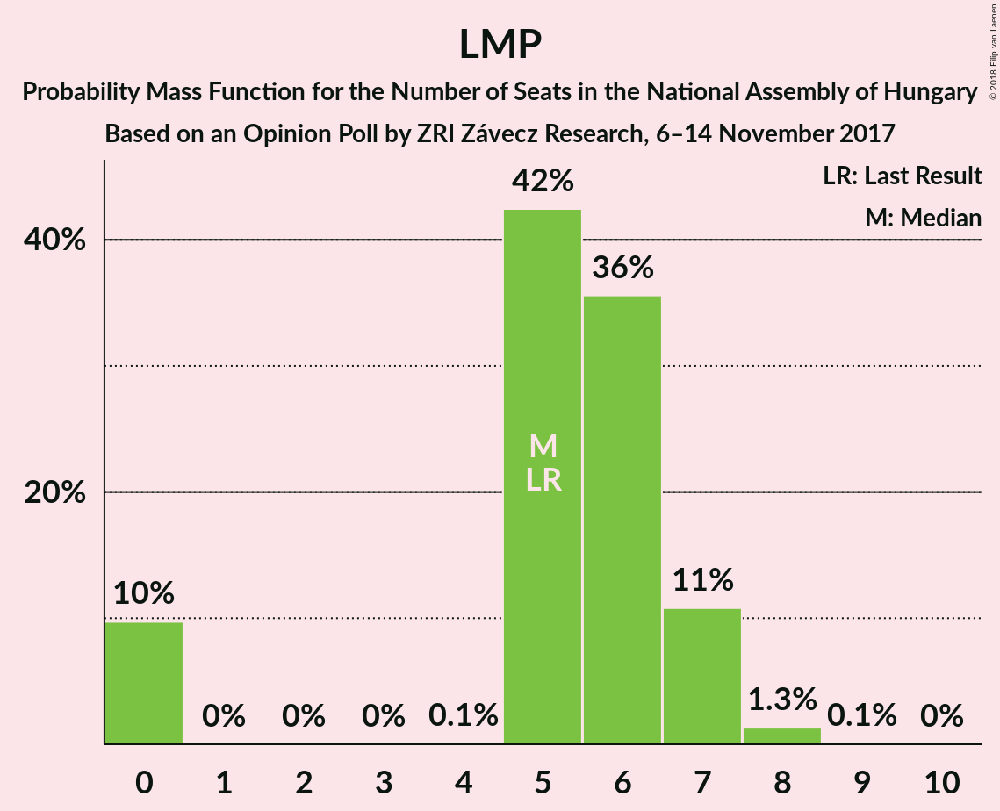

| Number of Seats | Probability | Accumulated | Special Marks |
|:---------------:|:-----------:|:-----------:|:-------------:|
| 0 | 4% | 100% |  |
| 1 | 0% | 96% |  |
| 2 | 0% | 96% |  |
| 3 | 0% | 96% |  |
| 4 | 0% | 96% |  |
| 5 | 10% | 96% | Last Result |
| 6 | 68% | 85% | Median |
| 7 | 16% | 17% |  |
| 8 | 1.2% | 1.2% |  |
| 9 | 0% | 0% |  |

### MM

*For a full overview of the results for this party, see the [MM](party-mm.html) page.*

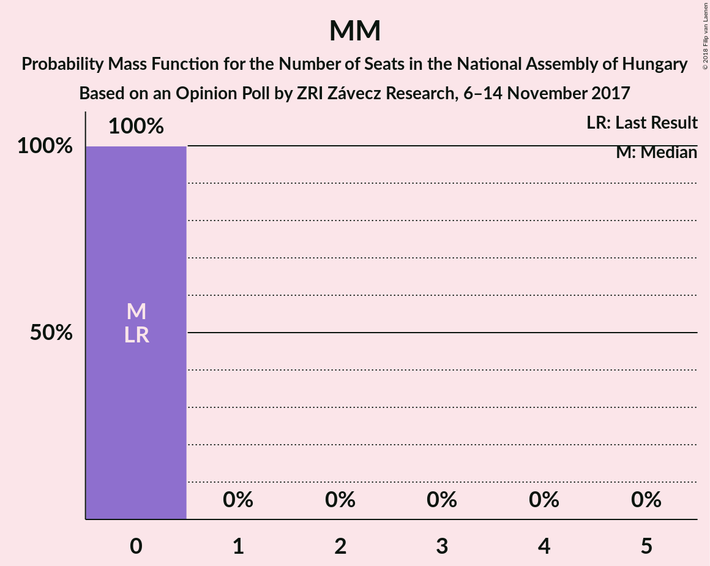

| Number of Seats | Probability | Accumulated | Special Marks |
|:---------------:|:-----------:|:-----------:|:-------------:|
| 0 | 100% | 100% | Last Result, Median |

### Együtt

*For a full overview of the results for this party, see the [Együtt](party-együtt.html) page.*

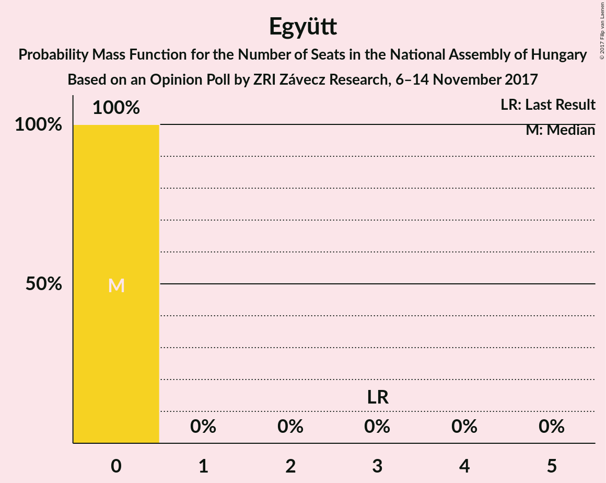

| Number of Seats | Probability | Accumulated | Special Marks |
|:---------------:|:-----------:|:-----------:|:-------------:|
| 0 | 100% | 100% | Median |
| 1 | 0% | 0% |  |
| 2 | 0% | 0% |  |
| 3 | 0% | 0% | Last Result |

### MLP

*For a full overview of the results for this party, see the [MLP](party-mlp.html) page.*

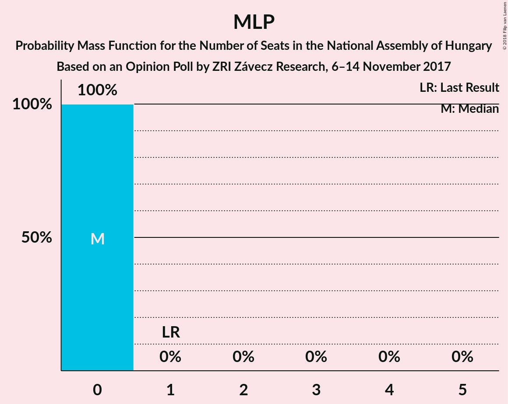

| Number of Seats | Probability | Accumulated | Special Marks |
|:---------------:|:-----------:|:-----------:|:-------------:|
| 0 | 100% | 100% | Median |
| 1 | 0% | 0% | Last Result |

### MKKP

*For a full overview of the results for this party, see the [MKKP](party-mkkp.html) page.*

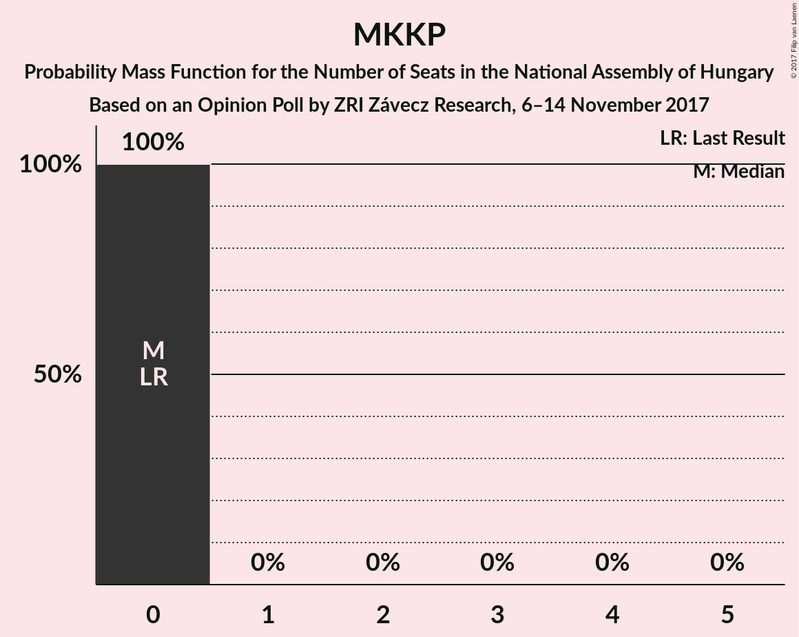

| Number of Seats | Probability | Accumulated | Special Marks |
|:---------------:|:-----------:|:-----------:|:-------------:|
| 0 | 100% | 100% | Last Result, Median |

## Coalitions

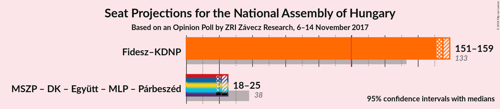

### Confidence Intervals

| Coalition | Last Result | Median | Majority? | 80% Confidence Interval | 90% Confidence Interval | 95% Confidence Interval | 99% Confidence Interval |
|:---------:|:-----------:|:------:|:---------:|:-----------------------:|:-----------------------:|:-----------------------:|:-----------------------:|
| Fidesz–KDNP | 133 | 155 | 100% | 153–156 | 153–158 | 152–159 | 151–160 |

### Fidesz–KDNP

| Number of Seats | Probability | Accumulated | Special Marks |
|:---------------:|:-----------:|:-----------:|:-------------:|
| 133 | 0% | 100% | Last Result |
| 134 | 0% | 100% |  |
| 135 | 0% | 100% |  |
| 136 | 0% | 100% |  |
| 137 | 0% | 100% |  |
| 138 | 0% | 100% |  |
| 139 | 0% | 100% |  |
| 140 | 0% | 100% |  |
| 141 | 0% | 100% |  |
| 142 | 0% | 100% |  |
| 143 | 0% | 100% |  |
| 144 | 0% | 100% |  |
| 145 | 0% | 100% |  |
| 146 | 0% | 100% |  |
| 147 | 0% | 100% |  |
| 148 | 0% | 100% |  |
| 149 | 0% | 100% |  |
| 150 | 0.2% | 100% |  |
| 151 | 2% | 99.7% |  |
| 152 | 3% | 98% |  |
| 153 | 6% | 95% |  |
| 154 | 29% | 89% |  |
| 155 | 47% | 60% | Median |
| 156 | 4% | 13% |  |
| 157 | 4% | 9% |  |
| 158 | 2% | 5% |  |
| 159 | 0.9% | 3% |  |
| 160 | 2% | 2% |  |
| 161 | 0.1% | 0.2% |  |
| 162 | 0% | 0% |  |

## Technical Information

### Opinion Poll

+ **Polling firm:** ZRI Závecz Research
+ **Commissioner(s):** —
+ **Fieldwork period:** 6–14 November 2017

### Calculations

+ **Sample size:** 1000
+ **Simulations done:** 262,144
+ **Error estimate:** 1.59%

