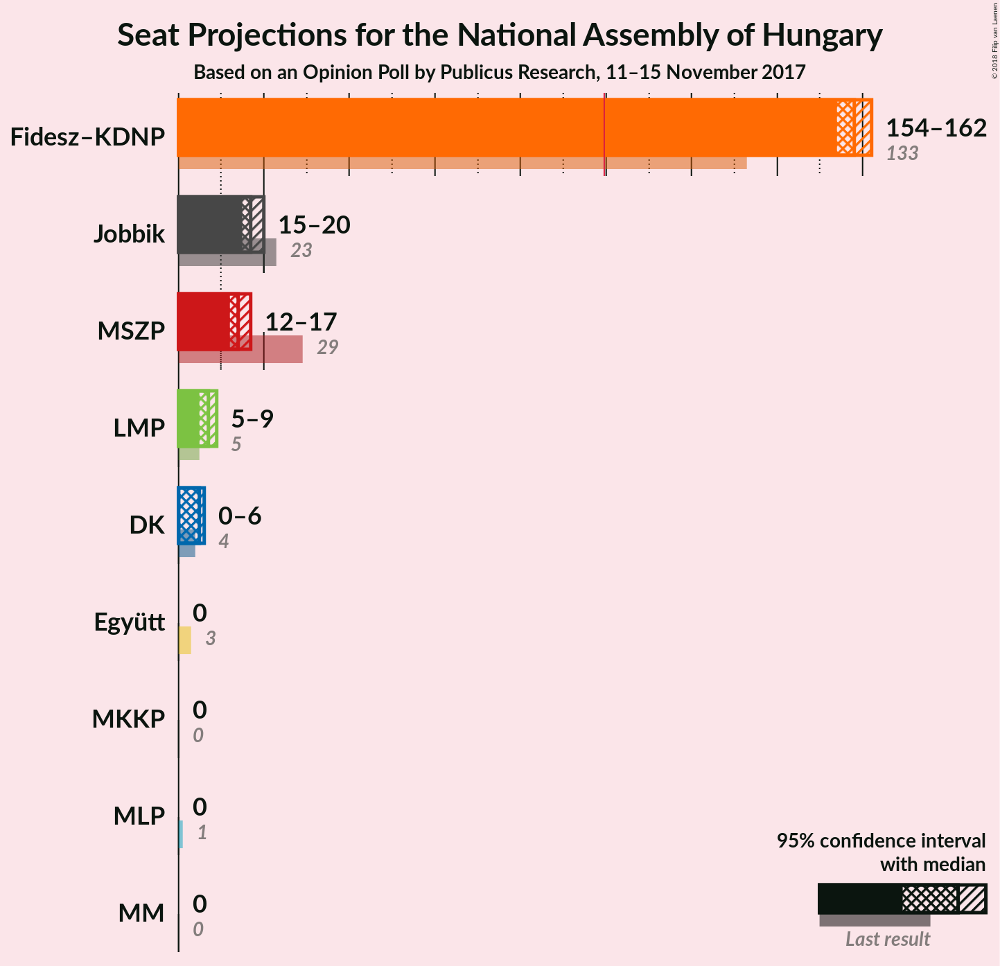
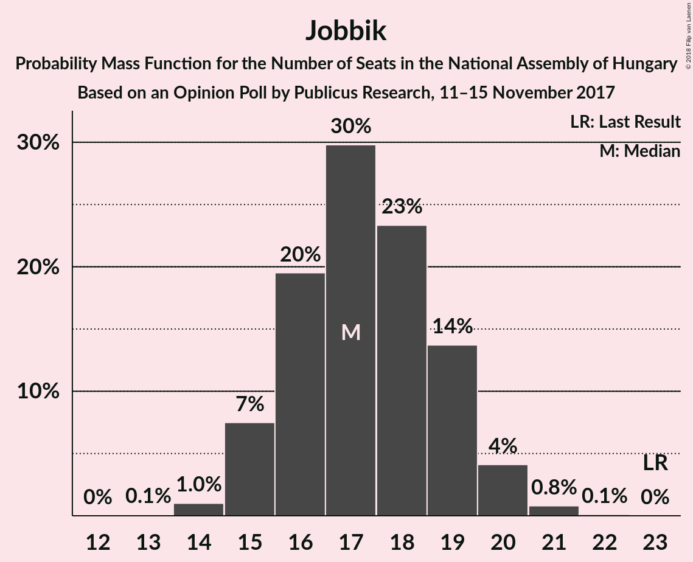
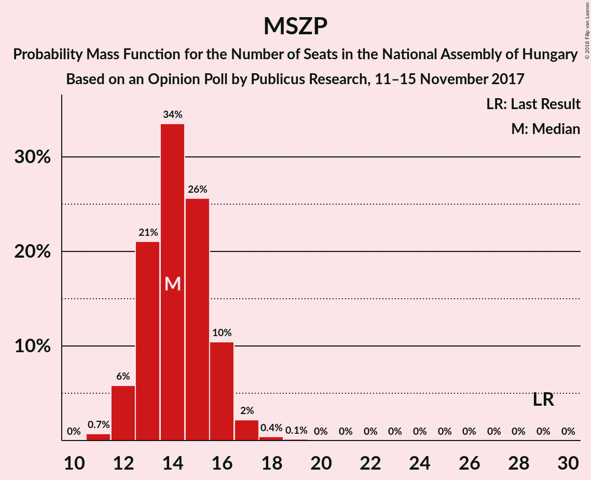
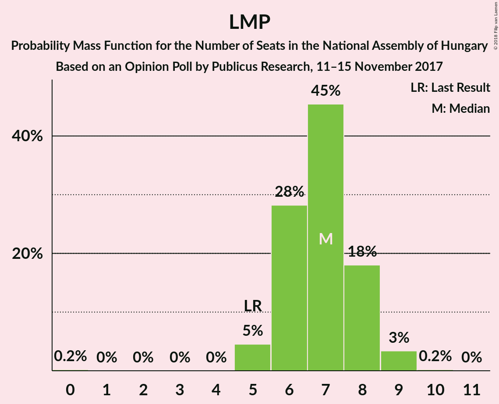
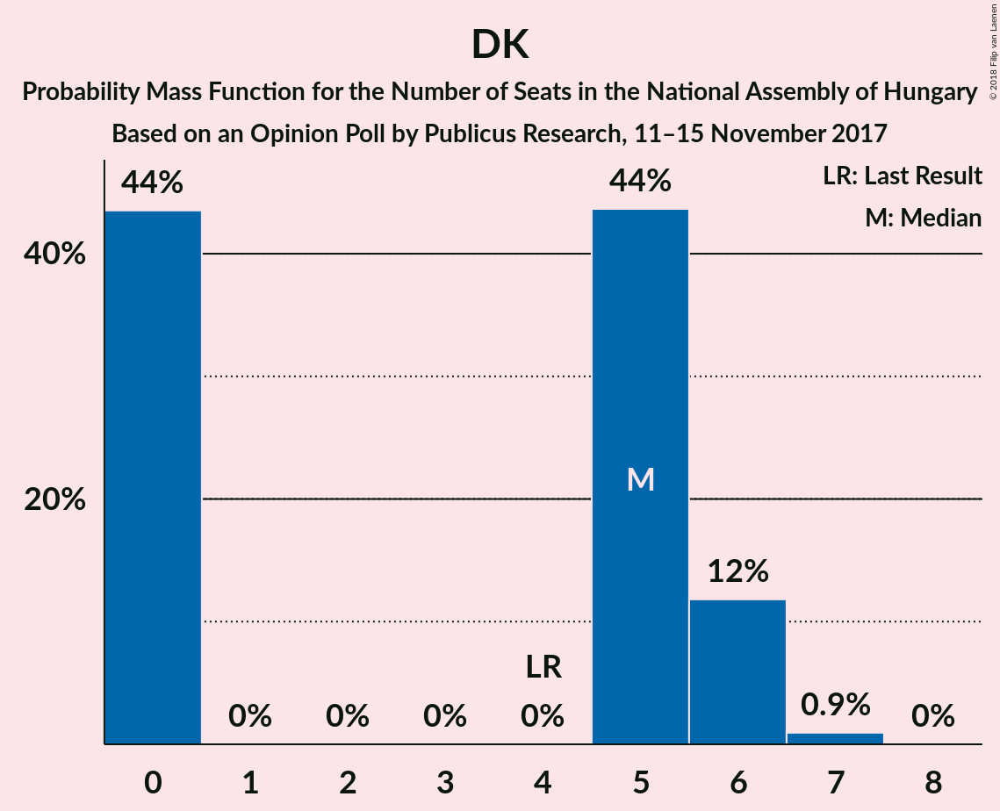
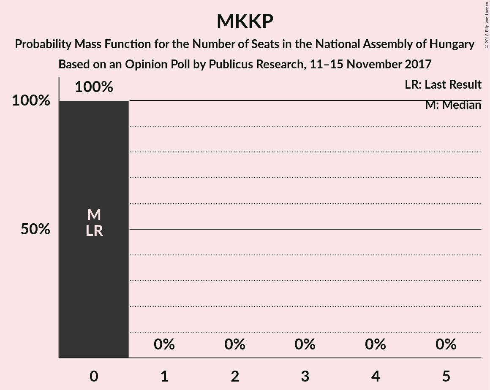

# Opinion Poll by Publicus Research, 11–15 November 2017

<a href="#voting-intentions">Voting Intentions</a> | <a href="#seats">Seats</a> | <a href="#coalitions">Coalitions</a> | <a href="#technical-information">Technical Information</a>

## Voting Intentions

### Confidence Intervals

| Party | Last Result | Poll Result | 80% Confidence Interval | 90% Confidence Interval | 95% Confidence Interval | 99% Confidence Interval |
|:-----:|:-----------:|:-----------:|:-----------------------:|:-----------------------:|:-----------------------:|:-----------------------:|
| Fidesz–KDNP | 44.9% | 50.8% | 48.8–52.9% |48.2–53.5% |47.8–53.9% |46.8–54.9% |
| Jobbik | 20.2% | 17.3% | 15.8–18.9% |15.4–19.4% |15.1–19.8% |14.4–20.5% |
| MSZP | 25.6% | 14.3% | 12.9–15.8% |12.6–16.2% |12.3–16.6% |11.6–17.3% |
| LMP | 5.3% | 7.1% | 6.1–8.2% |5.9–8.6% |5.7–8.9% |5.2–9.4% |
| DK | 25.6% | 5.1% | 4.3–6.1% |4.1–6.4% |3.9–6.6% |3.6–7.2% |
| Együtt | 25.6% | 1.0% | 0.7–1.5% |0.6–1.7% |0.5–1.8% |0.4–2.1% |
| MKKP | 0.0% | 1.0% | 0.7–1.5% |0.6–1.7% |0.5–1.8% |0.4–2.1% |
| MM | 0.0% | 1.0% | 0.7–1.5% |0.6–1.7% |0.5–1.8% |0.4–2.1% |
| MLP | 25.6% | 0.3% | 0.2–0.7% |0.1–0.8% |0.1–0.9% |0.1–1.1% |

*Note:* The poll result column reflects the actual value used in the calculations. Published results may vary slightly, and in addition be rounded to fewer digits.

## Seats

### Confidence Intervals

| Party | Last Result | Median | 80% Confidence Interval | 90% Confidence Interval | 95% Confidence Interval | 99% Confidence Interval |
|:-----:|:-----------:|:------:|:-----------------------:|:-----------------------:|:-----------------------:|:-----------------------:|
| <a href="#fidesz–kdnp">Fidesz–KDNP</a> | 133 | 158 | 155–160 |154–161 |154–162 |153–163 |
| <a href="#jobbik">Jobbik</a> | 23 | 17 | 16–19 |15–20 |15–20 |14–21 |
| <a href="#mszp">MSZP</a> | 29 | 14 | 13–16 |12–16 |12–17 |11–18 |
| <a href="#lmp">LMP</a> | 5 | 7 | 6–8 |6–8 |5–9 |5–9 |
| <a href="#dk">DK</a> | 4 | 5 | 0–6 |0–6 |0–6 |0–7 |
| <a href="#együtt">Együtt</a> | 3 | 0 | 0 |0 |0 |0 |
| <a href="#mkkp">MKKP</a> | 0 | 0 | 0 |0 |0 |0 |
| <a href="#mm">MM</a> | 0 | 0 | 0 |0 |0 |0 |
| <a href="#mlp">MLP</a> | 1 | 0 | 0 |0 |0 |0 |

### Fidesz–KDNP

*For a full overview of the results for this party, see the [Fidesz–KDNP](party-fidesz–kdnp.html) page.*

| Number of Seats | Probability | Accumulated | Special Marks |
|:---------------:|:-----------:|:-----------:|:-------------:|
| 133 | 0% | 100% | Last Result |
| 134 | 0% | 100% |  |
| 135 | 0% | 100% |  |
| 136 | 0% | 100% |  |
| 137 | 0% | 100% |  |
| 138 | 0% | 100% |  |
| 139 | 0% | 100% |  |
| 140 | 0% | 100% |  |
| 141 | 0% | 100% |  |
| 142 | 0% | 100% |  |
| 143 | 0% | 100% |  |
| 144 | 0% | 100% |  |
| 145 | 0% | 100% |  |
| 146 | 0% | 100% |  |
| 147 | 0% | 100% |  |
| 148 | 0% | 100% |  |
| 149 | 0% | 100% |  |
| 150 | 0% | 100% |  |
| 151 | 0.1% | 100% |  |
| 152 | 0.4% | 99.9% |  |
| 153 | 1.4% | 99.6% |  |
| 154 | 5% | 98% |  |
| 155 | 9% | 94% |  |
| 156 | 15% | 84% |  |
| 157 | 16% | 69% |  |
| 158 | 19% | 53% | Median |
| 159 | 12% | 34% |  |
| 160 | 12% | 22% |  |
| 161 | 6% | 10% |  |
| 162 | 2% | 3% |  |
| 163 | 1.0% | 1.2% |  |
| 164 | 0.2% | 0.2% |  |
| 165 | 0% | 0% |  |

### Jobbik

*For a full overview of the results for this party, see the [Jobbik](party-jobbik.html) page.*

| Number of Seats | Probability | Accumulated | Special Marks |
|:---------------:|:-----------:|:-----------:|:-------------:|
| 13 | 0.1% | 100% |  |
| 14 | 1.0% | 99.9% |  |
| 15 | 7% | 98.9% |  |
| 16 | 20% | 91% |  |
| 17 | 30% | 72% | Median |
| 18 | 23% | 42% |  |
| 19 | 14% | 19% |  |
| 20 | 4% | 5% |  |
| 21 | 0.8% | 0.9% |  |
| 22 | 0.1% | 0.1% |  |
| 23 | 0% | 0% | Last Result |

### MSZP

*For a full overview of the results for this party, see the [MSZP](party-mszp.html) page.*

| Number of Seats | Probability | Accumulated | Special Marks |
|:---------------:|:-----------:|:-----------:|:-------------:|
| 11 | 0.7% | 100% |  |
| 12 | 6% | 99.2% |  |
| 13 | 21% | 93% |  |
| 14 | 34% | 72% | Median |
| 15 | 26% | 39% |  |
| 16 | 10% | 13% |  |
| 17 | 2% | 3% |  |
| 18 | 0.4% | 0.6% |  |
| 19 | 0.1% | 0.2% |  |
| 20 | 0% | 0% |  |
| 21 | 0% | 0% |  |
| 22 | 0% | 0% |  |
| 23 | 0% | 0% |  |
| 24 | 0% | 0% |  |
| 25 | 0% | 0% |  |
| 26 | 0% | 0% |  |
| 27 | 0% | 0% |  |
| 28 | 0% | 0% |  |
| 29 | 0% | 0% | Last Result |

### LMP

*For a full overview of the results for this party, see the [LMP](party-lmp.html) page.*

| Number of Seats | Probability | Accumulated | Special Marks |
|:---------------:|:-----------:|:-----------:|:-------------:|
| 0 | 0.2% | 100% |  |
| 1 | 0% | 99.8% |  |
| 2 | 0% | 99.8% |  |
| 3 | 0% | 99.8% |  |
| 4 | 0% | 99.8% |  |
| 5 | 5% | 99.8% | Last Result |
| 6 | 28% | 95% |  |
| 7 | 45% | 67% | Median |
| 8 | 18% | 22% |  |
| 9 | 3% | 4% |  |
| 10 | 0.2% | 0.2% |  |
| 11 | 0% | 0% |  |

### DK

*For a full overview of the results for this party, see the [DK](party-dk.html) page.*

| Number of Seats | Probability | Accumulated | Special Marks |
|:---------------:|:-----------:|:-----------:|:-------------:|
| 0 | 44% | 100% |  |
| 1 | 0% | 56% |  |
| 2 | 0% | 56% |  |
| 3 | 0% | 56% |  |
| 4 | 0% | 56% | Last Result |
| 5 | 44% | 56% | Median |
| 6 | 12% | 13% |  |
| 7 | 0.9% | 1.0% |  |
| 8 | 0% | 0% |  |

### Együtt

*For a full overview of the results for this party, see the [Együtt](party-együtt.html) page.*

| Number of Seats | Probability | Accumulated | Special Marks |
|:---------------:|:-----------:|:-----------:|:-------------:|
| 0 | 100% | 100% | Median |
| 1 | 0% | 0% |  |
| 2 | 0% | 0% |  |
| 3 | 0% | 0% | Last Result |

### MKKP

*For a full overview of the results for this party, see the [MKKP](party-mkkp.html) page.*

| Number of Seats | Probability | Accumulated | Special Marks |
|:---------------:|:-----------:|:-----------:|:-------------:|
| 0 | 100% | 100% | Last Result, Median |

### MM

*For a full overview of the results for this party, see the [MM](party-mm.html) page.*

| Number of Seats | Probability | Accumulated | Special Marks |
|:---------------:|:-----------:|:-----------:|:-------------:|
| 0 | 100% | 100% | Last Result, Median |

### MLP

*For a full overview of the results for this party, see the [MLP](party-mlp.html) page.*

| Number of Seats | Probability | Accumulated | Special Marks |
|:---------------:|:-----------:|:-----------:|:-------------:|
| 0 | 100% | 100% | Median |
| 1 | 0% | 0% | Last Result |

## Coalitions

### Confidence Intervals

| Coalition | Last Result | Median | Majority? | 80% Confidence Interval | 90% Confidence Interval | 95% Confidence Interval | 99% Confidence Interval |
|:---------:|:-----------:|:------:|:---------:|:-----------------------:|:-----------------------:|:-----------------------:|:-----------------------:|
| Fidesz–KDNP | 133 | 158 | 100% | 155–160 | 154–161 | 154–162 | 153–163 |

### Fidesz–KDNP

| Number of Seats | Probability | Accumulated | Special Marks |
|:---------------:|:-----------:|:-----------:|:-------------:|
| 133 | 0% | 100% | Last Result |
| 134 | 0% | 100% |  |
| 135 | 0% | 100% |  |
| 136 | 0% | 100% |  |
| 137 | 0% | 100% |  |
| 138 | 0% | 100% |  |
| 139 | 0% | 100% |  |
| 140 | 0% | 100% |  |
| 141 | 0% | 100% |  |
| 142 | 0% | 100% |  |
| 143 | 0% | 100% |  |
| 144 | 0% | 100% |  |
| 145 | 0% | 100% |  |
| 146 | 0% | 100% |  |
| 147 | 0% | 100% |  |
| 148 | 0% | 100% |  |
| 149 | 0% | 100% |  |
| 150 | 0% | 100% |  |
| 151 | 0.1% | 100% |  |
| 152 | 0.4% | 99.9% |  |
| 153 | 1.4% | 99.6% |  |
| 154 | 5% | 98% |  |
| 155 | 9% | 94% |  |
| 156 | 15% | 84% |  |
| 157 | 16% | 69% |  |
| 158 | 19% | 53% | Median |
| 159 | 12% | 34% |  |
| 160 | 12% | 22% |  |
| 161 | 6% | 10% |  |
| 162 | 2% | 3% |  |
| 163 | 1.0% | 1.2% |  |
| 164 | 0.2% | 0.2% |  |
| 165 | 0% | 0% |  |

## Technical Information

### Opinion Poll

+ **Polling firm:** Publicus Research
+ **Commissioner(s):** —
+ **Fieldwork period:** 11–15 November 2017

### Calculations

+ **Sample size:** 1001
+ **Simulations done:** 8,388,608
+ **Error estimate:** 1.25%

