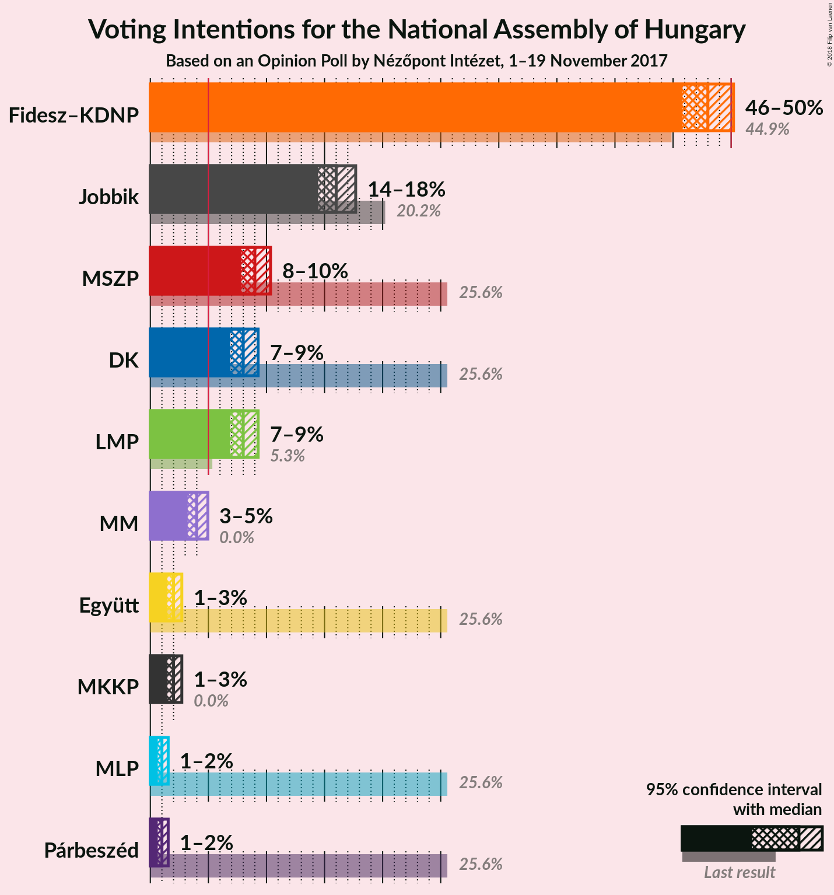
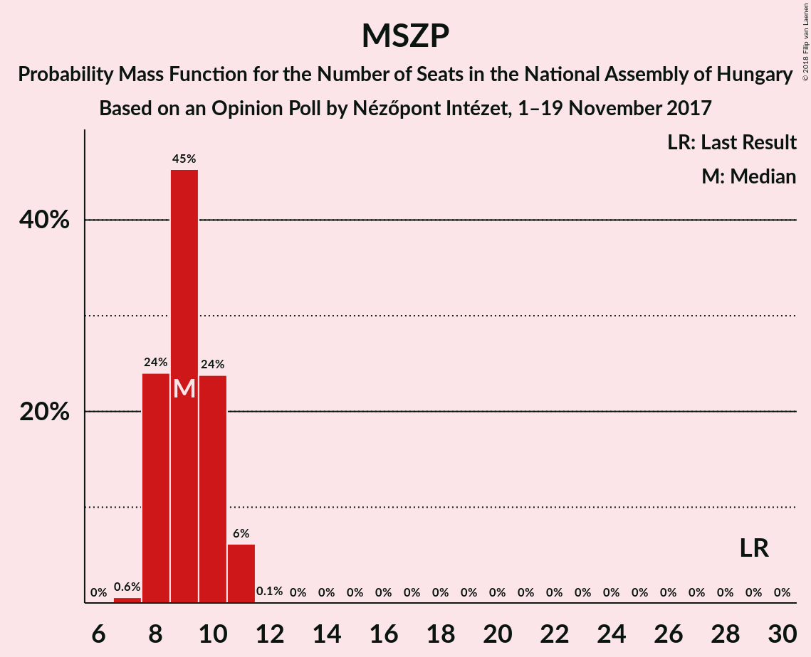
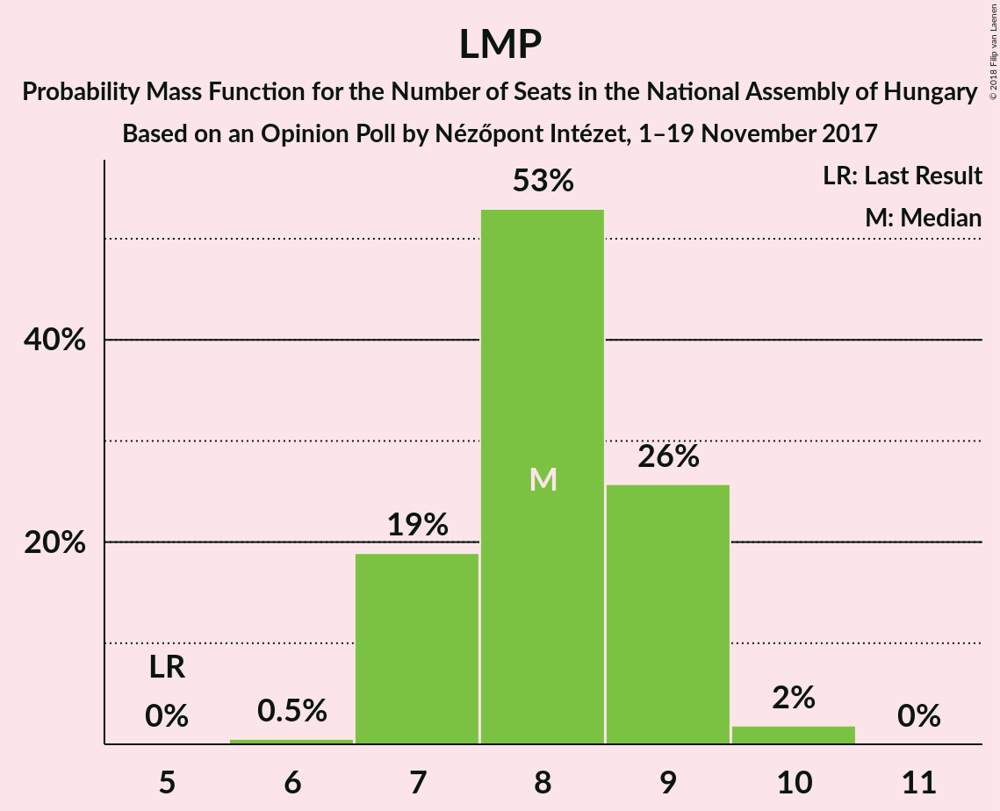
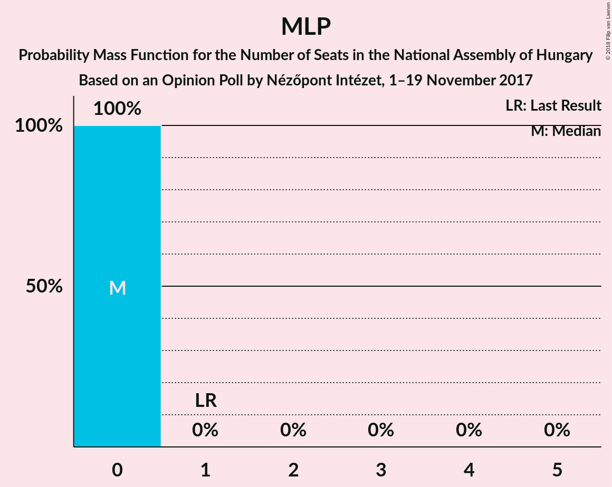
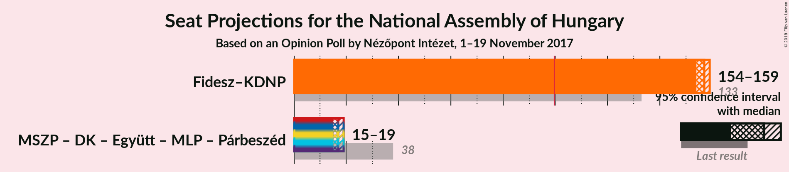

# Opinion Poll by Nézőpont Intézet, 1–19 November 2017

<a href="#voting-intentions">Voting Intentions</a> | <a href="#seats">Seats</a> | <a href="#coalitions">Coalitions</a> | <a href="#technical-information">Technical Information</a>

## Voting Intentions

### Confidence Intervals

| Party | Last Result | Poll Result | 80% Confidence Interval | 90% Confidence Interval | 95% Confidence Interval | 99% Confidence Interval |
|:-----:|:-----------:|:-----------:|:-----------------------:|:-----------------------:|:-----------------------:|:-----------------------:|
| Fidesz–KDNP | 44.9% | 48.0% | 46.6–49.4% |46.2–49.8% |45.8–50.2% |45.1–50.9% |
| Jobbik | 20.2% | 16.0% | 15.0–17.1% |14.7–17.4% |14.4–17.7% |14.0–18.2% |
| MSZP | 25.6% | 9.0% | 8.2–9.9% |8.0–10.1% |7.8–10.3% |7.5–10.8% |
| LMP | 5.3% | 8.0% | 7.3–8.8% |7.1–9.1% |6.9–9.3% |6.6–9.7% |
| DK | 25.6% | 8.0% | 7.3–8.8% |7.1–9.1% |6.9–9.3% |6.6–9.7% |
| MM | 0.0% | 4.0% | 3.5–4.6% |3.3–4.8% |3.2–5.0% |3.0–5.3% |
| Együtt | 25.6% | 2.0% | 1.6–2.5% |1.6–2.6% |1.5–2.7% |1.3–3.0% |
| MKKP | 0.0% | 2.0% | 1.6–2.5% |1.6–2.6% |1.5–2.7% |1.3–3.0% |
| Párbeszéd | 25.6% | 1.0% | 0.8–1.4% |0.7–1.5% |0.6–1.5% |0.5–1.7% |
| MLP | 25.6% | 1.0% | 0.8–1.4% |0.7–1.5% |0.6–1.5% |0.5–1.7% |

*Note:* The poll result column reflects the actual value used in the calculations. Published results may vary slightly, and in addition be rounded to fewer digits.

## Seats

### Confidence Intervals

| Party | Last Result | Median | 80% Confidence Interval | 90% Confidence Interval | 95% Confidence Interval | 99% Confidence Interval |
|:-----:|:-----------:|:------:|:-----------------------:|:-----------------------:|:-----------------------:|:-----------------------:|
| <a href="#fidesz–kdnp">Fidesz–KDNP</a> | 133 | 157 | 155–159 |155–159 |154–159 |153–160 |
| <a href="#jobbik">Jobbik</a> | 23 | 17 | 15–18 |15–18 |15–19 |14–19 |
| <a href="#mszp">MSZP</a> | 29 | 9 | 8–10 |8–11 |8–11 |7–11 |
| <a href="#lmp">LMP</a> | 5 | 8 | 7–9 |7–9 |7–9 |6–10 |
| <a href="#dk">DK</a> | 4 | 8 | 7–9 |7–9 |7–9 |7–10 |
| <a href="#mm">MM</a> | 0 | 0 | 0 |0 |0 |0–5 |
| <a href="#együtt">Együtt</a> | 3 | 0 | 0 |0 |0 |0 |
| <a href="#mkkp">MKKP</a> | 0 | 0 | 0 |0 |0 |0 |
| <a href="#párbeszéd">Párbeszéd</a> | 1 | 0 | 0 |0 |0 |0 |
| <a href="#mlp">MLP</a> | 1 | 0 | 0 |0 |0 |0 |

### Fidesz–KDNP

*For a full overview of the results for this party, see the [Fidesz–KDNP](party-fidesz–kdnp.html) page.*

| Number of Seats | Probability | Accumulated | Special Marks |
|:---------------:|:-----------:|:-----------:|:-------------:|
| 133 | 0% | 100% | Last Result |
| 134 | 0% | 100% |  |
| 135 | 0% | 100% |  |
| 136 | 0% | 100% |  |
| 137 | 0% | 100% |  |
| 138 | 0% | 100% |  |
| 139 | 0% | 100% |  |
| 140 | 0% | 100% |  |
| 141 | 0% | 100% |  |
| 142 | 0% | 100% |  |
| 143 | 0% | 100% |  |
| 144 | 0% | 100% |  |
| 145 | 0% | 100% |  |
| 146 | 0% | 100% |  |
| 147 | 0% | 100% |  |
| 148 | 0% | 100% |  |
| 149 | 0% | 100% |  |
| 150 | 0% | 100% |  |
| 151 | 0% | 100% |  |
| 152 | 0.1% | 100% |  |
| 153 | 0.5% | 99.9% |  |
| 154 | 2% | 99.4% |  |
| 155 | 11% | 97% |  |
| 156 | 22% | 86% |  |
| 157 | 30% | 64% | Median |
| 158 | 21% | 34% |  |
| 159 | 12% | 13% |  |
| 160 | 1.2% | 1.3% |  |
| 161 | 0.1% | 0.1% |  |
| 162 | 0% | 0% |  |

### Jobbik

*For a full overview of the results for this party, see the [Jobbik](party-jobbik.html) page.*

| Number of Seats | Probability | Accumulated | Special Marks |
|:---------------:|:-----------:|:-----------:|:-------------:|
| 14 | 0.8% | 100% |  |
| 15 | 9% | 99.2% |  |
| 16 | 35% | 90% |  |
| 17 | 37% | 55% | Median |
| 18 | 15% | 18% |  |
| 19 | 3% | 3% |  |
| 20 | 0.1% | 0.1% |  |
| 21 | 0% | 0% |  |
| 22 | 0% | 0% |  |
| 23 | 0% | 0% | Last Result |

### MSZP

*For a full overview of the results for this party, see the [MSZP](party-mszp.html) page.*

| Number of Seats | Probability | Accumulated | Special Marks |
|:---------------:|:-----------:|:-----------:|:-------------:|
| 7 | 0.6% | 100% |  |
| 8 | 24% | 99.4% |  |
| 9 | 45% | 75% | Median |
| 10 | 24% | 30% |  |
| 11 | 6% | 6% |  |
| 12 | 0.1% | 0.1% |  |
| 13 | 0% | 0% |  |
| 14 | 0% | 0% |  |
| 15 | 0% | 0% |  |
| 16 | 0% | 0% |  |
| 17 | 0% | 0% |  |
| 18 | 0% | 0% |  |
| 19 | 0% | 0% |  |
| 20 | 0% | 0% |  |
| 21 | 0% | 0% |  |
| 22 | 0% | 0% |  |
| 23 | 0% | 0% |  |
| 24 | 0% | 0% |  |
| 25 | 0% | 0% |  |
| 26 | 0% | 0% |  |
| 27 | 0% | 0% |  |
| 28 | 0% | 0% |  |
| 29 | 0% | 0% | Last Result |

### LMP

*For a full overview of the results for this party, see the [LMP](party-lmp.html) page.*

| Number of Seats | Probability | Accumulated | Special Marks |
|:---------------:|:-----------:|:-----------:|:-------------:|
| 5 | 0% | 100% | Last Result |
| 6 | 0.5% | 100% |  |
| 7 | 19% | 99.5% |  |
| 8 | 53% | 81% | Median |
| 9 | 26% | 28% |  |
| 10 | 2% | 2% |  |
| 11 | 0% | 0% |  |

### DK

*For a full overview of the results for this party, see the [DK](party-dk.html) page.*

| Number of Seats | Probability | Accumulated | Special Marks |
|:---------------:|:-----------:|:-----------:|:-------------:|
| 4 | 0% | 100% | Last Result |
| 5 | 0% | 100% |  |
| 6 | 0.4% | 100% |  |
| 7 | 17% | 99.6% |  |
| 8 | 56% | 82% | Median |
| 9 | 24% | 27% |  |
| 10 | 2% | 2% |  |
| 11 | 0% | 0% |  |

### MM

*For a full overview of the results for this party, see the [MM](party-mm.html) page.*

| Number of Seats | Probability | Accumulated | Special Marks |
|:---------------:|:-----------:|:-----------:|:-------------:|
| 0 | 98% | 100% | Last Result, Median |
| 1 | 0% | 2% |  |
| 2 | 0% | 2% |  |
| 3 | 0% | 2% |  |
| 4 | 0% | 2% |  |
| 5 | 2% | 2% |  |
| 6 | 0% | 0% |  |

### Együtt

*For a full overview of the results for this party, see the [Együtt](party-együtt.html) page.*

| Number of Seats | Probability | Accumulated | Special Marks |
|:---------------:|:-----------:|:-----------:|:-------------:|
| 0 | 100% | 100% | Median |
| 1 | 0% | 0% |  |
| 2 | 0% | 0% |  |
| 3 | 0% | 0% | Last Result |

### MKKP

*For a full overview of the results for this party, see the [MKKP](party-mkkp.html) page.*

| Number of Seats | Probability | Accumulated | Special Marks |
|:---------------:|:-----------:|:-----------:|:-------------:|
| 0 | 100% | 100% | Last Result, Median |

### Párbeszéd

*For a full overview of the results for this party, see the [Párbeszéd](party-párbeszéd.html) page.*

| Number of Seats | Probability | Accumulated | Special Marks |
|:---------------:|:-----------:|:-----------:|:-------------:|
| 0 | 100% | 100% | Median |
| 1 | 0% | 0% | Last Result |

### MLP

*For a full overview of the results for this party, see the [MLP](party-mlp.html) page.*

| Number of Seats | Probability | Accumulated | Special Marks |
|:---------------:|:-----------:|:-----------:|:-------------:|
| 0 | 100% | 100% | Median |
| 1 | 0% | 0% | Last Result |

## Coalitions

### Confidence Intervals

| Coalition | Last Result | Median | Majority? | 80% Confidence Interval | 90% Confidence Interval | 95% Confidence Interval | 99% Confidence Interval |
|:---------:|:-----------:|:------:|:---------:|:-----------------------:|:-----------------------:|:-----------------------:|:-----------------------:|
| Fidesz–KDNP | 133 | 157 | 100% | 155–159 | 155–159 | 154–159 | 153–160 |
| MSZP – DK – Együtt – MLP – Párbeszéd | 38 | 17 | 0% | 16–19 | 16–19 | 15–19 | 15–20 |

### Fidesz–KDNP

| Number of Seats | Probability | Accumulated | Special Marks |
|:---------------:|:-----------:|:-----------:|:-------------:|
| 133 | 0% | 100% | Last Result |
| 134 | 0% | 100% |  |
| 135 | 0% | 100% |  |
| 136 | 0% | 100% |  |
| 137 | 0% | 100% |  |
| 138 | 0% | 100% |  |
| 139 | 0% | 100% |  |
| 140 | 0% | 100% |  |
| 141 | 0% | 100% |  |
| 142 | 0% | 100% |  |
| 143 | 0% | 100% |  |
| 144 | 0% | 100% |  |
| 145 | 0% | 100% |  |
| 146 | 0% | 100% |  |
| 147 | 0% | 100% |  |
| 148 | 0% | 100% |  |
| 149 | 0% | 100% |  |
| 150 | 0% | 100% |  |
| 151 | 0% | 100% |  |
| 152 | 0.1% | 100% |  |
| 153 | 0.5% | 99.9% |  |
| 154 | 2% | 99.4% |  |
| 155 | 11% | 97% |  |
| 156 | 22% | 86% |  |
| 157 | 30% | 64% | Median |
| 158 | 21% | 34% |  |
| 159 | 12% | 13% |  |
| 160 | 1.2% | 1.3% |  |
| 161 | 0.1% | 0.1% |  |
| 162 | 0% | 0% |  |

### MSZP – DK – Együtt – MLP – Párbeszéd

| Number of Seats | Probability | Accumulated | Special Marks |
|:---------------:|:-----------:|:-----------:|:-------------:|
| 14 | 0.1% | 100% |  |
| 15 | 3% | 99.9% |  |
| 16 | 20% | 97% |  |
| 17 | 39% | 76% | Median |
| 18 | 26% | 37% |  |
| 19 | 10% | 11% |  |
| 20 | 1.1% | 1.2% |  |
| 21 | 0.1% | 0.1% |  |
| 22 | 0% | 0% |  |
| 23 | 0% | 0% |  |
| 24 | 0% | 0% |  |
| 25 | 0% | 0% |  |
| 26 | 0% | 0% |  |
| 27 | 0% | 0% |  |
| 28 | 0% | 0% |  |
| 29 | 0% | 0% |  |
| 30 | 0% | 0% |  |
| 31 | 0% | 0% |  |
| 32 | 0% | 0% |  |
| 33 | 0% | 0% |  |
| 34 | 0% | 0% |  |
| 35 | 0% | 0% |  |
| 36 | 0% | 0% |  |
| 37 | 0% | 0% |  |
| 38 | 0% | 0% | Last Result |

## Technical Information

### Opinion Poll

+ **Polling firm:** Nézőpont Intézet
+ **Commissioner(s):** —
+ **Fieldwork period:** 1–19 November 2017

### Calculations

+ **Sample size:** 2000
+ **Simulations done:** 8,388,608
+ **Error estimate:** 1.40%

