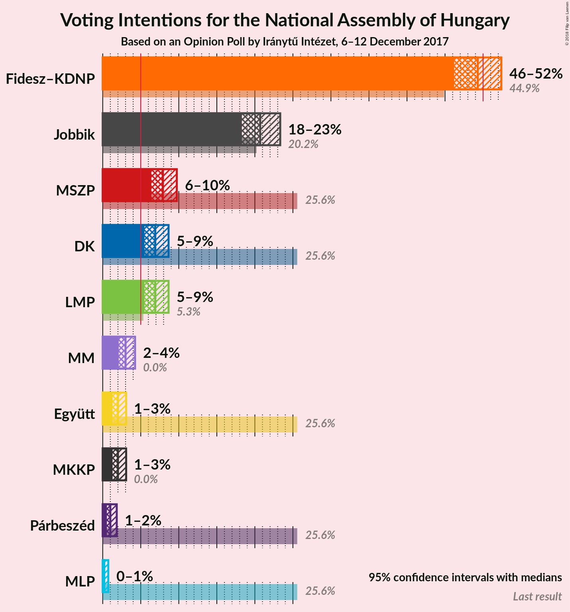
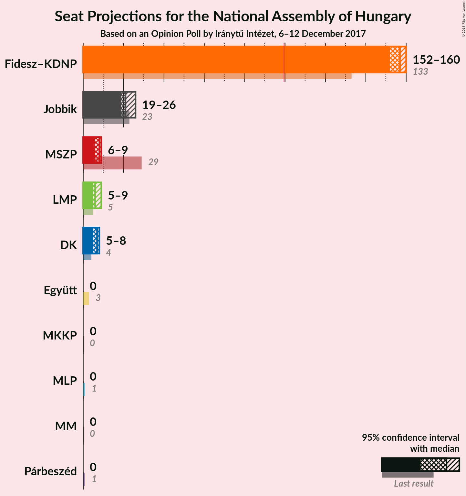
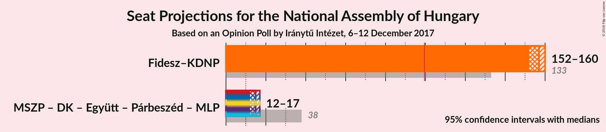

# Opinion Poll by Iránytű Intézet, 6–12 December 2017

<a href="#voting-intentions">Voting Intentions</a> | <a href="#seats">Seats</a> | <a href="#coalitions">Coalitions</a> | <a href="#technical-information">Technical Information</a>

## Voting Intentions

### Confidence Intervals

| Party | Last Result | Poll Result | 80% Confidence Interval | 90% Confidence Interval | 95% Confidence Interval | 99% Confidence Interval |
|:-----:|:-----------:|:-----------:|:-----------------------:|:-----------------------:|:-----------------------:|:-----------------------:|
| Fidesz–KDNP | 44.9% | 49.3% | N/A |N/A |N/A |N/A |
| Jobbik | 20.2% | 20.7% | N/A |N/A |N/A |N/A |
| MSZP | 25.6% | 7.9% | N/A |N/A |N/A |N/A |
| LMP | 5.3% | 6.9% | N/A |N/A |N/A |N/A |
| DK | 25.6% | 6.9% | N/A |N/A |N/A |N/A |
| MM | 0.0% | 3.0% | N/A |N/A |N/A |N/A |
| Együtt | 25.6% | 2.0% | N/A |N/A |N/A |N/A |
| MKKP | 0.0% | 2.0% | N/A |N/A |N/A |N/A |
| Párbeszéd | 25.6% | 1.0% | N/A |N/A |N/A |N/A |
| MLP | 25.6% | 0.2% | N/A |N/A |N/A |N/A |

*Note:* The poll result column reflects the actual value used in the calculations. Published results may vary slightly, and in addition be rounded to fewer digits.

## Seats

### Confidence Intervals

| Party | Last Result | Median | 80% Confidence Interval | 90% Confidence Interval | 95% Confidence Interval | 99% Confidence Interval |
|:-----:|:-----------:|:------:|:-----------------------:|:-----------------------:|:-----------------------:|:-----------------------:|
| <a href="#fidesz–kdnp">Fidesz–KDNP</a> | 133 | N/A | N/A |N/A |N/A |N/A |
| <a href="#jobbik">Jobbik</a> | 23 | N/A | N/A |N/A |N/A |N/A |
| <a href="#mszp">MSZP</a> | 29 | N/A | N/A |N/A |N/A |N/A |
| <a href="#lmp">LMP</a> | 5 | N/A | N/A |N/A |N/A |N/A |
| <a href="#dk">DK</a> | 4 | N/A | N/A |N/A |N/A |N/A |
| <a href="#mm">MM</a> | 0 | N/A | N/A |N/A |N/A |N/A |
| <a href="#együtt">Együtt</a> | 3 | N/A | N/A |N/A |N/A |N/A |
| <a href="#mkkp">MKKP</a> | 0 | N/A | N/A |N/A |N/A |N/A |
| <a href="#párbeszéd">Párbeszéd</a> | 1 | N/A | N/A |N/A |N/A |N/A |
| <a href="#mlp">MLP</a> | 1 | N/A | N/A |N/A |N/A |N/A |

## Coalitions

## Technical Information

### Opinion Poll

+ **Polling firm:** Iránytű Intézet
+ **Commissioner(s):** —
+ **Fieldwork period:** 6–12 December 2017

### Calculations

+ **Sample size:** 1000
+ **Simulations done:** 0
+ **Error estimate:** 100.00%

