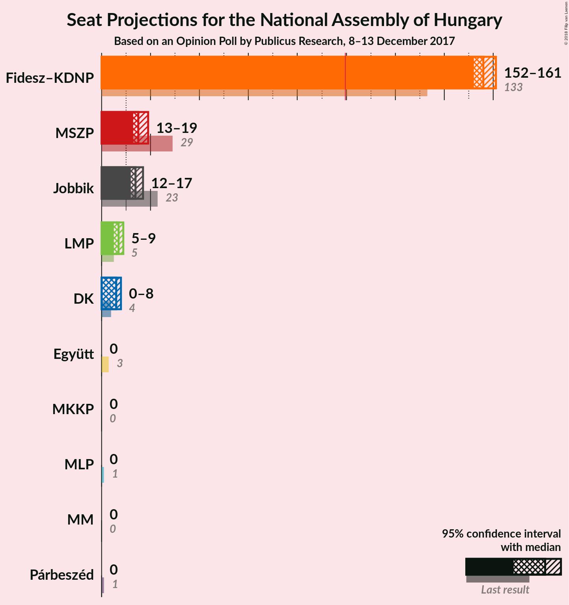
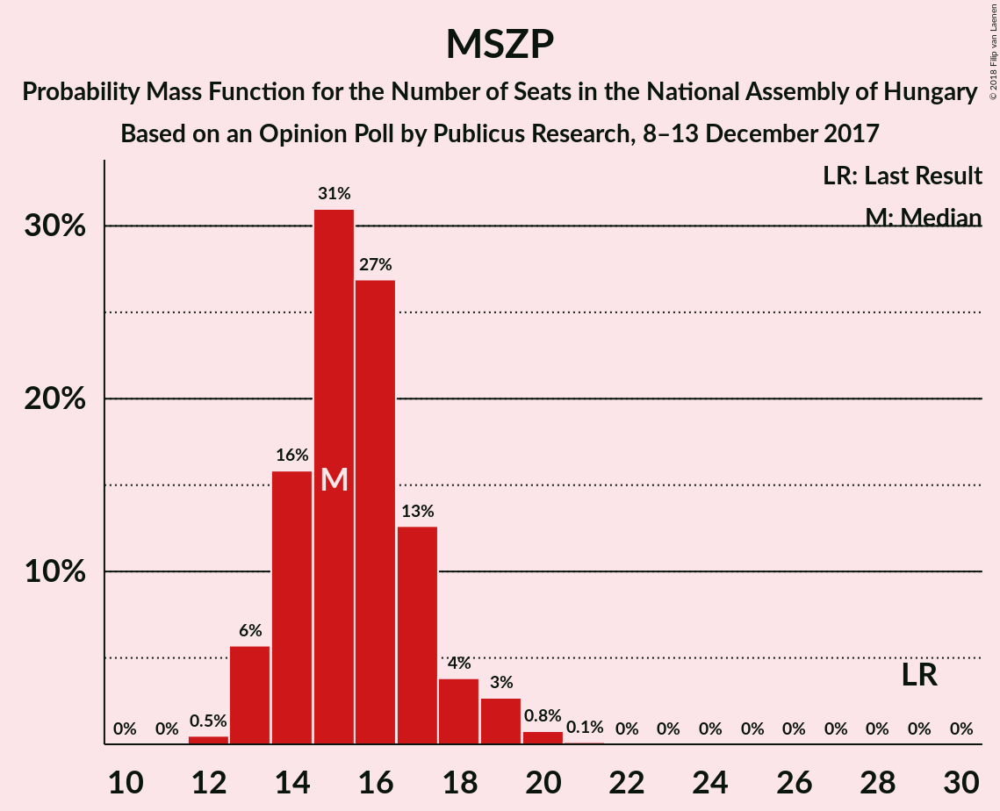
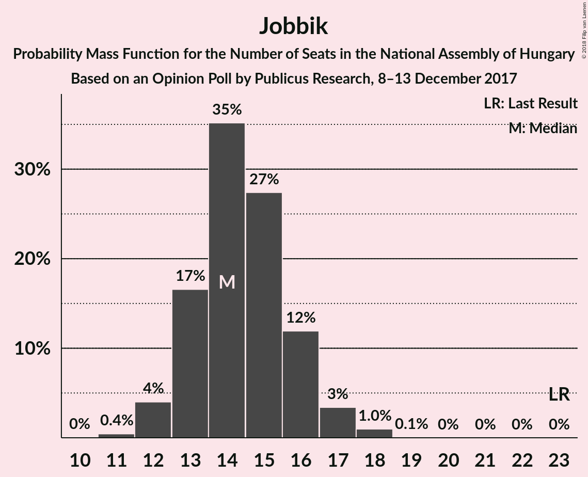
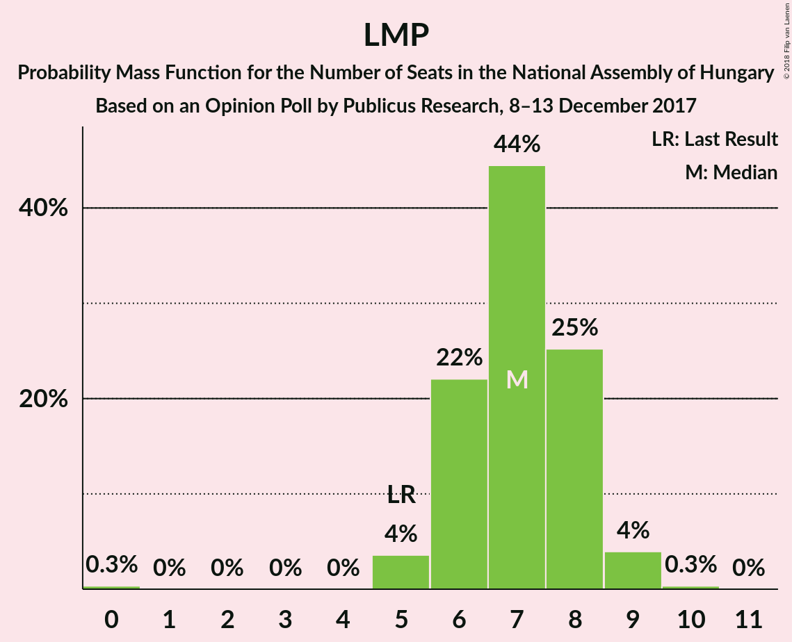
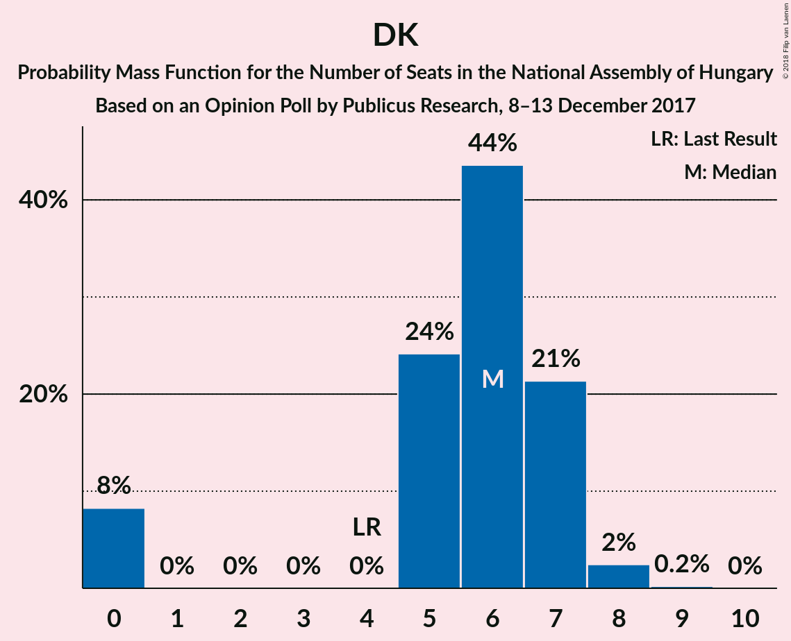
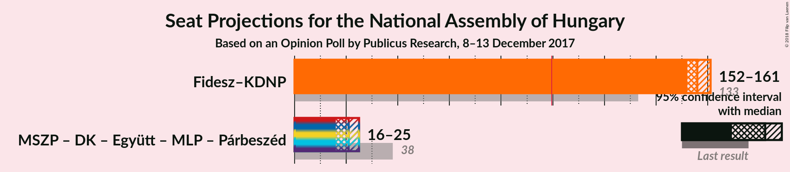

# Opinion Poll by Publicus Research, 8–13 December 2017

<a href="#voting-intentions">Voting Intentions</a> | <a href="#seats">Seats</a> | <a href="#coalitions">Coalitions</a> | <a href="#technical-information">Technical Information</a>

## Voting Intentions

### Confidence Intervals

| Party | Last Result | Poll Result | 80% Confidence Interval | 90% Confidence Interval | 95% Confidence Interval | 99% Confidence Interval |
|:-----:|:-----------:|:-----------:|:-----------------------:|:-----------------------:|:-----------------------:|:-----------------------:|
| Fidesz–KDNP | 44.9% | 47.8% | 45.7–49.8% |45.2–50.4% |44.7–50.9% |43.7–51.8% |
| MSZP | 25.6% | 14.9% | 13.6–16.5% |13.2–16.9% |12.8–17.3% |12.2–18.0% |
| Jobbik | 20.2% | 13.9% | 12.6–15.4% |12.2–15.9% |11.9–16.2% |11.3–16.9% |
| LMP | 5.3% | 7.0% | 6.0–8.1% |5.8–8.4% |5.5–8.7% |5.1–9.3% |
| DK | 25.6% | 6.0% | 5.1–7.0% |4.9–7.3% |4.7–7.6% |4.3–8.2% |
| Együtt | 25.6% | 2.0% | 1.5–2.7% |1.4–2.9% |1.3–3.1% |1.1–3.4% |
| MKKP | 0.0% | 2.0% | 1.5–2.7% |1.4–2.9% |1.3–3.1% |1.1–3.4% |
| MM | 0.0% | 2.0% | 1.5–2.7% |1.4–2.9% |1.3–3.1% |1.1–3.4% |
| Párbeszéd | 25.6% | 0.3% | 0.2–0.7% |0.1–0.8% |0.1–0.9% |0.1–1.1% |
| MLP | 25.6% | 0.3% | 0.2–0.7% |0.1–0.8% |0.1–0.9% |0.1–1.1% |

*Note:* The poll result column reflects the actual value used in the calculations. Published results may vary slightly, and in addition be rounded to fewer digits.

## Seats

### Confidence Intervals

| Party | Last Result | Median | 80% Confidence Interval | 90% Confidence Interval | 95% Confidence Interval | 99% Confidence Interval |
|:-----:|:-----------:|:------:|:-----------------------:|:-----------------------:|:-----------------------:|:-----------------------:|
| <a href="#fidesz–kdnp">Fidesz–KDNP</a> | 133 | 156 | 154–159 |153–160 |152–161 |151–162 |
| <a href="#mszp">MSZP</a> | 29 | 15 | 14–17 |13–18 |13–19 |12–20 |
| <a href="#jobbik">Jobbik</a> | 23 | 14 | 13–16 |13–16 |12–17 |12–18 |
| <a href="#lmp">LMP</a> | 5 | 7 | 6–8 |6–8 |5–9 |5–9 |
| <a href="#dk">DK</a> | 4 | 6 | 5–7 |0–7 |0–8 |0–8 |
| <a href="#együtt">Együtt</a> | 3 | 0 | 0 |0 |0 |0 |
| <a href="#mkkp">MKKP</a> | 0 | 0 | 0 |0 |0 |0 |
| <a href="#mm">MM</a> | 0 | 0 | 0 |0 |0 |0 |
| <a href="#párbeszéd">Párbeszéd</a> | 1 | 0 | 0 |0 |0 |0 |
| <a href="#mlp">MLP</a> | 1 | 0 | 0 |0 |0 |0 |

### Fidesz–KDNP

*For a full overview of the results for this party, see the [Fidesz–KDNP](party-fidesz–kdnp.html) page.*

| Number of Seats | Probability | Accumulated | Special Marks |
|:---------------:|:-----------:|:-----------:|:-------------:|
| 133 | 0% | 100% | Last Result |
| 134 | 0% | 100% |  |
| 135 | 0% | 100% |  |
| 136 | 0% | 100% |  |
| 137 | 0% | 100% |  |
| 138 | 0% | 100% |  |
| 139 | 0% | 100% |  |
| 140 | 0% | 100% |  |
| 141 | 0% | 100% |  |
| 142 | 0% | 100% |  |
| 143 | 0% | 100% |  |
| 144 | 0% | 100% |  |
| 145 | 0% | 100% |  |
| 146 | 0% | 100% |  |
| 147 | 0% | 100% |  |
| 148 | 0% | 100% |  |
| 149 | 0% | 100% |  |
| 150 | 0.2% | 100% |  |
| 151 | 0.7% | 99.8% |  |
| 152 | 2% | 99.0% |  |
| 153 | 5% | 97% |  |
| 154 | 6% | 92% |  |
| 155 | 17% | 86% |  |
| 156 | 24% | 68% | Median |
| 157 | 21% | 45% |  |
| 158 | 10% | 23% |  |
| 159 | 8% | 14% |  |
| 160 | 3% | 6% |  |
| 161 | 2% | 3% |  |
| 162 | 0.6% | 1.0% |  |
| 163 | 0.2% | 0.3% |  |
| 164 | 0.1% | 0.1% |  |
| 165 | 0% | 0% |  |

### MSZP

*For a full overview of the results for this party, see the [MSZP](party-mszp.html) page.*

| Number of Seats | Probability | Accumulated | Special Marks |
|:---------------:|:-----------:|:-----------:|:-------------:|
| 12 | 0.5% | 100% |  |
| 13 | 6% | 99.5% |  |
| 14 | 16% | 94% |  |
| 15 | 31% | 78% | Median |
| 16 | 27% | 47% |  |
| 17 | 13% | 20% |  |
| 18 | 4% | 7% |  |
| 19 | 3% | 4% |  |
| 20 | 0.8% | 0.9% |  |
| 21 | 0.1% | 0.1% |  |
| 22 | 0% | 0% |  |
| 23 | 0% | 0% |  |
| 24 | 0% | 0% |  |
| 25 | 0% | 0% |  |
| 26 | 0% | 0% |  |
| 27 | 0% | 0% |  |
| 28 | 0% | 0% |  |
| 29 | 0% | 0% | Last Result |

### Jobbik

*For a full overview of the results for this party, see the [Jobbik](party-jobbik.html) page.*

| Number of Seats | Probability | Accumulated | Special Marks |
|:---------------:|:-----------:|:-----------:|:-------------:|
| 11 | 0.4% | 100% |  |
| 12 | 4% | 99.5% |  |
| 13 | 17% | 96% |  |
| 14 | 35% | 79% | Median |
| 15 | 27% | 44% |  |
| 16 | 12% | 16% |  |
| 17 | 3% | 4% |  |
| 18 | 1.0% | 1.1% |  |
| 19 | 0.1% | 0.1% |  |
| 20 | 0% | 0% |  |
| 21 | 0% | 0% |  |
| 22 | 0% | 0% |  |
| 23 | 0% | 0% | Last Result |

### LMP

*For a full overview of the results for this party, see the [LMP](party-lmp.html) page.*

| Number of Seats | Probability | Accumulated | Special Marks |
|:---------------:|:-----------:|:-----------:|:-------------:|
| 0 | 0.3% | 100% |  |
| 1 | 0% | 99.7% |  |
| 2 | 0% | 99.7% |  |
| 3 | 0% | 99.7% |  |
| 4 | 0% | 99.7% |  |
| 5 | 4% | 99.7% | Last Result |
| 6 | 22% | 96% |  |
| 7 | 44% | 74% | Median |
| 8 | 25% | 30% |  |
| 9 | 4% | 4% |  |
| 10 | 0.3% | 0.4% |  |
| 11 | 0% | 0% |  |

### DK

*For a full overview of the results for this party, see the [DK](party-dk.html) page.*

| Number of Seats | Probability | Accumulated | Special Marks |
|:---------------:|:-----------:|:-----------:|:-------------:|
| 0 | 8% | 100% |  |
| 1 | 0% | 92% |  |
| 2 | 0% | 92% |  |
| 3 | 0% | 92% |  |
| 4 | 0% | 92% | Last Result |
| 5 | 24% | 92% |  |
| 6 | 44% | 68% | Median |
| 7 | 21% | 24% |  |
| 8 | 2% | 3% |  |
| 9 | 0.2% | 0.2% |  |
| 10 | 0% | 0% |  |

### Együtt

*For a full overview of the results for this party, see the [Együtt](party-együtt.html) page.*

| Number of Seats | Probability | Accumulated | Special Marks |
|:---------------:|:-----------:|:-----------:|:-------------:|
| 0 | 100% | 100% | Median |
| 1 | 0% | 0% |  |
| 2 | 0% | 0% |  |
| 3 | 0% | 0% | Last Result |

### MKKP

*For a full overview of the results for this party, see the [MKKP](party-mkkp.html) page.*

| Number of Seats | Probability | Accumulated | Special Marks |
|:---------------:|:-----------:|:-----------:|:-------------:|
| 0 | 100% | 100% | Last Result, Median |

### MM

*For a full overview of the results for this party, see the [MM](party-mm.html) page.*

| Number of Seats | Probability | Accumulated | Special Marks |
|:---------------:|:-----------:|:-----------:|:-------------:|
| 0 | 100% | 100% | Last Result, Median |

### Párbeszéd

*For a full overview of the results for this party, see the [Párbeszéd](party-párbeszéd.html) page.*

| Number of Seats | Probability | Accumulated | Special Marks |
|:---------------:|:-----------:|:-----------:|:-------------:|
| 0 | 100% | 100% | Median |
| 1 | 0% | 0% | Last Result |

### MLP

*For a full overview of the results for this party, see the [MLP](party-mlp.html) page.*

| Number of Seats | Probability | Accumulated | Special Marks |
|:---------------:|:-----------:|:-----------:|:-------------:|
| 0 | 100% | 100% | Median |
| 1 | 0% | 0% | Last Result |

## Coalitions

### Confidence Intervals

| Coalition | Last Result | Median | Majority? | 80% Confidence Interval | 90% Confidence Interval | 95% Confidence Interval | 99% Confidence Interval |
|:---------:|:-----------:|:------:|:---------:|:-----------------------:|:-----------------------:|:-----------------------:|:-----------------------:|
| Fidesz–KDNP | 133 | 156 | 100% | 154–159 | 153–160 | 152–161 | 151–162 |
| MSZP – DK – Együtt – MLP – Párbeszéd | 38 | 21 | 0% | 19–23 | 17–24 | 16–25 | 15–26 |

### Fidesz–KDNP

| Number of Seats | Probability | Accumulated | Special Marks |
|:---------------:|:-----------:|:-----------:|:-------------:|
| 133 | 0% | 100% | Last Result |
| 134 | 0% | 100% |  |
| 135 | 0% | 100% |  |
| 136 | 0% | 100% |  |
| 137 | 0% | 100% |  |
| 138 | 0% | 100% |  |
| 139 | 0% | 100% |  |
| 140 | 0% | 100% |  |
| 141 | 0% | 100% |  |
| 142 | 0% | 100% |  |
| 143 | 0% | 100% |  |
| 144 | 0% | 100% |  |
| 145 | 0% | 100% |  |
| 146 | 0% | 100% |  |
| 147 | 0% | 100% |  |
| 148 | 0% | 100% |  |
| 149 | 0% | 100% |  |
| 150 | 0.2% | 100% |  |
| 151 | 0.7% | 99.8% |  |
| 152 | 2% | 99.0% |  |
| 153 | 5% | 97% |  |
| 154 | 6% | 92% |  |
| 155 | 17% | 86% |  |
| 156 | 24% | 68% | Median |
| 157 | 21% | 45% |  |
| 158 | 10% | 23% |  |
| 159 | 8% | 14% |  |
| 160 | 3% | 6% |  |
| 161 | 2% | 3% |  |
| 162 | 0.6% | 1.0% |  |
| 163 | 0.2% | 0.3% |  |
| 164 | 0.1% | 0.1% |  |
| 165 | 0% | 0% |  |

### MSZP – DK – Együtt – MLP – Párbeszéd

| Number of Seats | Probability | Accumulated | Special Marks |
|:---------------:|:-----------:|:-----------:|:-------------:|
| 13 | 0.1% | 100% |  |
| 14 | 0.4% | 99.9% |  |
| 15 | 2% | 99.6% |  |
| 16 | 2% | 98% |  |
| 17 | 2% | 95% |  |
| 18 | 3% | 93% |  |
| 19 | 5% | 91% |  |
| 20 | 15% | 86% |  |
| 21 | 28% | 71% | Median |
| 22 | 26% | 43% |  |
| 23 | 10% | 17% |  |
| 24 | 3% | 6% |  |
| 25 | 2% | 4% |  |
| 26 | 1.1% | 1.3% |  |
| 27 | 0.2% | 0.2% |  |
| 28 | 0% | 0% |  |
| 29 | 0% | 0% |  |
| 30 | 0% | 0% |  |
| 31 | 0% | 0% |  |
| 32 | 0% | 0% |  |
| 33 | 0% | 0% |  |
| 34 | 0% | 0% |  |
| 35 | 0% | 0% |  |
| 36 | 0% | 0% |  |
| 37 | 0% | 0% |  |
| 38 | 0% | 0% | Last Result |

## Technical Information

### Opinion Poll

+ **Polling firm:** Publicus Research
+ **Commissioner(s):** —
+ **Fieldwork period:** 8–13 December 2017

### Calculations

+ **Sample size:** 1005
+ **Simulations done:** 8,388,608
+ **Error estimate:** 0.55%

