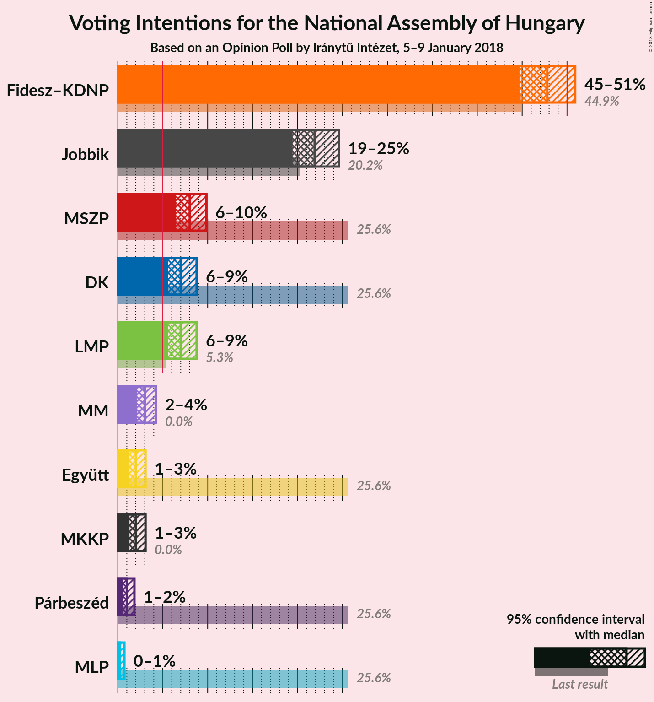

# Opinion Poll by Iránytű Intézet, 5–9 January 2018

<a href="#voting-intentions">Voting Intentions</a> | <a href="#seats">Seats</a> | <a href="#coalitions">Coalitions</a> | <a href="#technical-information">Technical Information</a>

## Voting Intentions

### Confidence Intervals

| Party | Last Result | Poll Result | 80% Confidence Interval | 90% Confidence Interval | 95% Confidence Interval | 99% Confidence Interval |
|:-----:|:-----------:|:-----------:|:-----------------------:|:-----------------------:|:-----------------------:|:-----------------------:|
| Fidesz–KDNP | 44.9% | 47.8% | 45.8–49.8% |45.2–50.4% |44.7–50.9% |43.7–51.9% |
| Jobbik | 20.2% | 21.9% | 20.3–23.7% |19.8–24.1% |19.4–24.6% |18.7–25.5% |
| MSZP | 25.6% | 8.0% | 7.0–9.2% |6.7–9.6% |6.4–9.9% |6.0–10.5% |
| LMP | 5.3% | 7.0% | 6.0–8.2% |5.8–8.5% |5.6–8.8% |5.1–9.4% |
| DK | 25.6% | 7.0% | 6.0–8.2% |5.8–8.5% |5.6–8.8% |5.1–9.4% |
| MM | 0.0% | 3.0% | 2.4–3.8% |2.2–4.1% |2.1–4.3% |1.8–4.7% |
| Együtt | 25.6% | 2.0% | 1.5–2.7% |1.4–2.9% |1.3–3.1% |1.1–3.5% |
| MKKP | 0.0% | 2.0% | 1.5–2.7% |1.4–2.9% |1.3–3.1% |1.1–3.5% |
| Párbeszéd | 25.6% | 1.0% | 0.7–1.6% |0.6–1.7% |0.5–1.9% |0.4–2.1% |
| MLP | 25.6% | 0.2% | 0.1–0.5% |0.0–0.6% |0.0–0.7% |0.0–1.0% |

*Note:* The poll result column reflects the actual value used in the calculations. Published results may vary slightly, and in addition be rounded to fewer digits.

## Seats

### Confidence Intervals

| Party | Last Result | Median | 80% Confidence Interval | 90% Confidence Interval | 95% Confidence Interval | 99% Confidence Interval |
|:-----:|:-----------:|:------:|:-----------------------:|:-----------------------:|:-----------------------:|:-----------------------:|
| <a href="#fidesz–kdnp">Fidesz–KDNP</a> | 133 | N/A | N/A |N/A |N/A |N/A |
| <a href="#jobbik">Jobbik</a> | 23 | N/A | N/A |N/A |N/A |N/A |
| <a href="#mszp">MSZP</a> | 29 | N/A | N/A |N/A |N/A |N/A |
| <a href="#lmp">LMP</a> | 5 | N/A | N/A |N/A |N/A |N/A |
| <a href="#dk">DK</a> | 4 | N/A | N/A |N/A |N/A |N/A |
| <a href="#mm">MM</a> | 0 | N/A | N/A |N/A |N/A |N/A |
| <a href="#együtt">Együtt</a> | 3 | N/A | N/A |N/A |N/A |N/A |
| <a href="#mkkp">MKKP</a> | 0 | N/A | N/A |N/A |N/A |N/A |
| <a href="#párbeszéd">Párbeszéd</a> | 1 | N/A | N/A |N/A |N/A |N/A |
| <a href="#mlp">MLP</a> | 1 | N/A | N/A |N/A |N/A |N/A |

## Coalitions

## Technical Information

### Opinion Poll

+ **Polling firm:** Iránytű Intézet
+ **Commissioner(s):** —
+ **Fieldwork period:** 5–9 January 2018

### Calculations

+ **Sample size:** 1000
+ **Simulations done:** 0
+ **Error estimate:** 100.00%

