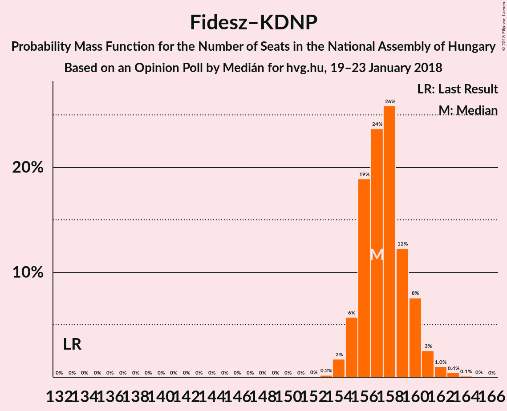

# Opinion Poll by Medián for hvg.hu, 19–23 January 2018

<a href="#voting-intentions">Voting Intentions</a> | <a href="#seats">Seats</a> | <a href="#coalitions">Coalitions</a> | <a href="#technical-information">Technical Information</a>

## Voting Intentions

### Confidence Intervals

| Party | Last Result | Poll Result | 80% Confidence Interval | 90% Confidence Interval | 95% Confidence Interval | 99% Confidence Interval |
|:-----:|:-----------:|:-----------:|:-----------------------:|:-----------------------:|:-----------------------:|:-----------------------:|
| Fidesz–KDNP | 44.9% | 53.2% | 51.3–55.0% |50.8–55.5% |50.3–56.0% |49.4–56.9% |
| Jobbik | 20.2% | 18.1% | 16.7–19.6% |16.3–20.0% |16.0–20.4% |15.4–21.1% |
| MSZP | 25.6% | 11.0% | 9.9–12.2% |9.6–12.6% |9.3–12.9% |8.9–13.5% |
| DK | 25.6% | 9.0% | 8.0–10.2% |7.7–10.5% |7.5–10.8% |7.1–11.3% |
| LMP | 5.3% | 6.0% | 5.2–7.0% |5.0–7.3% |4.8–7.5% |4.4–8.0% |
| Együtt | 25.6% | 1.0% | 0.7–1.5% |0.6–1.6% |0.6–1.8% |0.5–2.0% |
| MM | 0.0% | 1.0% | 0.7–1.5% |0.6–1.6% |0.6–1.8% |0.5–2.0% |
| MLP | 25.6% | 0.2% | 0.1–0.6% |0.1–0.7% |0.1–0.7% |0.0–0.9% |
| MKKP | 0.0% | 0.2% | 0.1–0.6% |0.1–0.7% |0.1–0.7% |0.0–0.9% |

*Note:* The poll result column reflects the actual value used in the calculations. Published results may vary slightly, and in addition be rounded to fewer digits.

## Seats

### Confidence Intervals

| Party | Last Result | Median | 80% Confidence Interval | 90% Confidence Interval | 95% Confidence Interval | 99% Confidence Interval |
|:-----:|:-----------:|:------:|:-----------------------:|:-----------------------:|:-----------------------:|:-----------------------:|
| <a href="#fidesz–kdnp">Fidesz–KDNP</a> | 133 | 158 | 155–161 |155–161 |152–165 |150–165 |
| <a href="#jobbik">Jobbik</a> | 23 | 20 | 15–21 |13–22 |13–22 |13–22 |
| <a href="#mszp">MSZP</a> | 29 | 10 | 9–12 |9–12 |9–13 |7–13 |
| <a href="#dk">DK</a> | 4 | 8 | 5–10 |5–11 |5–13 |5–13 |
| <a href="#lmp">LMP</a> | 5 | 6 | 0–7 |0–7 |0–7 |0–8 |
| <a href="#együtt">Együtt</a> | 3 | 0 | 0 |0 |0 |0 |
| <a href="#mm">MM</a> | 0 | 0 | 0 |0 |0 |0 |
| <a href="#mlp">MLP</a> | 1 | 0 | 0 |0 |0 |0 |
| <a href="#mkkp">MKKP</a> | 0 | 0 | 0 |0 |0 |0 |

### Fidesz–KDNP

*For a full overview of the results for this party, see the [Fidesz–KDNP](party-fidesz–kdnp.html) page.*

| Number of Seats | Probability | Accumulated | Special Marks |
|:---------------:|:-----------:|:-----------:|:-------------:|
| 133 | 0% | 100% | Last Result |
| 134 | 0% | 100% |  |
| 135 | 0% | 100% |  |
| 136 | 0% | 100% |  |
| 137 | 0% | 100% |  |
| 138 | 0% | 100% |  |
| 139 | 0% | 100% |  |
| 140 | 0% | 100% |  |
| 141 | 0% | 100% |  |
| 142 | 0% | 100% |  |
| 143 | 0% | 100% |  |
| 144 | 0% | 100% |  |
| 145 | 0% | 100% |  |
| 146 | 0% | 100% |  |
| 147 | 0% | 100% |  |
| 148 | 0% | 100% |  |
| 149 | 0% | 100% |  |
| 150 | 0.7% | 100% |  |
| 151 | 0% | 99.3% |  |
| 152 | 4% | 99.3% |  |
| 153 | 0% | 96% |  |
| 154 | 0.4% | 96% |  |
| 155 | 19% | 95% |  |
| 156 | 20% | 77% |  |
| 157 | 0.6% | 56% |  |
| 158 | 9% | 56% | Median |
| 159 | 2% | 47% |  |
| 160 | 26% | 45% |  |
| 161 | 14% | 19% |  |
| 162 | 0.1% | 5% |  |
| 163 | 0% | 4% |  |
| 164 | 2% | 4% |  |
| 165 | 3% | 3% |  |
| 166 | 0% | 0% |  |

### Jobbik

*For a full overview of the results for this party, see the [Jobbik](party-jobbik.html) page.*

| Number of Seats | Probability | Accumulated | Special Marks |
|:---------------:|:-----------:|:-----------:|:-------------:|
| 13 | 8% | 100% |  |
| 14 | 0% | 92% |  |
| 15 | 7% | 92% |  |
| 16 | 0.1% | 86% |  |
| 17 | 3% | 85% |  |
| 18 | 9% | 82% |  |
| 19 | 1.5% | 73% |  |
| 20 | 43% | 72% | Median |
| 21 | 18% | 28% |  |
| 22 | 10% | 10% |  |
| 23 | 0% | 0% | Last Result |

### MSZP

*For a full overview of the results for this party, see the [MSZP](party-mszp.html) page.*

| Number of Seats | Probability | Accumulated | Special Marks |
|:---------------:|:-----------:|:-----------:|:-------------:|
| 7 | 0.9% | 100% |  |
| 8 | 0.1% | 99.1% |  |
| 9 | 26% | 99.1% |  |
| 10 | 33% | 73% | Median |
| 11 | 26% | 40% |  |
| 12 | 11% | 14% |  |
| 13 | 3% | 3% |  |
| 14 | 0% | 0.1% |  |
| 15 | 0% | 0% |  |
| 16 | 0% | 0% |  |
| 17 | 0% | 0% |  |
| 18 | 0% | 0% |  |
| 19 | 0% | 0% |  |
| 20 | 0% | 0% |  |
| 21 | 0% | 0% |  |
| 22 | 0% | 0% |  |
| 23 | 0% | 0% |  |
| 24 | 0% | 0% |  |
| 25 | 0% | 0% |  |
| 26 | 0% | 0% |  |
| 27 | 0% | 0% |  |
| 28 | 0% | 0% |  |
| 29 | 0% | 0% | Last Result |

### DK

*For a full overview of the results for this party, see the [DK](party-dk.html) page.*

| Number of Seats | Probability | Accumulated | Special Marks |
|:---------------:|:-----------:|:-----------:|:-------------:|
| 4 | 0% | 100% | Last Result |
| 5 | 19% | 100% |  |
| 6 | 18% | 81% |  |
| 7 | 11% | 62% |  |
| 8 | 8% | 51% | Median |
| 9 | 4% | 43% |  |
| 10 | 33% | 39% |  |
| 11 | 2% | 6% |  |
| 12 | 0.3% | 4% |  |
| 13 | 3% | 3% |  |
| 14 | 0% | 0% |  |

### LMP

*For a full overview of the results for this party, see the [LMP](party-lmp.html) page.*

| Number of Seats | Probability | Accumulated | Special Marks |
|:---------------:|:-----------:|:-----------:|:-------------:|
| 0 | 46% | 100% |  |
| 1 | 0% | 54% |  |
| 2 | 0% | 54% |  |
| 3 | 0% | 54% |  |
| 4 | 0% | 54% |  |
| 5 | 2% | 54% | Last Result |
| 6 | 10% | 52% | Median |
| 7 | 41% | 42% |  |
| 8 | 0.5% | 0.6% |  |
| 9 | 0% | 0% |  |

### Együtt

*For a full overview of the results for this party, see the [Együtt](party-együtt.html) page.*

| Number of Seats | Probability | Accumulated | Special Marks |
|:---------------:|:-----------:|:-----------:|:-------------:|
| 0 | 100% | 100% | Median |
| 1 | 0% | 0% |  |
| 2 | 0% | 0% |  |
| 3 | 0% | 0% | Last Result |

### MM

*For a full overview of the results for this party, see the [MM](party-mm.html) page.*

| Number of Seats | Probability | Accumulated | Special Marks |
|:---------------:|:-----------:|:-----------:|:-------------:|
| 0 | 100% | 100% | Last Result, Median |

### MLP

*For a full overview of the results for this party, see the [MLP](party-mlp.html) page.*

| Number of Seats | Probability | Accumulated | Special Marks |
|:---------------:|:-----------:|:-----------:|:-------------:|
| 0 | 100% | 100% | Median |
| 1 | 0% | 0% | Last Result |

### MKKP

*For a full overview of the results for this party, see the [MKKP](party-mkkp.html) page.*

| Number of Seats | Probability | Accumulated | Special Marks |
|:---------------:|:-----------:|:-----------:|:-------------:|
| 0 | 100% | 100% | Last Result, Median |

## Coalitions

### Confidence Intervals

| Coalition | Last Result | Median | Majority? | 80% Confidence Interval | 90% Confidence Interval | 95% Confidence Interval | 99% Confidence Interval |
|:---------:|:-----------:|:------:|:---------:|:-----------------------:|:-----------------------:|:-----------------------:|:-----------------------:|
| Fidesz–KDNP | 133 | 158 | 100% | 155–161 | 155–161 | 152–165 | 150–165 |

### Fidesz–KDNP

| Number of Seats | Probability | Accumulated | Special Marks |
|:---------------:|:-----------:|:-----------:|:-------------:|
| 133 | 0% | 100% | Last Result |
| 134 | 0% | 100% |  |
| 135 | 0% | 100% |  |
| 136 | 0% | 100% |  |
| 137 | 0% | 100% |  |
| 138 | 0% | 100% |  |
| 139 | 0% | 100% |  |
| 140 | 0% | 100% |  |
| 141 | 0% | 100% |  |
| 142 | 0% | 100% |  |
| 143 | 0% | 100% |  |
| 144 | 0% | 100% |  |
| 145 | 0% | 100% |  |
| 146 | 0% | 100% |  |
| 147 | 0% | 100% |  |
| 148 | 0% | 100% |  |
| 149 | 0% | 100% |  |
| 150 | 0.7% | 100% |  |
| 151 | 0% | 99.3% |  |
| 152 | 4% | 99.3% |  |
| 153 | 0% | 96% |  |
| 154 | 0.4% | 96% |  |
| 155 | 19% | 95% |  |
| 156 | 20% | 77% |  |
| 157 | 0.6% | 56% |  |
| 158 | 9% | 56% | Median |
| 159 | 2% | 47% |  |
| 160 | 26% | 45% |  |
| 161 | 14% | 19% |  |
| 162 | 0.1% | 5% |  |
| 163 | 0% | 4% |  |
| 164 | 2% | 4% |  |
| 165 | 3% | 3% |  |
| 166 | 0% | 0% |  |

## Technical Information

### Opinion Poll

+ **Polling firm:** Medián
+ **Commissioner(s):** hvg.hu
+ **Fieldwork period:** 19–23 January 2018

### Calculations

+ **Sample size:** 1200
+ **Simulations done:** 1,024
+ **Error estimate:** 3.98%

