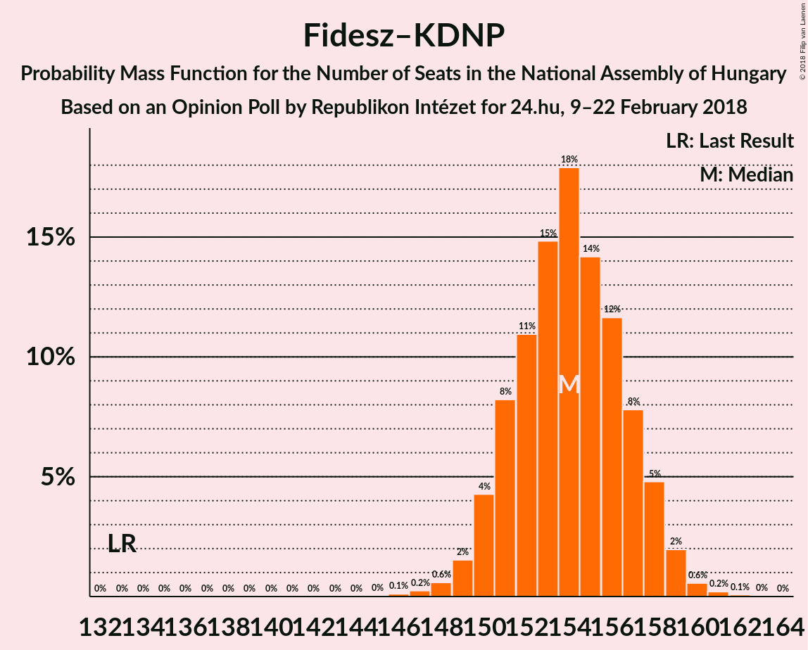

# Opinion Poll by Republikon Intézet for 24.hu, 9–22 February 2018

<a href="#voting-intentions">Voting Intentions</a> | <a href="#seats">Seats</a> | <a href="#coalitions">Coalitions</a> | <a href="#technical-information">Technical Information</a>

## Voting Intentions

### Confidence Intervals

| Party | Last Result | Poll Result | 80% Confidence Interval | 90% Confidence Interval | 95% Confidence Interval | 99% Confidence Interval |
|:-----:|:-----------:|:-----------:|:-----------------------:|:-----------------------:|:-----------------------:|:-----------------------:|
| Fidesz–KDNP | 44.9% | 50.0% | 48.0–52.0% |47.4–52.6% |46.9–53.1% |45.9–54.1% |
| Jobbik | 20.2% | 19.8% | 18.2–21.5% |17.8–22.0% |17.4–22.4% |16.7–23.2% |
| MSZP | 25.6% | 17.7% | 16.2–19.3% |15.8–19.8% |15.5–20.2% |14.8–21.0% |
| DK | 25.6% | 6.3% | 5.4–7.4% |5.2–7.7% |5.0–8.0% |4.6–8.6% |
| LMP | 5.3% | 5.2% | 4.4–6.2% |4.2–6.5% |4.0–6.8% |3.6–7.3% |
| Együtt | 25.6% | 0.3% | 0.2–0.7% |0.1–0.8% |0.1–0.9% |0.1–1.1% |
| MKKP | 0.0% | 0.3% | 0.2–0.7% |0.1–0.8% |0.1–0.9% |0.1–1.1% |
| MM | 0.0% | 0.3% | 0.2–0.7% |0.1–0.8% |0.1–0.9% |0.1–1.1% |

*Note:* The poll result column reflects the actual value used in the calculations. Published results may vary slightly, and in addition be rounded to fewer digits.

## Seats

### Confidence Intervals

| Party | Last Result | Median | 80% Confidence Interval | 90% Confidence Interval | 95% Confidence Interval | 99% Confidence Interval |
|:-----:|:-----------:|:------:|:-----------------------:|:-----------------------:|:-----------------------:|:-----------------------:|
| <a href="#fidesz–kdnp">Fidesz–KDNP</a> | 133 | 154 | 151–157 |150–158 |149–159 |148–160 |
| <a href="#jobbik">Jobbik</a> | 23 | 19 | 17–21 |17–21 |16–22 |16–24 |
| <a href="#mszp">MSZP</a> | 29 | 17 | 15–19 |15–20 |14–20 |14–21 |
| <a href="#dk">DK</a> | 4 | 6 | 5–7 |5–7 |0–7 |0–8 |
| <a href="#lmp">LMP</a> | 5 | 5 | 0–5 |0–6 |0–6 |0–7 |
| <a href="#együtt">Együtt</a> | 3 | 0 | 0 |0 |0 |0 |
| <a href="#mkkp">MKKP</a> | 0 | 0 | 0 |0 |0 |0 |
| <a href="#mm">MM</a> | 0 | 0 | 0 |0 |0 |0 |

### Fidesz–KDNP

*For a full overview of the results for this party, see the [Fidesz–KDNP](party-fidesz–kdnp.html) page.*

| Number of Seats | Probability | Accumulated | Special Marks |
|:---------------:|:-----------:|:-----------:|:-------------:|
| 133 | 0% | 100% | Last Result |
| 134 | 0% | 100% |  |
| 135 | 0% | 100% |  |
| 136 | 0% | 100% |  |
| 137 | 0% | 100% |  |
| 138 | 0% | 100% |  |
| 139 | 0% | 100% |  |
| 140 | 0% | 100% |  |
| 141 | 0% | 100% |  |
| 142 | 0% | 100% |  |
| 143 | 0% | 100% |  |
| 144 | 0% | 100% |  |
| 145 | 0% | 100% |  |
| 146 | 0.1% | 99.9% |  |
| 147 | 0.2% | 99.8% |  |
| 148 | 0.6% | 99.6% |  |
| 149 | 2% | 99.0% |  |
| 150 | 4% | 97% |  |
| 151 | 8% | 93% |  |
| 152 | 11% | 85% |  |
| 153 | 15% | 74% |  |
| 154 | 18% | 59% | Median |
| 155 | 14% | 41% |  |
| 156 | 12% | 27% |  |
| 157 | 8% | 15% |  |
| 158 | 5% | 8% |  |
| 159 | 2% | 3% |  |
| 160 | 0.6% | 0.9% |  |
| 161 | 0.2% | 0.3% |  |
| 162 | 0.1% | 0.1% |  |
| 163 | 0% | 0% |  |

### Jobbik

*For a full overview of the results for this party, see the [Jobbik](party-jobbik.html) page.*

| Number of Seats | Probability | Accumulated | Special Marks |
|:---------------:|:-----------:|:-----------:|:-------------:|
| 15 | 0.3% | 100% |  |
| 16 | 3% | 99.7% |  |
| 17 | 11% | 97% |  |
| 18 | 24% | 86% |  |
| 19 | 28% | 61% | Median |
| 20 | 21% | 34% |  |
| 21 | 8% | 12% |  |
| 22 | 2% | 4% |  |
| 23 | 0.7% | 2% | Last Result |
| 24 | 0.7% | 1.1% |  |
| 25 | 0.3% | 0.4% |  |
| 26 | 0.1% | 0.1% |  |
| 27 | 0% | 0% |  |

### MSZP

*For a full overview of the results for this party, see the [MSZP](party-mszp.html) page.*

| Number of Seats | Probability | Accumulated | Special Marks |
|:---------------:|:-----------:|:-----------:|:-------------:|
| 13 | 0.2% | 100% |  |
| 14 | 2% | 99.8% |  |
| 15 | 12% | 97% |  |
| 16 | 23% | 86% |  |
| 17 | 21% | 63% | Median |
| 18 | 15% | 42% |  |
| 19 | 18% | 27% |  |
| 20 | 7% | 10% |  |
| 21 | 2% | 2% |  |
| 22 | 0.3% | 0.4% |  |
| 23 | 0% | 0.1% |  |
| 24 | 0% | 0% |  |
| 25 | 0% | 0% |  |
| 26 | 0% | 0% |  |
| 27 | 0% | 0% |  |
| 28 | 0% | 0% |  |
| 29 | 0% | 0% | Last Result |

### DK

*For a full overview of the results for this party, see the [DK](party-dk.html) page.*

| Number of Seats | Probability | Accumulated | Special Marks |
|:---------------:|:-----------:|:-----------:|:-------------:|
| 0 | 3% | 100% |  |
| 1 | 0% | 97% |  |
| 2 | 0% | 97% |  |
| 3 | 0% | 97% |  |
| 4 | 2% | 97% | Last Result |
| 5 | 34% | 95% |  |
| 6 | 44% | 61% | Median |
| 7 | 15% | 17% |  |
| 8 | 1.5% | 2% |  |
| 9 | 0.1% | 0.1% |  |
| 10 | 0% | 0% |  |

### LMP

*For a full overview of the results for this party, see the [LMP](party-lmp.html) page.*

| Number of Seats | Probability | Accumulated | Special Marks |
|:---------------:|:-----------:|:-----------:|:-------------:|
| 0 | 38% | 100% |  |
| 1 | 0% | 62% |  |
| 2 | 0% | 62% |  |
| 3 | 0% | 62% |  |
| 4 | 10% | 62% |  |
| 5 | 43% | 52% | Last Result, Median |
| 6 | 9% | 9% |  |
| 7 | 0.5% | 0.5% |  |
| 8 | 0% | 0% |  |

### Együtt

*For a full overview of the results for this party, see the [Együtt](party-együtt.html) page.*

| Number of Seats | Probability | Accumulated | Special Marks |
|:---------------:|:-----------:|:-----------:|:-------------:|
| 0 | 100% | 100% | Median |
| 1 | 0% | 0% |  |
| 2 | 0% | 0% |  |
| 3 | 0% | 0% | Last Result |

### MKKP

*For a full overview of the results for this party, see the [MKKP](party-mkkp.html) page.*

| Number of Seats | Probability | Accumulated | Special Marks |
|:---------------:|:-----------:|:-----------:|:-------------:|
| 0 | 100% | 100% | Last Result, Median |

### MM

*For a full overview of the results for this party, see the [MM](party-mm.html) page.*

| Number of Seats | Probability | Accumulated | Special Marks |
|:---------------:|:-----------:|:-----------:|:-------------:|
| 0 | 100% | 100% | Last Result, Median |

## Coalitions

### Confidence Intervals

| Coalition | Last Result | Median | Majority? | 80% Confidence Interval | 90% Confidence Interval | 95% Confidence Interval | 99% Confidence Interval |
|:---------:|:-----------:|:------:|:---------:|:-----------------------:|:-----------------------:|:-----------------------:|:-----------------------:|
| Fidesz–KDNP | 133 | 154 | 100% | 151–157 | 150–158 | 149–159 | 148–160 |

### Fidesz–KDNP

| Number of Seats | Probability | Accumulated | Special Marks |
|:---------------:|:-----------:|:-----------:|:-------------:|
| 133 | 0% | 100% | Last Result |
| 134 | 0% | 100% |  |
| 135 | 0% | 100% |  |
| 136 | 0% | 100% |  |
| 137 | 0% | 100% |  |
| 138 | 0% | 100% |  |
| 139 | 0% | 100% |  |
| 140 | 0% | 100% |  |
| 141 | 0% | 100% |  |
| 142 | 0% | 100% |  |
| 143 | 0% | 100% |  |
| 144 | 0% | 100% |  |
| 145 | 0% | 100% |  |
| 146 | 0.1% | 99.9% |  |
| 147 | 0.2% | 99.8% |  |
| 148 | 0.6% | 99.6% |  |
| 149 | 2% | 99.0% |  |
| 150 | 4% | 97% |  |
| 151 | 8% | 93% |  |
| 152 | 11% | 85% |  |
| 153 | 15% | 74% |  |
| 154 | 18% | 59% | Median |
| 155 | 14% | 41% |  |
| 156 | 12% | 27% |  |
| 157 | 8% | 15% |  |
| 158 | 5% | 8% |  |
| 159 | 2% | 3% |  |
| 160 | 0.6% | 0.9% |  |
| 161 | 0.2% | 0.3% |  |
| 162 | 0.1% | 0.1% |  |
| 163 | 0% | 0% |  |

## Technical Information

### Opinion Poll

+ **Polling firm:** Republikon Intézet
+ **Commissioner(s):** 24.hu
+ **Fieldwork period:** 9–22 February 2018

### Calculations

+ **Sample size:** 1000
+ **Simulations done:** 8,388,608
+ **Error estimate:** 0.90%

