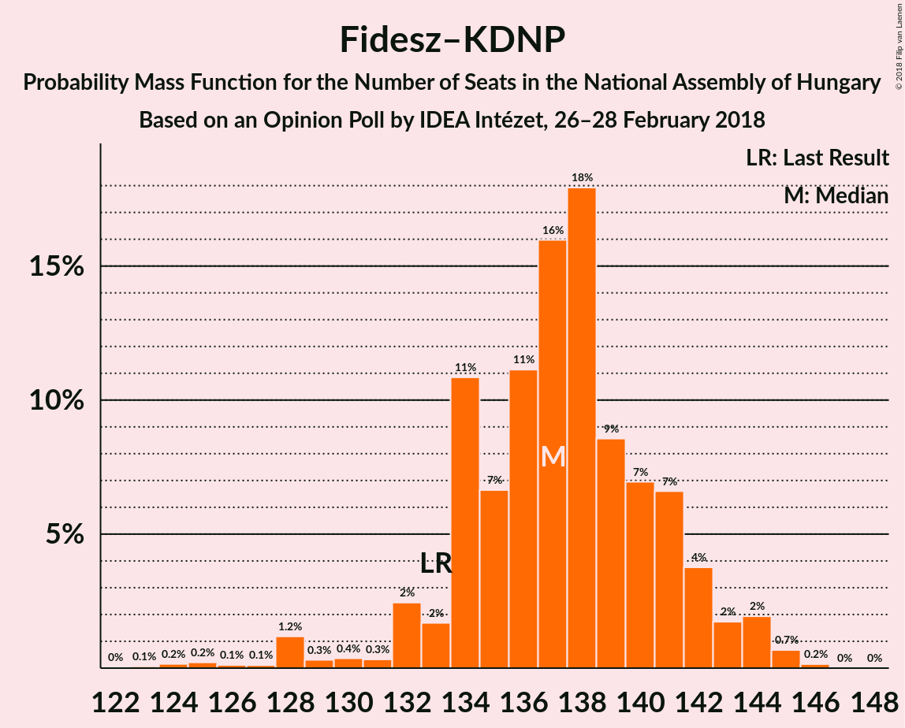

# Opinion Poll by IDEA Intézet, 26–28 February 2018

<a href="#voting-intentions">Voting Intentions</a> | <a href="#seats">Seats</a> | <a href="#coalitions">Coalitions</a> | <a href="#technical-information">Technical Information</a>

## Voting Intentions

### Confidence Intervals

| Party | Last Result | Poll Result | 80% Confidence Interval | 90% Confidence Interval | 95% Confidence Interval | 99% Confidence Interval |
|:-----:|:-----------:|:-----------:|:-----------------------:|:-----------------------:|:-----------------------:|:-----------------------:|
| Fidesz–KDNP | 44.9% | 35.8% | 33.9–37.8% |33.3–38.3% |32.9–38.8% |32.0–39.8% |
| Jobbik | 20.2% | 18.9% | 17.4–20.6% |16.9–21.0% |16.6–21.5% |15.9–22.3% |
| MSZP | 25.6% | 12.9% | 11.6–14.4% |11.3–14.8% |11.0–15.1% |10.4–15.9% |
| DK | 25.6% | 12.9% | 11.6–14.4% |11.3–14.8% |11.0–15.1% |10.4–15.9% |
| LMP | 5.3% | 8.0% | 7.0–9.2% |6.7–9.6% |6.5–9.9% |6.0–10.5% |
| MM | 0.0% | 2.0% | 1.5–2.7% |1.4–2.9% |1.3–3.1% |1.1–3.4% |
| Együtt | 25.6% | 1.0% | 0.7–1.5% |0.6–1.7% |0.5–1.8% |0.4–2.1% |
| MLP | 25.6% | 0.2% | 0.1–0.5% |0.1–0.6% |0.1–0.7% |0.0–0.9% |
| MKKP | 0.0% | 0.2% | 0.1–0.5% |0.1–0.6% |0.1–0.7% |0.0–0.9% |

*Note:* The poll result column reflects the actual value used in the calculations. Published results may vary slightly, and in addition be rounded to fewer digits.

## Seats

### Confidence Intervals

| Party | Last Result | Median | 80% Confidence Interval | 90% Confidence Interval | 95% Confidence Interval | 99% Confidence Interval |
|:-----:|:-----------:|:------:|:-----------------------:|:-----------------------:|:-----------------------:|:-----------------------:|
| <a href="#fidesz–kdnp">Fidesz–KDNP</a> | 133 | 137 | 134–141 |132–143 |132–144 |125–145 |
| <a href="#jobbik">Jobbik</a> | 23 | 21 | 17–24 |16–26 |16–27 |15–32 |
| <a href="#mszp">MSZP</a> | 29 | 12 | 11–15 |11–15 |10–15 |10–16 |
| <a href="#dk">DK</a> | 4 | 12 | 11–15 |11–15 |10–15 |10–16 |
| <a href="#lmp">LMP</a> | 5 | 8 | 6–9 |6–9 |6–9 |5–10 |
| <a href="#mm">MM</a> | 0 | 0 | 0 |0 |0 |0 |
| <a href="#együtt">Együtt</a> | 3 | 0 | 0 |0 |0 |0 |
| <a href="#mlp">MLP</a> | 1 | 0 | 0 |0 |0 |0 |
| <a href="#mkkp">MKKP</a> | 0 | 0 | 0 |0 |0 |0 |

### Fidesz–KDNP

*For a full overview of the results for this party, see the [Fidesz–KDNP](party-fidesz–kdnp.html) page.*

| Number of Seats | Probability | Accumulated | Special Marks |
|:---------------:|:-----------:|:-----------:|:-------------:|
| 122 | 0.1% | 100% |  |
| 123 | 0.1% | 99.9% |  |
| 124 | 0.2% | 99.8% |  |
| 125 | 0.2% | 99.6% |  |
| 126 | 0.1% | 99.4% |  |
| 127 | 0.1% | 99.3% |  |
| 128 | 0.7% | 99.2% |  |
| 129 | 0.3% | 98% |  |
| 130 | 0.2% | 98% |  |
| 131 | 0.3% | 98% |  |
| 132 | 3% | 98% |  |
| 133 | 1.1% | 94% | Last Result |
| 134 | 9% | 93% |  |
| 135 | 6% | 84% |  |
| 136 | 12% | 78% |  |
| 137 | 17% | 66% | Median |
| 138 | 19% | 49% |  |
| 139 | 7% | 30% |  |
| 140 | 7% | 23% |  |
| 141 | 7% | 16% |  |
| 142 | 3% | 9% |  |
| 143 | 2% | 6% |  |
| 144 | 3% | 4% |  |
| 145 | 0.8% | 1.0% |  |
| 146 | 0.2% | 0.2% |  |
| 147 | 0% | 0% |  |

### Jobbik

*For a full overview of the results for this party, see the [Jobbik](party-jobbik.html) page.*

| Number of Seats | Probability | Accumulated | Special Marks |
|:---------------:|:-----------:|:-----------:|:-------------:|
| 15 | 1.3% | 100% |  |
| 16 | 7% | 98.7% |  |
| 17 | 4% | 91% |  |
| 18 | 8% | 87% |  |
| 19 | 16% | 79% |  |
| 20 | 8% | 63% |  |
| 21 | 8% | 56% | Median |
| 22 | 15% | 47% |  |
| 23 | 14% | 33% | Last Result |
| 24 | 10% | 19% |  |
| 25 | 3% | 9% |  |
| 26 | 2% | 5% |  |
| 27 | 2% | 4% |  |
| 28 | 0.2% | 2% |  |
| 29 | 0.2% | 2% |  |
| 30 | 0.8% | 2% |  |
| 31 | 0.3% | 0.8% |  |
| 32 | 0.2% | 0.6% |  |
| 33 | 0.1% | 0.4% |  |
| 34 | 0.1% | 0.3% |  |
| 35 | 0.2% | 0.2% |  |
| 36 | 0% | 0% |  |

### MSZP

*For a full overview of the results for this party, see the [MSZP](party-mszp.html) page.*

| Number of Seats | Probability | Accumulated | Special Marks |
|:---------------:|:-----------:|:-----------:|:-------------:|
| 9 | 0.2% | 100% |  |
| 10 | 4% | 99.8% |  |
| 11 | 16% | 96% |  |
| 12 | 35% | 80% | Median |
| 13 | 12% | 45% |  |
| 14 | 18% | 33% |  |
| 15 | 13% | 15% |  |
| 16 | 2% | 2% |  |
| 17 | 0.2% | 0.2% |  |
| 18 | 0% | 0% |  |
| 19 | 0% | 0% |  |
| 20 | 0% | 0% |  |
| 21 | 0% | 0% |  |
| 22 | 0% | 0% |  |
| 23 | 0% | 0% |  |
| 24 | 0% | 0% |  |
| 25 | 0% | 0% |  |
| 26 | 0% | 0% |  |
| 27 | 0% | 0% |  |
| 28 | 0% | 0% |  |
| 29 | 0% | 0% | Last Result |

### DK

*For a full overview of the results for this party, see the [DK](party-dk.html) page.*

| Number of Seats | Probability | Accumulated | Special Marks |
|:---------------:|:-----------:|:-----------:|:-------------:|
| 4 | 0% | 100% | Last Result |
| 5 | 0% | 100% |  |
| 6 | 0% | 100% |  |
| 7 | 0% | 100% |  |
| 8 | 0% | 100% |  |
| 9 | 0.1% | 100% |  |
| 10 | 3% | 99.9% |  |
| 11 | 19% | 97% |  |
| 12 | 31% | 78% | Median |
| 13 | 9% | 47% |  |
| 14 | 27% | 38% |  |
| 15 | 8% | 11% |  |
| 16 | 2% | 2% |  |
| 17 | 0.2% | 0.2% |  |
| 18 | 0% | 0% |  |

### LMP

*For a full overview of the results for this party, see the [LMP](party-lmp.html) page.*

| Number of Seats | Probability | Accumulated | Special Marks |
|:---------------:|:-----------:|:-----------:|:-------------:|
| 5 | 0.6% | 100% | Last Result |
| 6 | 13% | 99.3% |  |
| 7 | 36% | 86% |  |
| 8 | 37% | 50% | Median |
| 9 | 12% | 14% |  |
| 10 | 2% | 2% |  |
| 11 | 0.1% | 0.1% |  |
| 12 | 0% | 0% |  |

### MM

*For a full overview of the results for this party, see the [MM](party-mm.html) page.*

| Number of Seats | Probability | Accumulated | Special Marks |
|:---------------:|:-----------:|:-----------:|:-------------:|
| 0 | 100% | 100% | Last Result, Median |

### Együtt

*For a full overview of the results for this party, see the [Együtt](party-együtt.html) page.*

| Number of Seats | Probability | Accumulated | Special Marks |
|:---------------:|:-----------:|:-----------:|:-------------:|
| 0 | 100% | 100% | Median |
| 1 | 0% | 0% |  |
| 2 | 0% | 0% |  |
| 3 | 0% | 0% | Last Result |

### MLP

*For a full overview of the results for this party, see the [MLP](party-mlp.html) page.*

| Number of Seats | Probability | Accumulated | Special Marks |
|:---------------:|:-----------:|:-----------:|:-------------:|
| 0 | 100% | 100% | Median |
| 1 | 0% | 0% | Last Result |

### MKKP

*For a full overview of the results for this party, see the [MKKP](party-mkkp.html) page.*

| Number of Seats | Probability | Accumulated | Special Marks |
|:---------------:|:-----------:|:-----------:|:-------------:|
| 0 | 100% | 100% | Last Result, Median |

## Coalitions

### Confidence Intervals

| Coalition | Last Result | Median | Majority? | 80% Confidence Interval | 90% Confidence Interval | 95% Confidence Interval | 99% Confidence Interval |
|:---------:|:-----------:|:------:|:---------:|:-----------------------:|:-----------------------:|:-----------------------:|:-----------------------:|
| Fidesz–KDNP | 133 | 137 | 100% | 134–141 | 132–143 | 132–144 | 125–145 |

### Fidesz–KDNP

| Number of Seats | Probability | Accumulated | Special Marks |
|:---------------:|:-----------:|:-----------:|:-------------:|
| 122 | 0.1% | 100% |  |
| 123 | 0.1% | 99.9% |  |
| 124 | 0.2% | 99.8% |  |
| 125 | 0.2% | 99.6% |  |
| 126 | 0.1% | 99.4% |  |
| 127 | 0.1% | 99.3% |  |
| 128 | 0.7% | 99.2% |  |
| 129 | 0.3% | 98% |  |
| 130 | 0.2% | 98% |  |
| 131 | 0.3% | 98% |  |
| 132 | 3% | 98% |  |
| 133 | 1.1% | 94% | Last Result |
| 134 | 9% | 93% |  |
| 135 | 6% | 84% |  |
| 136 | 12% | 78% |  |
| 137 | 17% | 66% | Median |
| 138 | 19% | 49% |  |
| 139 | 7% | 30% |  |
| 140 | 7% | 23% |  |
| 141 | 7% | 16% |  |
| 142 | 3% | 9% |  |
| 143 | 2% | 6% |  |
| 144 | 3% | 4% |  |
| 145 | 0.8% | 1.0% |  |
| 146 | 0.2% | 0.2% |  |
| 147 | 0% | 0% |  |

## Technical Information

### Opinion Poll

+ **Polling firm:** IDEA Intézet
+ **Commissioner(s):** —
+ **Fieldwork period:** 26–28 February 2018

### Calculations

+ **Sample size:** 1000
+ **Simulations done:** 2,097,152
+ **Error estimate:** 2.32%

