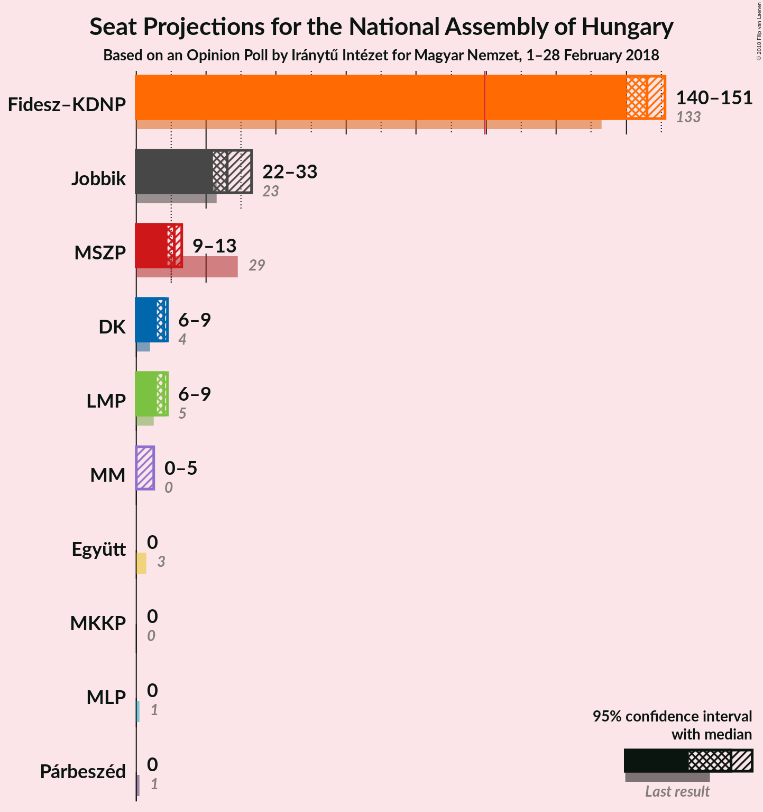
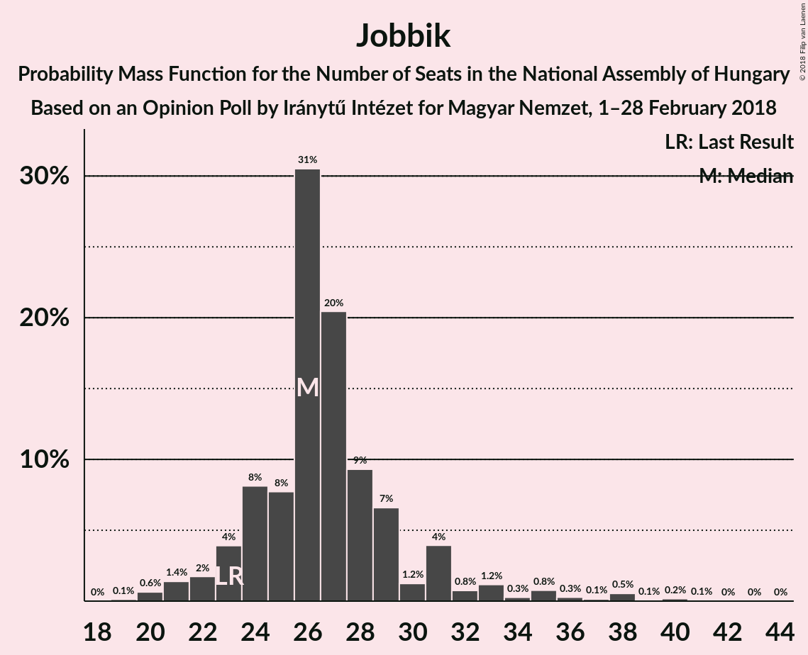
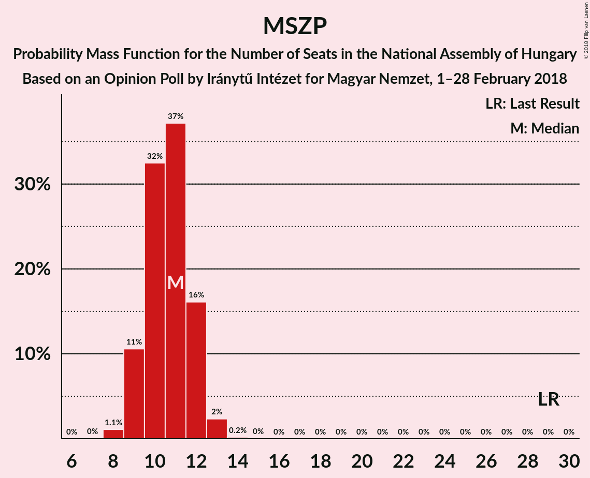
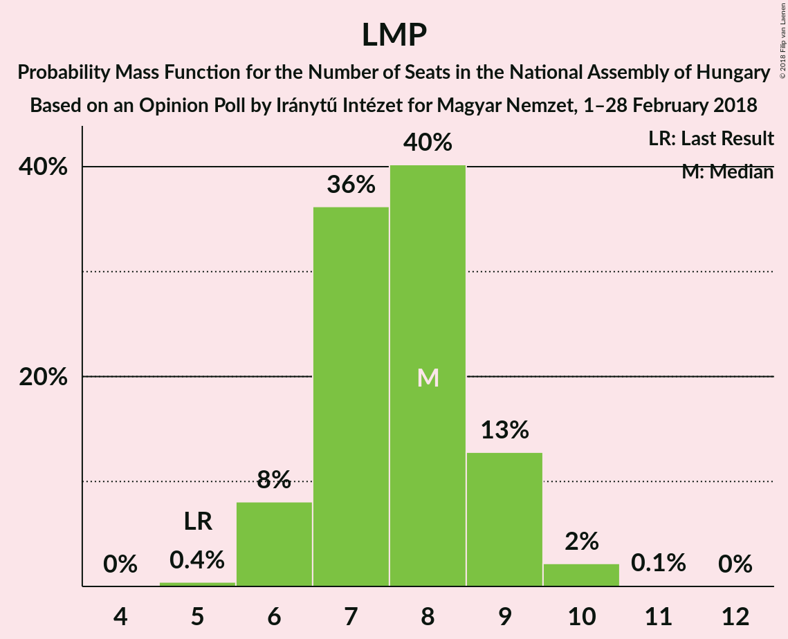
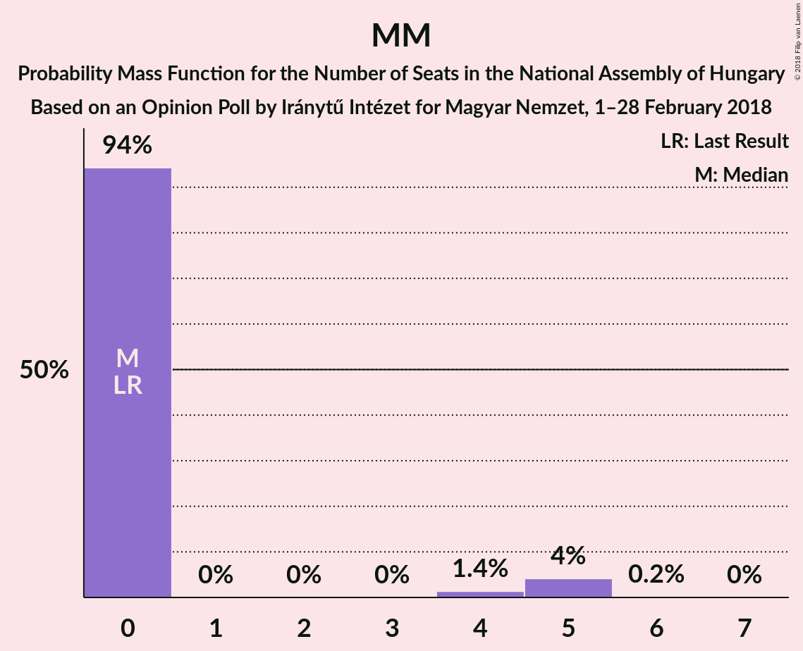
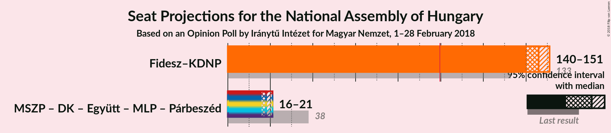

# Opinion Poll by Iránytű Intézet for Magyar Nemzet, 1–28 February 2018

<a href="#voting-intentions">Voting Intentions</a> | <a href="#seats">Seats</a> | <a href="#coalitions">Coalitions</a> | <a href="#technical-information">Technical Information</a>

## Voting Intentions

### Confidence Intervals

| Party | Last Result | Poll Result | 80% Confidence Interval | 90% Confidence Interval | 95% Confidence Interval | 99% Confidence Interval |
|:-----:|:-----------:|:-----------:|:-----------------------:|:-----------------------:|:-----------------------:|:-----------------------:|
| Fidesz–KDNP | 44.9% | 43.9% | 41.9–45.9% |41.3–46.5% |40.8–47.0% |39.9–48.0% |
| Jobbik | 20.2% | 23.9% | 22.2–25.7% |21.8–26.2% |21.4–26.6% |20.6–27.5% |
| MSZP | 25.6% | 11.0% | 9.8–12.4% |9.5–12.8% |9.2–13.1% |8.7–13.8% |
| LMP | 5.3% | 8.0% | 7.0–9.2% |6.7–9.6% |6.5–9.9% |6.0–10.5% |
| DK | 25.6% | 8.0% | 7.0–9.2% |6.7–9.6% |6.5–9.9% |6.0–10.5% |
| MM | 0.0% | 4.0% | 3.3–4.9% |3.1–5.2% |2.9–5.4% |2.7–5.9% |
| Együtt | 25.6% | 0.2% | 0.1–0.5% |0.1–0.6% |0.1–0.7% |0.0–0.9% |
| Párbeszéd | 25.6% | 0.2% | 0.1–0.5% |0.1–0.6% |0.1–0.7% |0.0–0.9% |
| MLP | 25.6% | 0.2% | 0.1–0.5% |0.1–0.6% |0.1–0.7% |0.0–0.9% |
| MKKP | 0.0% | 0.2% | 0.1–0.5% |0.1–0.6% |0.1–0.7% |0.0–0.9% |

*Note:* The poll result column reflects the actual value used in the calculations. Published results may vary slightly, and in addition be rounded to fewer digits.

## Seats

### Confidence Intervals

| Party | Last Result | Median | 80% Confidence Interval | 90% Confidence Interval | 95% Confidence Interval | 99% Confidence Interval |
|:-----:|:-----------:|:------:|:-----------------------:|:-----------------------:|:-----------------------:|:-----------------------:|
| <a href="#fidesz–kdnp">Fidesz–KDNP</a> | 133 | 146 | 143–149 |141–150 |140–151 |135–153 |
| <a href="#jobbik">Jobbik</a> | 23 | 26 | 24–29 |23–31 |22–33 |20–38 |
| <a href="#mszp">MSZP</a> | 29 | 11 | 9–12 |9–12 |9–13 |8–13 |
| <a href="#lmp">LMP</a> | 5 | 8 | 7–9 |6–9 |6–9 |6–10 |
| <a href="#dk">DK</a> | 4 | 8 | 6–9 |6–9 |6–9 |6–10 |
| <a href="#mm">MM</a> | 0 | 0 | 0 |0–4 |0–5 |0–5 |
| <a href="#együtt">Együtt</a> | 3 | 0 | 0 |0 |0 |0 |
| <a href="#párbeszéd">Párbeszéd</a> | 1 | 0 | 0 |0 |0 |0 |
| <a href="#mlp">MLP</a> | 1 | 0 | 0 |0 |0 |0 |
| <a href="#mkkp">MKKP</a> | 0 | 0 | 0 |0 |0 |0 |

### Fidesz–KDNP

*For a full overview of the results for this party, see the [Fidesz–KDNP](party-fidesz–kdnp.html) page.*

| Number of Seats | Probability | Accumulated | Special Marks |
|:---------------:|:-----------:|:-----------:|:-------------:|
| 131 | 0% | 100% |  |
| 132 | 0.1% | 99.9% |  |
| 133 | 0.1% | 99.8% | Last Result |
| 134 | 0.1% | 99.7% |  |
| 135 | 0.3% | 99.6% |  |
| 136 | 0.5% | 99.3% |  |
| 137 | 0.2% | 98.8% |  |
| 138 | 0.6% | 98.6% |  |
| 139 | 0.4% | 98% |  |
| 140 | 1.1% | 98% |  |
| 141 | 3% | 96% |  |
| 142 | 0.9% | 93% |  |
| 143 | 5% | 92% |  |
| 144 | 4% | 88% |  |
| 145 | 12% | 84% |  |
| 146 | 32% | 72% | Median |
| 147 | 9% | 41% |  |
| 148 | 17% | 31% |  |
| 149 | 8% | 14% |  |
| 150 | 2% | 6% |  |
| 151 | 2% | 4% |  |
| 152 | 1.1% | 2% |  |
| 153 | 1.0% | 1.2% |  |
| 154 | 0.1% | 0.2% |  |
| 155 | 0.1% | 0.1% |  |
| 156 | 0% | 0% |  |

### Jobbik

*For a full overview of the results for this party, see the [Jobbik](party-jobbik.html) page.*

| Number of Seats | Probability | Accumulated | Special Marks |
|:---------------:|:-----------:|:-----------:|:-------------:|
| 19 | 0.1% | 100% |  |
| 20 | 0.6% | 99.9% |  |
| 21 | 1.4% | 99.2% |  |
| 22 | 2% | 98% |  |
| 23 | 4% | 96% | Last Result |
| 24 | 8% | 92% |  |
| 25 | 8% | 84% |  |
| 26 | 31% | 76% | Median |
| 27 | 20% | 46% |  |
| 28 | 9% | 25% |  |
| 29 | 7% | 16% |  |
| 30 | 1.2% | 9% |  |
| 31 | 4% | 8% |  |
| 32 | 0.8% | 4% |  |
| 33 | 1.2% | 4% |  |
| 34 | 0.3% | 2% |  |
| 35 | 0.8% | 2% |  |
| 36 | 0.3% | 1.3% |  |
| 37 | 0.1% | 1.0% |  |
| 38 | 0.5% | 0.9% |  |
| 39 | 0.1% | 0.3% |  |
| 40 | 0.2% | 0.3% |  |
| 41 | 0.1% | 0.1% |  |
| 42 | 0% | 0.1% |  |
| 43 | 0% | 0% |  |

### MSZP

*For a full overview of the results for this party, see the [MSZP](party-mszp.html) page.*

| Number of Seats | Probability | Accumulated | Special Marks |
|:---------------:|:-----------:|:-----------:|:-------------:|
| 8 | 1.1% | 100% |  |
| 9 | 11% | 98.9% |  |
| 10 | 32% | 88% |  |
| 11 | 37% | 56% | Median |
| 12 | 16% | 19% |  |
| 13 | 2% | 3% |  |
| 14 | 0.2% | 0.2% |  |
| 15 | 0% | 0% |  |
| 16 | 0% | 0% |  |
| 17 | 0% | 0% |  |
| 18 | 0% | 0% |  |
| 19 | 0% | 0% |  |
| 20 | 0% | 0% |  |
| 21 | 0% | 0% |  |
| 22 | 0% | 0% |  |
| 23 | 0% | 0% |  |
| 24 | 0% | 0% |  |
| 25 | 0% | 0% |  |
| 26 | 0% | 0% |  |
| 27 | 0% | 0% |  |
| 28 | 0% | 0% |  |
| 29 | 0% | 0% | Last Result |

### LMP

*For a full overview of the results for this party, see the [LMP](party-lmp.html) page.*

| Number of Seats | Probability | Accumulated | Special Marks |
|:---------------:|:-----------:|:-----------:|:-------------:|
| 5 | 0.4% | 100% | Last Result |
| 6 | 8% | 99.6% |  |
| 7 | 36% | 92% |  |
| 8 | 40% | 55% | Median |
| 9 | 13% | 15% |  |
| 10 | 2% | 2% |  |
| 11 | 0.1% | 0.1% |  |
| 12 | 0% | 0% |  |

### DK

*For a full overview of the results for this party, see the [DK](party-dk.html) page.*

| Number of Seats | Probability | Accumulated | Special Marks |
|:---------------:|:-----------:|:-----------:|:-------------:|
| 4 | 0% | 100% | Last Result |
| 5 | 0.4% | 100% |  |
| 6 | 10% | 99.6% |  |
| 7 | 38% | 89% |  |
| 8 | 34% | 52% | Median |
| 9 | 16% | 17% |  |
| 10 | 2% | 2% |  |
| 11 | 0.1% | 0.1% |  |
| 12 | 0% | 0% |  |

### MM

*For a full overview of the results for this party, see the [MM](party-mm.html) page.*

| Number of Seats | Probability | Accumulated | Special Marks |
|:---------------:|:-----------:|:-----------:|:-------------:|
| 0 | 94% | 100% | Last Result, Median |
| 1 | 0% | 6% |  |
| 2 | 0% | 6% |  |
| 3 | 0% | 6% |  |
| 4 | 1.4% | 6% |  |
| 5 | 4% | 4% |  |
| 6 | 0.2% | 0.2% |  |
| 7 | 0% | 0% |  |

### Együtt

*For a full overview of the results for this party, see the [Együtt](party-együtt.html) page.*

| Number of Seats | Probability | Accumulated | Special Marks |
|:---------------:|:-----------:|:-----------:|:-------------:|
| 0 | 100% | 100% | Median |
| 1 | 0% | 0% |  |
| 2 | 0% | 0% |  |
| 3 | 0% | 0% | Last Result |

### Párbeszéd

*For a full overview of the results for this party, see the [Párbeszéd](party-párbeszéd.html) page.*

| Number of Seats | Probability | Accumulated | Special Marks |
|:---------------:|:-----------:|:-----------:|:-------------:|
| 0 | 100% | 100% | Median |
| 1 | 0% | 0% | Last Result |

### MLP

*For a full overview of the results for this party, see the [MLP](party-mlp.html) page.*

| Number of Seats | Probability | Accumulated | Special Marks |
|:---------------:|:-----------:|:-----------:|:-------------:|
| 0 | 100% | 100% | Median |
| 1 | 0% | 0% | Last Result |

### MKKP

*For a full overview of the results for this party, see the [MKKP](party-mkkp.html) page.*

| Number of Seats | Probability | Accumulated | Special Marks |
|:---------------:|:-----------:|:-----------:|:-------------:|
| 0 | 100% | 100% | Last Result, Median |

## Coalitions

### Confidence Intervals

| Coalition | Last Result | Median | Majority? | 80% Confidence Interval | 90% Confidence Interval | 95% Confidence Interval | 99% Confidence Interval |
|:---------:|:-----------:|:------:|:---------:|:-----------------------:|:-----------------------:|:-----------------------:|:-----------------------:|
| Fidesz–KDNP | 133 | 146 | 100% | 143–149 | 141–150 | 140–151 | 135–153 |
| MSZP – DK – Együtt – MLP – Párbeszéd | 38 | 18 | 0% | 17–20 | 16–20 | 16–21 | 15–22 |

### Fidesz–KDNP

| Number of Seats | Probability | Accumulated | Special Marks |
|:---------------:|:-----------:|:-----------:|:-------------:|
| 131 | 0% | 100% |  |
| 132 | 0.1% | 99.9% |  |
| 133 | 0.1% | 99.8% | Last Result |
| 134 | 0.1% | 99.7% |  |
| 135 | 0.3% | 99.6% |  |
| 136 | 0.5% | 99.3% |  |
| 137 | 0.2% | 98.8% |  |
| 138 | 0.6% | 98.6% |  |
| 139 | 0.4% | 98% |  |
| 140 | 1.1% | 98% |  |
| 141 | 3% | 96% |  |
| 142 | 0.9% | 93% |  |
| 143 | 5% | 92% |  |
| 144 | 4% | 88% |  |
| 145 | 12% | 84% |  |
| 146 | 32% | 72% | Median |
| 147 | 9% | 41% |  |
| 148 | 17% | 31% |  |
| 149 | 8% | 14% |  |
| 150 | 2% | 6% |  |
| 151 | 2% | 4% |  |
| 152 | 1.1% | 2% |  |
| 153 | 1.0% | 1.2% |  |
| 154 | 0.1% | 0.2% |  |
| 155 | 0.1% | 0.1% |  |
| 156 | 0% | 0% |  |

### MSZP – DK – Együtt – MLP – Párbeszéd

| Number of Seats | Probability | Accumulated | Special Marks |
|:---------------:|:-----------:|:-----------:|:-------------:|
| 14 | 0.1% | 100% |  |
| 15 | 2% | 99.9% |  |
| 16 | 7% | 98% |  |
| 17 | 20% | 91% |  |
| 18 | 29% | 71% |  |
| 19 | 27% | 42% | Median |
| 20 | 11% | 16% |  |
| 21 | 4% | 4% |  |
| 22 | 0.5% | 0.5% |  |
| 23 | 0% | 0.1% |  |
| 24 | 0% | 0% |  |
| 25 | 0% | 0% |  |
| 26 | 0% | 0% |  |
| 27 | 0% | 0% |  |
| 28 | 0% | 0% |  |
| 29 | 0% | 0% |  |
| 30 | 0% | 0% |  |
| 31 | 0% | 0% |  |
| 32 | 0% | 0% |  |
| 33 | 0% | 0% |  |
| 34 | 0% | 0% |  |
| 35 | 0% | 0% |  |
| 36 | 0% | 0% |  |
| 37 | 0% | 0% |  |
| 38 | 0% | 0% | Last Result |

## Technical Information

### Opinion Poll

+ **Polling firm:** Iránytű Intézet
+ **Commissioner(s):** Magyar Nemzet
+ **Fieldwork period:** 1–28 February 2018

### Calculations

+ **Sample size:** 1000
+ **Simulations done:** 4,194,304
+ **Error estimate:** 2.23%

