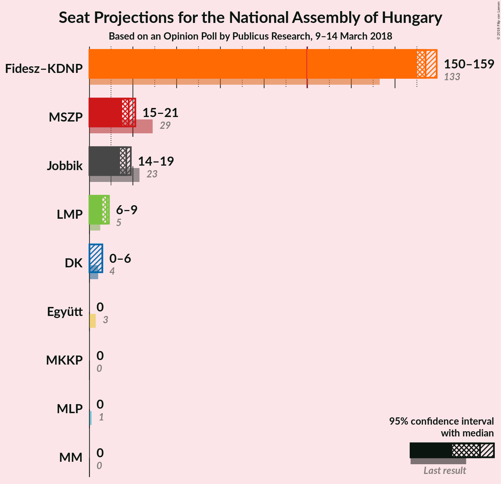
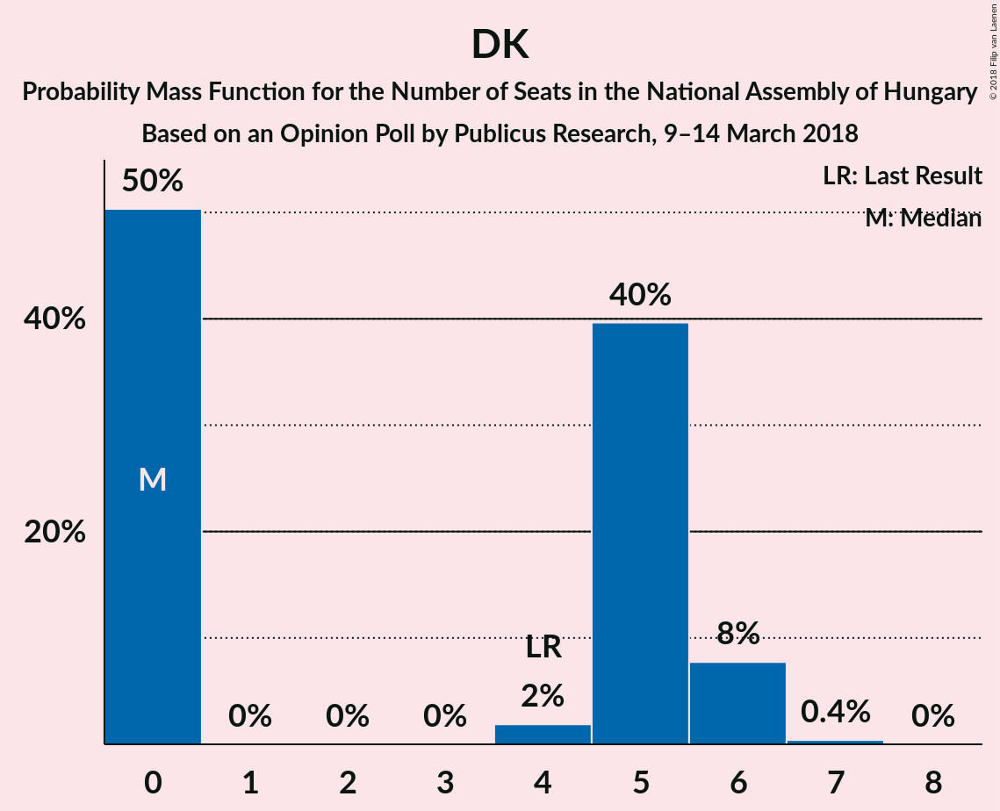
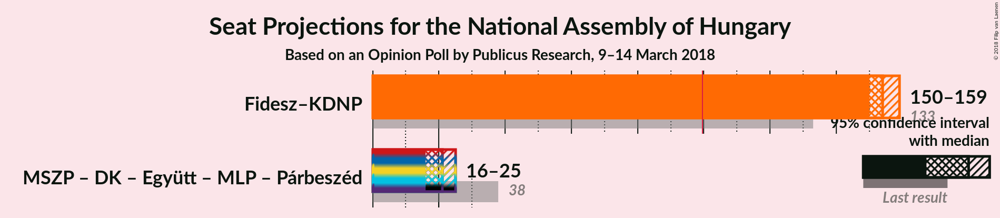

# Opinion Poll by Publicus Research, 9–14 March 2018

<a href="#voting-intentions">Voting Intentions</a> | <a href="#seats">Seats</a> | <a href="#coalitions">Coalitions</a> | <a href="#technical-information">Technical Information</a>

## Voting Intentions

### Confidence Intervals

| Party | Last Result | Poll Result | 80% Confidence Interval | 90% Confidence Interval | 95% Confidence Interval | 99% Confidence Interval |
|:-----:|:-----------:|:-----------:|:-----------------------:|:-----------------------:|:-----------------------:|:-----------------------:|
| Fidesz–KDNP | 44.9% | 48.8% | 46.7–50.8% |46.2–51.4% |45.7–51.9% |44.7–52.8% |
| MSZP | 25.6% | 17.9% | 16.5–19.6% |16.0–20.0% |15.7–20.5% |15.0–21.3% |
| Jobbik | 20.2% | 16.9% | 15.5–18.5% |15.1–19.0% |14.8–19.4% |14.1–20.2% |
| LMP | 5.3% | 8.0% | 7.0–9.2% |6.7–9.5% |6.4–9.8% |6.0–10.4% |
| DK | 25.6% | 5.0% | 4.2–6.0% |4.0–6.3% |3.8–6.5% |3.5–7.0% |
| Együtt | 25.6% | 1.0% | 0.7–1.5% |0.6–1.7% |0.5–1.8% |0.4–2.1% |
| MKKP | 0.0% | 1.0% | 0.7–1.5% |0.6–1.7% |0.5–1.8% |0.4–2.1% |
| MM | 0.0% | 1.0% | 0.7–1.5% |0.6–1.7% |0.5–1.8% |0.4–2.1% |
| MLP | 25.6% | 0.2% | 0.1–0.5% |0.1–0.6% |0.1–0.7% |0.0–0.9% |

*Note:* The poll result column reflects the actual value used in the calculations. Published results may vary slightly, and in addition be rounded to fewer digits.

## Seats

### Confidence Intervals

| Party | Last Result | Median | 80% Confidence Interval | 90% Confidence Interval | 95% Confidence Interval | 99% Confidence Interval |
|:-----:|:-----------:|:------:|:-----------------------:|:-----------------------:|:-----------------------:|:-----------------------:|
| <a href="#fidesz–kdnp">Fidesz–KDNP</a> | 133 | 154 | 151–157 |150–158 |150–159 |148–160 |
| <a href="#mszp">MSZP</a> | 29 | 18 | 16–20 |16–21 |15–21 |15–22 |
| <a href="#jobbik">Jobbik</a> | 23 | 17 | 15–18 |15–19 |14–19 |13–20 |
| <a href="#lmp">LMP</a> | 5 | 8 | 7–9 |6–9 |6–9 |5–10 |
| <a href="#dk">DK</a> | 4 | 0 | 0–5 |0–6 |0–6 |0–6 |
| <a href="#együtt">Együtt</a> | 3 | 0 | 0 |0 |0 |0 |
| <a href="#mkkp">MKKP</a> | 0 | 0 | 0 |0 |0 |0 |
| <a href="#mm">MM</a> | 0 | 0 | 0 |0 |0 |0 |
| <a href="#mlp">MLP</a> | 1 | 0 | 0 |0 |0 |0 |

### Fidesz–KDNP

*For a full overview of the results for this party, see the [Fidesz–KDNP](party-fidesz–kdnp.html) page.*

| Number of Seats | Probability | Accumulated | Special Marks |
|:---------------:|:-----------:|:-----------:|:-------------:|
| 133 | 0% | 100% | Last Result |
| 134 | 0% | 100% |  |
| 135 | 0% | 100% |  |
| 136 | 0% | 100% |  |
| 137 | 0% | 100% |  |
| 138 | 0% | 100% |  |
| 139 | 0% | 100% |  |
| 140 | 0% | 100% |  |
| 141 | 0% | 100% |  |
| 142 | 0% | 100% |  |
| 143 | 0% | 100% |  |
| 144 | 0% | 100% |  |
| 145 | 0% | 100% |  |
| 146 | 0% | 100% |  |
| 147 | 0.1% | 100% |  |
| 148 | 0.4% | 99.9% |  |
| 149 | 2% | 99.5% |  |
| 150 | 5% | 98% |  |
| 151 | 9% | 93% |  |
| 152 | 9% | 84% |  |
| 153 | 14% | 75% |  |
| 154 | 17% | 62% | Median |
| 155 | 17% | 45% |  |
| 156 | 7% | 27% |  |
| 157 | 15% | 20% |  |
| 158 | 3% | 5% |  |
| 159 | 2% | 3% |  |
| 160 | 0.5% | 0.6% |  |
| 161 | 0.1% | 0.1% |  |
| 162 | 0% | 0% |  |

### MSZP

*For a full overview of the results for this party, see the [MSZP](party-mszp.html) page.*

| Number of Seats | Probability | Accumulated | Special Marks |
|:---------------:|:-----------:|:-----------:|:-------------:|
| 14 | 0.4% | 100% |  |
| 15 | 4% | 99.6% |  |
| 16 | 14% | 96% |  |
| 17 | 17% | 82% |  |
| 18 | 19% | 65% | Median |
| 19 | 21% | 45% |  |
| 20 | 17% | 24% |  |
| 21 | 6% | 8% |  |
| 22 | 1.5% | 2% |  |
| 23 | 0.2% | 0.3% |  |
| 24 | 0% | 0% |  |
| 25 | 0% | 0% |  |
| 26 | 0% | 0% |  |
| 27 | 0% | 0% |  |
| 28 | 0% | 0% |  |
| 29 | 0% | 0% | Last Result |

### Jobbik

*For a full overview of the results for this party, see the [Jobbik](party-jobbik.html) page.*

| Number of Seats | Probability | Accumulated | Special Marks |
|:---------------:|:-----------:|:-----------:|:-------------:|
| 13 | 0.5% | 100% |  |
| 14 | 4% | 99.4% |  |
| 15 | 15% | 96% |  |
| 16 | 25% | 81% |  |
| 17 | 34% | 56% | Median |
| 18 | 16% | 22% |  |
| 19 | 4% | 6% |  |
| 20 | 2% | 2% |  |
| 21 | 0.2% | 0.2% |  |
| 22 | 0% | 0% |  |
| 23 | 0% | 0% | Last Result |

### LMP

*For a full overview of the results for this party, see the [LMP](party-lmp.html) page.*

| Number of Seats | Probability | Accumulated | Special Marks |
|:---------------:|:-----------:|:-----------:|:-------------:|
| 5 | 0.8% | 100% | Last Result |
| 6 | 8% | 99.1% |  |
| 7 | 33% | 91% |  |
| 8 | 36% | 58% | Median |
| 9 | 21% | 22% |  |
| 10 | 1.3% | 1.5% |  |
| 11 | 0.1% | 0.1% |  |
| 12 | 0% | 0% |  |

### DK

*For a full overview of the results for this party, see the [DK](party-dk.html) page.*

| Number of Seats | Probability | Accumulated | Special Marks |
|:---------------:|:-----------:|:-----------:|:-------------:|
| 0 | 55% | 100% | Median |
| 1 | 0% | 45% |  |
| 2 | 0% | 45% |  |
| 3 | 0% | 45% |  |
| 4 | 0.5% | 45% | Last Result |
| 5 | 36% | 44% |  |
| 6 | 8% | 8% |  |
| 7 | 0.3% | 0.3% |  |
| 8 | 0% | 0% |  |

### Együtt

*For a full overview of the results for this party, see the [Együtt](party-együtt.html) page.*

| Number of Seats | Probability | Accumulated | Special Marks |
|:---------------:|:-----------:|:-----------:|:-------------:|
| 0 | 100% | 100% | Median |
| 1 | 0% | 0% |  |
| 2 | 0% | 0% |  |
| 3 | 0% | 0% | Last Result |

### MKKP

*For a full overview of the results for this party, see the [MKKP](party-mkkp.html) page.*

| Number of Seats | Probability | Accumulated | Special Marks |
|:---------------:|:-----------:|:-----------:|:-------------:|
| 0 | 100% | 100% | Last Result, Median |

### MM

*For a full overview of the results for this party, see the [MM](party-mm.html) page.*

| Number of Seats | Probability | Accumulated | Special Marks |
|:---------------:|:-----------:|:-----------:|:-------------:|
| 0 | 100% | 100% | Last Result, Median |

### MLP

*For a full overview of the results for this party, see the [MLP](party-mlp.html) page.*

| Number of Seats | Probability | Accumulated | Special Marks |
|:---------------:|:-----------:|:-----------:|:-------------:|
| 0 | 100% | 100% | Median |
| 1 | 0% | 0% | Last Result |

## Coalitions

### Confidence Intervals

| Coalition | Last Result | Median | Majority? | 80% Confidence Interval | 90% Confidence Interval | 95% Confidence Interval | 99% Confidence Interval |
|:---------:|:-----------:|:------:|:---------:|:-----------------------:|:-----------------------:|:-----------------------:|:-----------------------:|
| Fidesz–KDNP | 133 | 154 | 100% | 151–157 | 150–158 | 150–159 | 148–160 |

### Fidesz–KDNP

| Number of Seats | Probability | Accumulated | Special Marks |
|:---------------:|:-----------:|:-----------:|:-------------:|
| 133 | 0% | 100% | Last Result |
| 134 | 0% | 100% |  |
| 135 | 0% | 100% |  |
| 136 | 0% | 100% |  |
| 137 | 0% | 100% |  |
| 138 | 0% | 100% |  |
| 139 | 0% | 100% |  |
| 140 | 0% | 100% |  |
| 141 | 0% | 100% |  |
| 142 | 0% | 100% |  |
| 143 | 0% | 100% |  |
| 144 | 0% | 100% |  |
| 145 | 0% | 100% |  |
| 146 | 0% | 100% |  |
| 147 | 0.1% | 100% |  |
| 148 | 0.4% | 99.9% |  |
| 149 | 2% | 99.5% |  |
| 150 | 5% | 98% |  |
| 151 | 9% | 93% |  |
| 152 | 9% | 84% |  |
| 153 | 14% | 75% |  |
| 154 | 17% | 62% | Median |
| 155 | 17% | 45% |  |
| 156 | 7% | 27% |  |
| 157 | 15% | 20% |  |
| 158 | 3% | 5% |  |
| 159 | 2% | 3% |  |
| 160 | 0.5% | 0.6% |  |
| 161 | 0.1% | 0.1% |  |
| 162 | 0% | 0% |  |

## Technical Information

### Opinion Poll

+ **Polling firm:** Publicus Research
+ **Commissioner(s):** —
+ **Fieldwork period:** 9–14 March 2018

### Calculations

+ **Sample size:** 1003
+ **Simulations done:** 2,097,152
+ **Error estimate:** 1.80%

