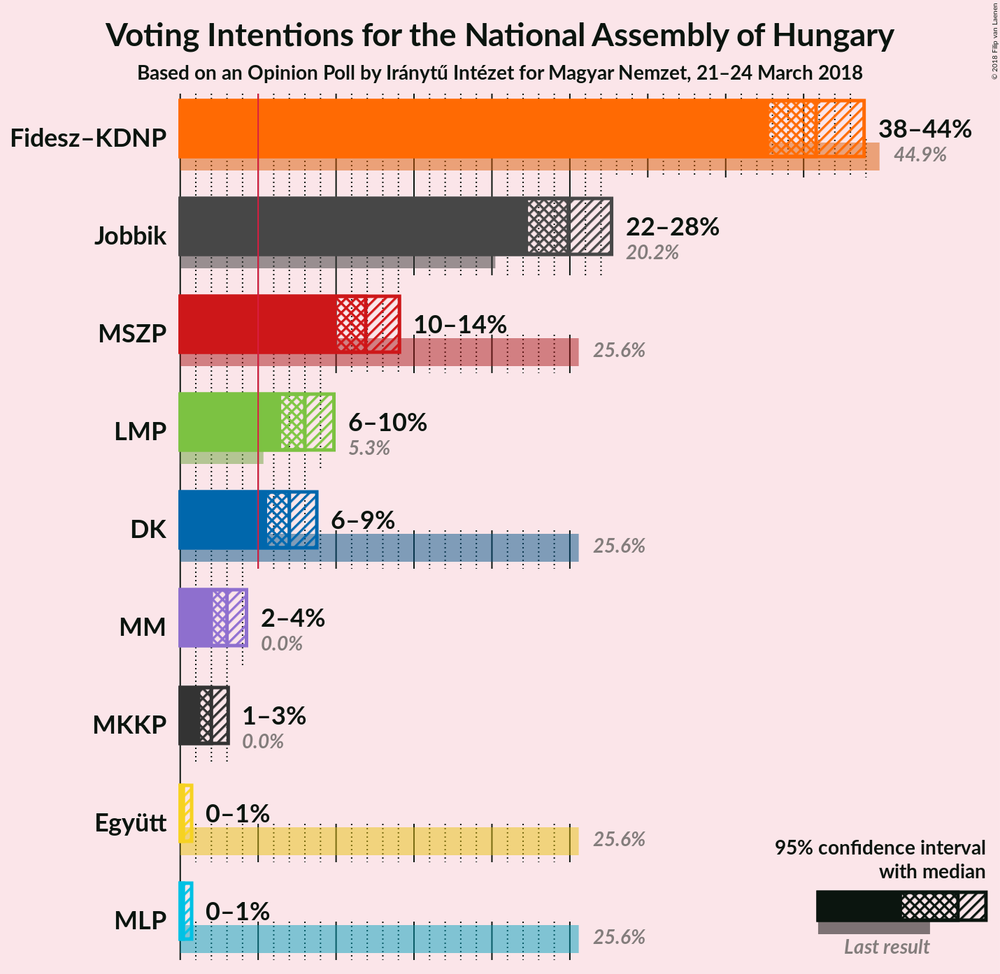
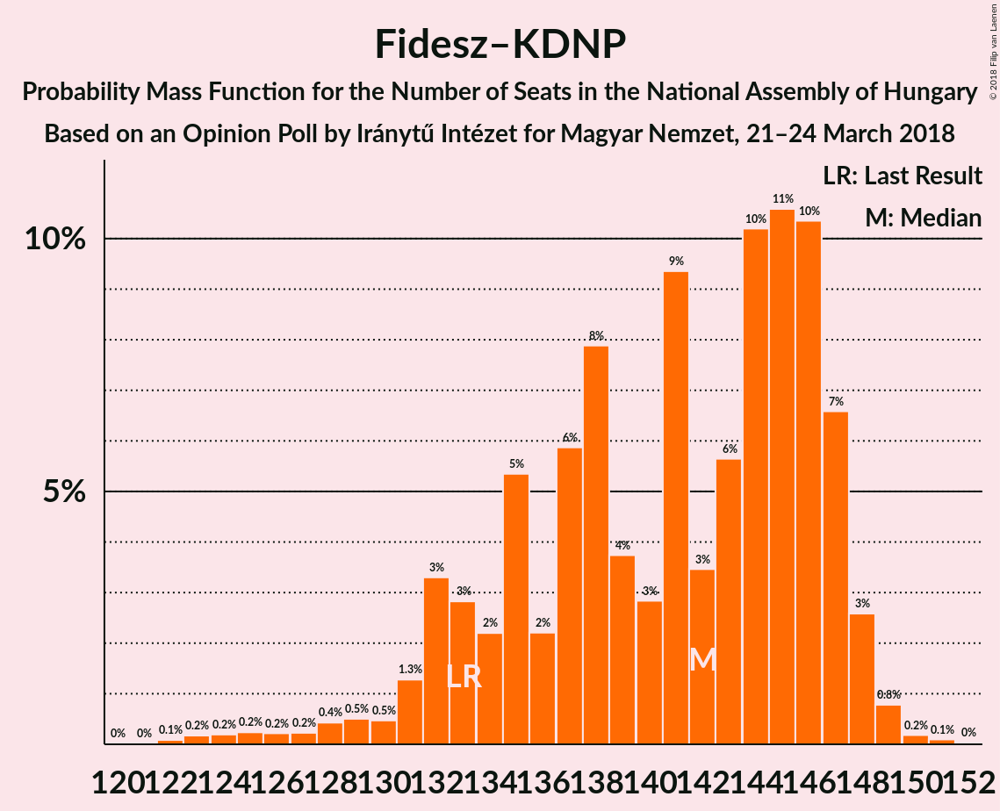
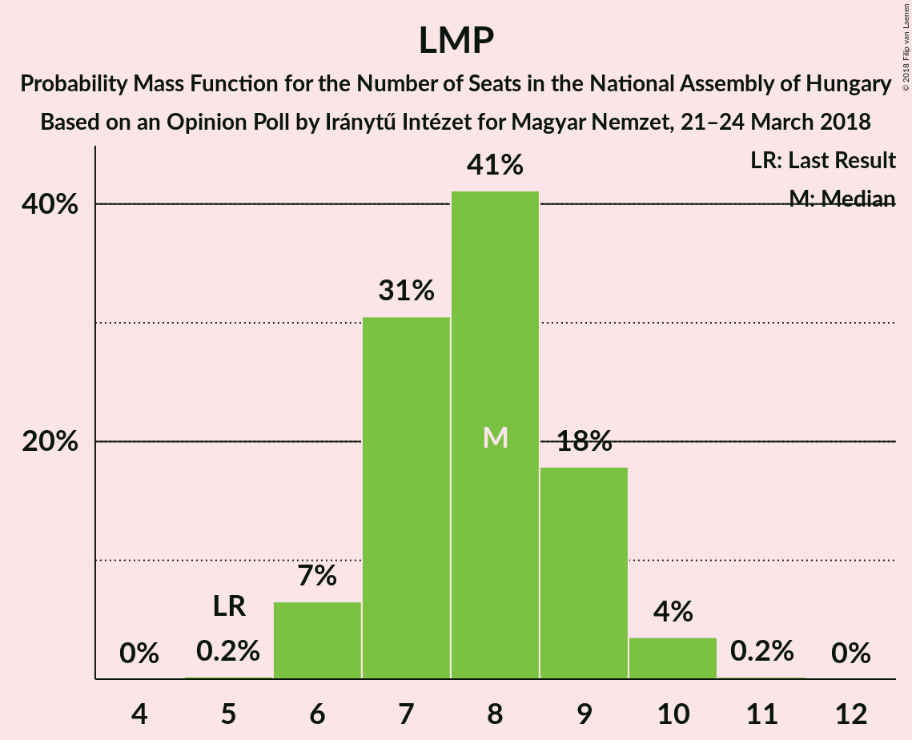
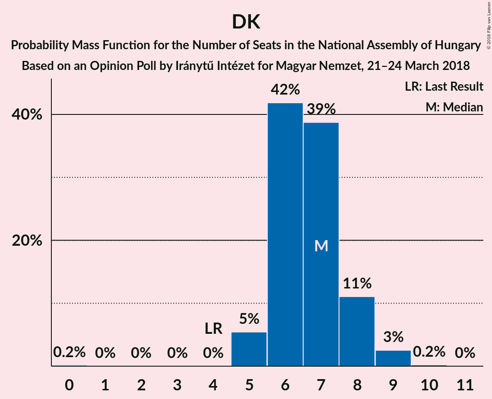

# Opinion Poll by Iránytű Intézet for Magyar Nemzet, 21–24 March 2018

<a href="#voting-intentions">Voting Intentions</a> | <a href="#seats">Seats</a> | <a href="#coalitions">Coalitions</a> | <a href="#technical-information">Technical Information</a>

## Voting Intentions

### Confidence Intervals

| Party | Last Result | Poll Result | 80% Confidence Interval | 90% Confidence Interval | 95% Confidence Interval | 99% Confidence Interval |
|:-----:|:-----------:|:-----------:|:-----------------------:|:-----------------------:|:-----------------------:|:-----------------------:|
| Fidesz–KDNP | 44.9% | 40.8% | 38.8–42.8% |38.3–43.4% |37.8–43.9% |36.9–44.9% |
| Jobbik | 20.2% | 24.9% | 23.2–26.7% |22.7–27.2% |22.3–27.7% |21.5–28.6% |
| MSZP | 25.6% | 11.9% | 10.7–13.3% |10.3–13.7% |10.0–14.1% |9.5–14.8% |
| LMP | 5.3% | 8.0% | 7.0–9.2% |6.7–9.6% |6.5–9.9% |6.0–10.5% |
| DK | 25.6% | 7.0% | 6.1–8.2% |5.8–8.5% |5.6–8.8% |5.2–9.3% |
| MM | 0.0% | 3.0% | 2.4–3.8% |2.2–4.1% |2.1–4.3% |1.9–4.7% |
| MKKP | 0.0% | 2.0% | 1.5–2.7% |1.4–2.9% |1.3–3.1% |1.1–3.4% |
| Együtt | 25.6% | 0.2% | 0.1–0.5% |0.1–0.6% |0.1–0.7% |0.0–0.9% |
| MLP | 25.6% | 0.2% | 0.1–0.5% |0.1–0.6% |0.1–0.7% |0.0–0.9% |

*Note:* The poll result column reflects the actual value used in the calculations. Published results may vary slightly, and in addition be rounded to fewer digits.

## Seats

### Confidence Intervals

| Party | Last Result | Median | 80% Confidence Interval | 90% Confidence Interval | 95% Confidence Interval | 99% Confidence Interval |
|:-----:|:-----------:|:------:|:-----------------------:|:-----------------------:|:-----------------------:|:-----------------------:|
| <a href="#fidesz–kdnp">Fidesz–KDNP</a> | 133 | 142 | 133–147 |132–147 |130–148 |124–149 |
| <a href="#jobbik">Jobbik</a> | 23 | 31 | 27–39 |26–41 |26–42 |24–48 |
| <a href="#mszp">MSZP</a> | 29 | 12 | 10–13 |10–13 |10–14 |9–16 |
| <a href="#lmp">LMP</a> | 5 | 8 | 7–9 |6–9 |6–10 |6–10 |
| <a href="#dk">DK</a> | 4 | 7 | 6–8 |5–8 |5–9 |5–9 |
| <a href="#mm">MM</a> | 0 | 0 | 0 |0 |0 |0 |
| <a href="#mkkp">MKKP</a> | 0 | 0 | 0 |0 |0 |0 |
| <a href="#együtt">Együtt</a> | 3 | 0 | 0 |0 |0 |0 |
| <a href="#mlp">MLP</a> | 1 | 0 | 0 |0 |0 |0 |

### Fidesz–KDNP

*For a full overview of the results for this party, see the [Fidesz–KDNP](party-fidesz–kdnp.html) page.*

| Number of Seats | Probability | Accumulated | Special Marks |
|:---------------:|:-----------:|:-----------:|:-------------:|
| 121 | 0% | 100% |  |
| 122 | 0.1% | 99.9% |  |
| 123 | 0.2% | 99.8% |  |
| 124 | 0.2% | 99.7% |  |
| 125 | 0.2% | 99.5% |  |
| 126 | 0.2% | 99.2% |  |
| 127 | 0.2% | 99.0% |  |
| 128 | 0.4% | 98.8% |  |
| 129 | 0.5% | 98% |  |
| 130 | 0.5% | 98% |  |
| 131 | 1.3% | 97% |  |
| 132 | 3% | 96% |  |
| 133 | 3% | 93% | Last Result |
| 134 | 2% | 90% |  |
| 135 | 5% | 88% |  |
| 136 | 2% | 82% |  |
| 137 | 6% | 80% |  |
| 138 | 8% | 74% |  |
| 139 | 4% | 66% |  |
| 140 | 3% | 63% |  |
| 141 | 9% | 60% |  |
| 142 | 3% | 51% | Median |
| 143 | 6% | 47% |  |
| 144 | 10% | 41% |  |
| 145 | 11% | 31% |  |
| 146 | 10% | 21% |  |
| 147 | 7% | 10% |  |
| 148 | 3% | 4% |  |
| 149 | 0.8% | 1.1% |  |
| 150 | 0.2% | 0.3% |  |
| 151 | 0.1% | 0.1% |  |
| 152 | 0% | 0% |  |

### Jobbik

*For a full overview of the results for this party, see the [Jobbik](party-jobbik.html) page.*

| Number of Seats | Probability | Accumulated | Special Marks |
|:---------------:|:-----------:|:-----------:|:-------------:|
| 21 | 0% | 100% |  |
| 22 | 0% | 99.9% |  |
| 23 | 0.2% | 99.9% | Last Result |
| 24 | 0.5% | 99.7% |  |
| 25 | 1.4% | 99.2% |  |
| 26 | 8% | 98% |  |
| 27 | 14% | 90% |  |
| 28 | 7% | 76% |  |
| 29 | 9% | 68% |  |
| 30 | 7% | 59% |  |
| 31 | 6% | 52% | Median |
| 32 | 7% | 46% |  |
| 33 | 1.5% | 39% |  |
| 34 | 6% | 38% |  |
| 35 | 8% | 32% |  |
| 36 | 6% | 25% |  |
| 37 | 3% | 18% |  |
| 38 | 3% | 15% |  |
| 39 | 2% | 11% |  |
| 40 | 4% | 10% |  |
| 41 | 2% | 6% |  |
| 42 | 1.3% | 4% |  |
| 43 | 0.4% | 2% |  |
| 44 | 0.4% | 2% |  |
| 45 | 0.3% | 1.5% |  |
| 46 | 0.2% | 1.2% |  |
| 47 | 0.2% | 0.9% |  |
| 48 | 0.3% | 0.7% |  |
| 49 | 0.2% | 0.4% |  |
| 50 | 0.1% | 0.2% |  |
| 51 | 0% | 0.1% |  |
| 52 | 0% | 0% |  |

### MSZP

*For a full overview of the results for this party, see the [MSZP](party-mszp.html) page.*

| Number of Seats | Probability | Accumulated | Special Marks |
|:---------------:|:-----------:|:-----------:|:-------------:|
| 9 | 1.2% | 100% |  |
| 10 | 12% | 98.7% |  |
| 11 | 31% | 87% |  |
| 12 | 34% | 56% | Median |
| 13 | 17% | 22% |  |
| 14 | 4% | 5% |  |
| 15 | 0.8% | 1.3% |  |
| 16 | 0.5% | 0.5% |  |
| 17 | 0% | 0% |  |
| 18 | 0% | 0% |  |
| 19 | 0% | 0% |  |
| 20 | 0% | 0% |  |
| 21 | 0% | 0% |  |
| 22 | 0% | 0% |  |
| 23 | 0% | 0% |  |
| 24 | 0% | 0% |  |
| 25 | 0% | 0% |  |
| 26 | 0% | 0% |  |
| 27 | 0% | 0% |  |
| 28 | 0% | 0% |  |
| 29 | 0% | 0% | Last Result |

### LMP

*For a full overview of the results for this party, see the [LMP](party-lmp.html) page.*

| Number of Seats | Probability | Accumulated | Special Marks |
|:---------------:|:-----------:|:-----------:|:-------------:|
| 5 | 0.2% | 100% | Last Result |
| 6 | 7% | 99.8% |  |
| 7 | 31% | 93% |  |
| 8 | 41% | 63% | Median |
| 9 | 18% | 22% |  |
| 10 | 4% | 4% |  |
| 11 | 0.2% | 0.2% |  |
| 12 | 0% | 0% |  |

### DK

*For a full overview of the results for this party, see the [DK](party-dk.html) page.*

| Number of Seats | Probability | Accumulated | Special Marks |
|:---------------:|:-----------:|:-----------:|:-------------:|
| 0 | 0.2% | 100% |  |
| 1 | 0% | 99.8% |  |
| 2 | 0% | 99.8% |  |
| 3 | 0% | 99.8% |  |
| 4 | 0% | 99.8% | Last Result |
| 5 | 5% | 99.8% |  |
| 6 | 42% | 94% |  |
| 7 | 39% | 53% | Median |
| 8 | 11% | 14% |  |
| 9 | 3% | 3% |  |
| 10 | 0.2% | 0.2% |  |
| 11 | 0% | 0% |  |

### MM

*For a full overview of the results for this party, see the [MM](party-mm.html) page.*

| Number of Seats | Probability | Accumulated | Special Marks |
|:---------------:|:-----------:|:-----------:|:-------------:|
| 0 | 99.9% | 100% | Last Result, Median |
| 1 | 0% | 0.1% |  |
| 2 | 0% | 0.1% |  |
| 3 | 0% | 0.1% |  |
| 4 | 0% | 0.1% |  |
| 5 | 0.1% | 0.1% |  |
| 6 | 0% | 0% |  |

### MKKP

*For a full overview of the results for this party, see the [MKKP](party-mkkp.html) page.*

| Number of Seats | Probability | Accumulated | Special Marks |
|:---------------:|:-----------:|:-----------:|:-------------:|
| 0 | 100% | 100% | Last Result, Median |

### Együtt

*For a full overview of the results for this party, see the [Együtt](party-együtt.html) page.*

| Number of Seats | Probability | Accumulated | Special Marks |
|:---------------:|:-----------:|:-----------:|:-------------:|
| 0 | 100% | 100% | Median |
| 1 | 0% | 0% |  |
| 2 | 0% | 0% |  |
| 3 | 0% | 0% | Last Result |

### MLP

*For a full overview of the results for this party, see the [MLP](party-mlp.html) page.*

| Number of Seats | Probability | Accumulated | Special Marks |
|:---------------:|:-----------:|:-----------:|:-------------:|
| 0 | 100% | 100% | Median |
| 1 | 0% | 0% | Last Result |

## Coalitions

### Confidence Intervals

| Coalition | Last Result | Median | Majority? | 80% Confidence Interval | 90% Confidence Interval | 95% Confidence Interval | 99% Confidence Interval |
|:---------:|:-----------:|:------:|:---------:|:-----------------------:|:-----------------------:|:-----------------------:|:-----------------------:|
| Fidesz–KDNP | 133 | 142 | 100% | 133–147 | 132–147 | 130–148 | 124–149 |

### Fidesz–KDNP

| Number of Seats | Probability | Accumulated | Special Marks |
|:---------------:|:-----------:|:-----------:|:-------------:|
| 121 | 0% | 100% |  |
| 122 | 0.1% | 99.9% |  |
| 123 | 0.2% | 99.8% |  |
| 124 | 0.2% | 99.7% |  |
| 125 | 0.2% | 99.5% |  |
| 126 | 0.2% | 99.2% |  |
| 127 | 0.2% | 99.0% |  |
| 128 | 0.4% | 98.8% |  |
| 129 | 0.5% | 98% |  |
| 130 | 0.5% | 98% |  |
| 131 | 1.3% | 97% |  |
| 132 | 3% | 96% |  |
| 133 | 3% | 93% | Last Result |
| 134 | 2% | 90% |  |
| 135 | 5% | 88% |  |
| 136 | 2% | 82% |  |
| 137 | 6% | 80% |  |
| 138 | 8% | 74% |  |
| 139 | 4% | 66% |  |
| 140 | 3% | 63% |  |
| 141 | 9% | 60% |  |
| 142 | 3% | 51% | Median |
| 143 | 6% | 47% |  |
| 144 | 10% | 41% |  |
| 145 | 11% | 31% |  |
| 146 | 10% | 21% |  |
| 147 | 7% | 10% |  |
| 148 | 3% | 4% |  |
| 149 | 0.8% | 1.1% |  |
| 150 | 0.2% | 0.3% |  |
| 151 | 0.1% | 0.1% |  |
| 152 | 0% | 0% |  |

## Technical Information

### Opinion Poll

+ **Polling firm:** Iránytű Intézet
+ **Commissioner(s):** Magyar Nemzet
+ **Fieldwork period:** 21–24 March 2018

### Calculations

+ **Sample size:** 1000
+ **Simulations done:** 8,388,608
+ **Error estimate:** 2.50%

