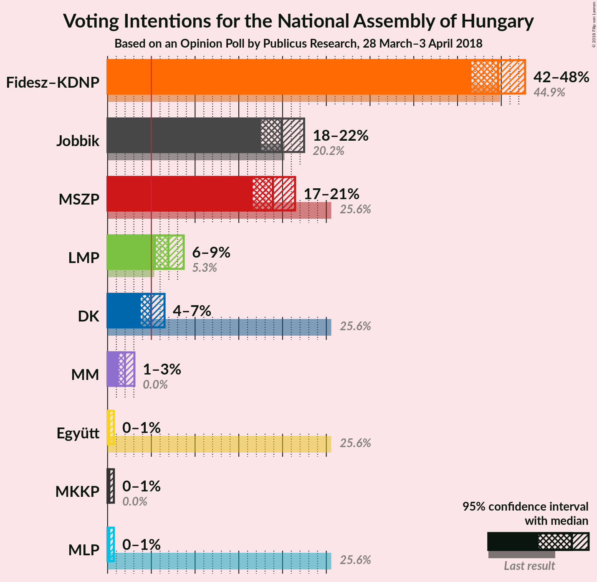
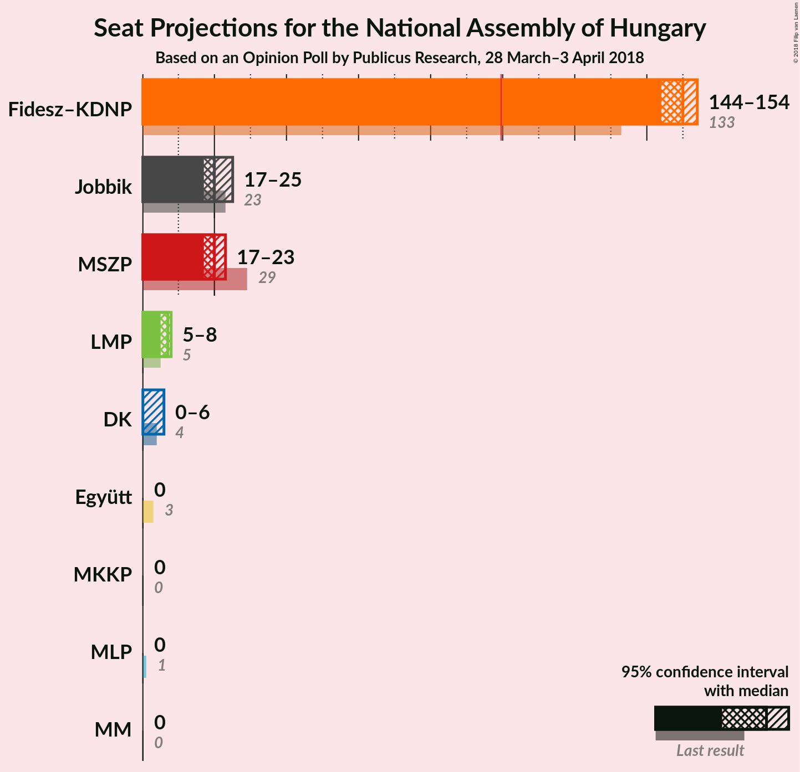
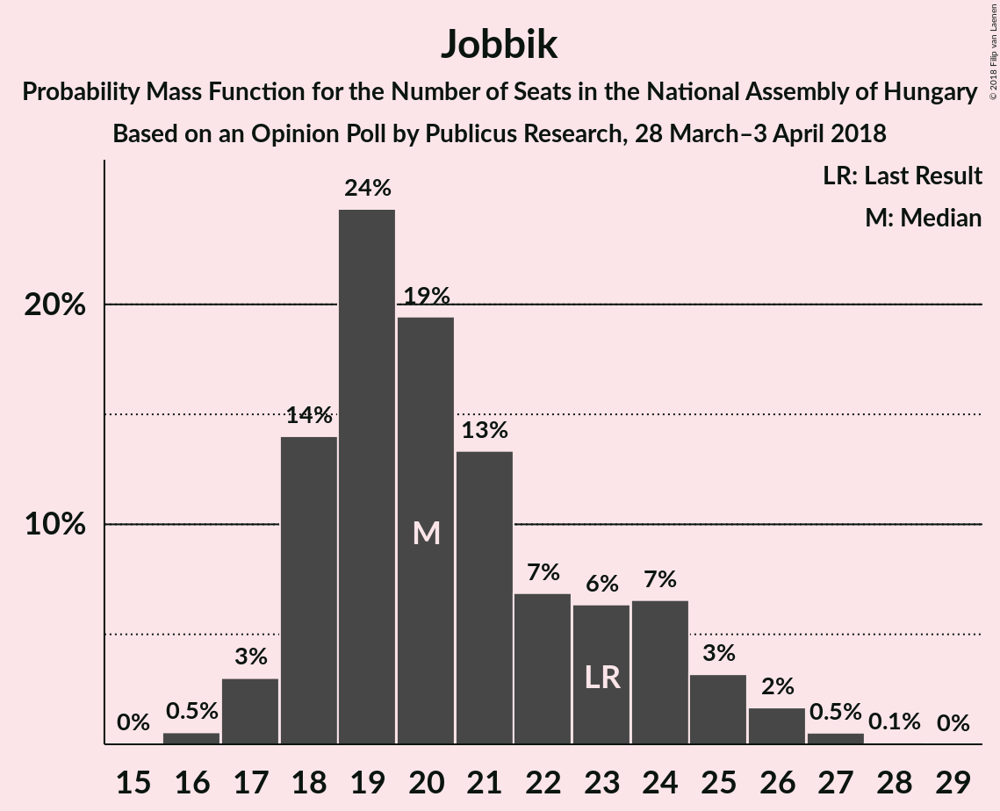
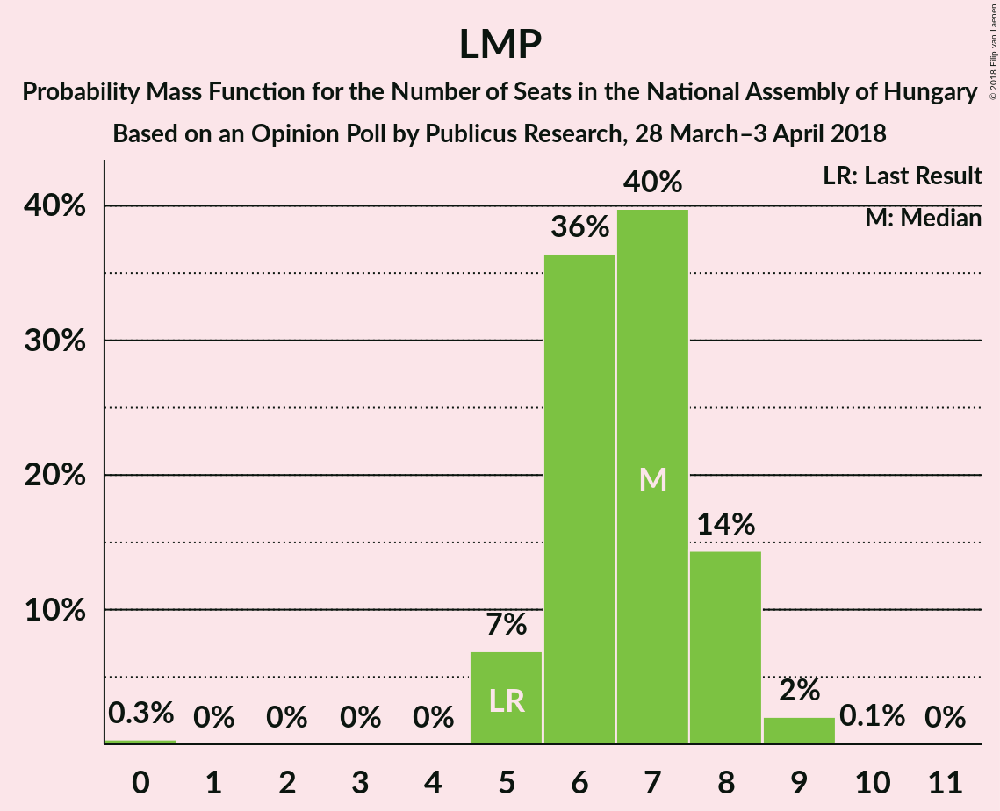
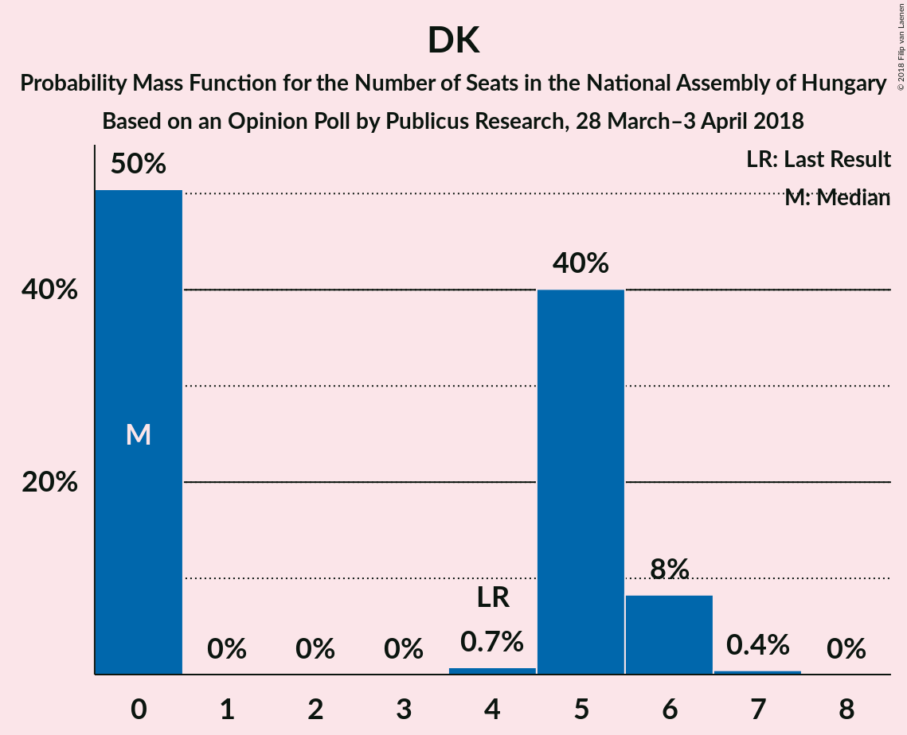

# Opinion Poll by Publicus Research, 28 March–3 April 2018

<a href="#voting-intentions">Voting Intentions</a> | <a href="#seats">Seats</a> | <a href="#coalitions">Coalitions</a> | <a href="#technical-information">Technical Information</a>

## Voting Intentions

### Confidence Intervals

| Party | Last Result | Poll Result | 80% Confidence Interval | 90% Confidence Interval | 95% Confidence Interval | 99% Confidence Interval |
|:-----:|:-----------:|:-----------:|:-----------------------:|:-----------------------:|:-----------------------:|:-----------------------:|
| Fidesz–KDNP | 44.9% | 44.6% | 42.6–46.7% |42.1–47.2% |41.6–47.7% |40.6–48.7% |
| Jobbik | 20.2% | 19.9% | 18.3–21.6% |17.9–22.1% |17.5–22.5% |16.8–23.3% |
| MSZP | 25.6% | 18.9% | 17.4–20.5% |16.9–21.0% |16.6–21.4% |15.9–22.3% |
| LMP | 5.3% | 7.0% | 6.0–8.1% |5.8–8.4% |5.5–8.7% |5.1–9.3% |
| DK | 25.6% | 5.0% | 4.2–6.0% |4.0–6.2% |3.8–6.5% |3.4–7.0% |
| MM | 0.0% | 2.0% | 1.5–2.7% |1.4–2.9% |1.3–3.1% |1.1–3.4% |
| Együtt | 25.6% | 0.2% | 0.1–0.5% |0.1–0.6% |0.1–0.7% |0.0–0.9% |
| MLP | 25.6% | 0.2% | 0.1–0.5% |0.1–0.6% |0.1–0.7% |0.0–0.9% |
| MKKP | 0.0% | 0.2% | 0.1–0.5% |0.1–0.6% |0.1–0.7% |0.0–0.9% |

*Note:* The poll result column reflects the actual value used in the calculations. Published results may vary slightly, and in addition be rounded to fewer digits.

## Seats

### Confidence Intervals

| Party | Last Result | Median | 80% Confidence Interval | 90% Confidence Interval | 95% Confidence Interval | 99% Confidence Interval |
|:-----:|:-----------:|:------:|:-----------------------:|:-----------------------:|:-----------------------:|:-----------------------:|
| <a href="#fidesz–kdnp">Fidesz–KDNP</a> | 133 | 150 | 146–153 |145–153 |144–154 |142–156 |
| <a href="#jobbik">Jobbik</a> | 23 | 20 | 18–24 |18–25 |17–25 |16–27 |
| <a href="#mszp">MSZP</a> | 29 | 20 | 18–22 |18–22 |17–23 |16–24 |
| <a href="#lmp">LMP</a> | 5 | 7 | 6–8 |5–8 |5–8 |0–9 |
| <a href="#dk">DK</a> | 4 | 0 | 0–5 |0–6 |0–6 |0–6 |
| <a href="#mm">MM</a> | 0 | 0 | 0 |0 |0 |0 |
| <a href="#együtt">Együtt</a> | 3 | 0 | 0 |0 |0 |0 |
| <a href="#mlp">MLP</a> | 1 | 0 | 0 |0 |0 |0 |
| <a href="#mkkp">MKKP</a> | 0 | 0 | 0 |0 |0 |0 |

### Fidesz–KDNP

*For a full overview of the results for this party, see the [Fidesz–KDNP](party-fidesz–kdnp.html) page.*

| Number of Seats | Probability | Accumulated | Special Marks |
|:---------------:|:-----------:|:-----------:|:-------------:|
| 133 | 0% | 100% | Last Result |
| 134 | 0% | 100% |  |
| 135 | 0% | 100% |  |
| 136 | 0% | 100% |  |
| 137 | 0% | 100% |  |
| 138 | 0% | 100% |  |
| 139 | 0% | 100% |  |
| 140 | 0% | 100% |  |
| 141 | 0% | 99.9% |  |
| 142 | 0.6% | 99.9% |  |
| 143 | 0.8% | 99.3% |  |
| 144 | 3% | 98% |  |
| 145 | 2% | 96% |  |
| 146 | 9% | 94% |  |
| 147 | 6% | 84% |  |
| 148 | 11% | 78% |  |
| 149 | 15% | 67% |  |
| 150 | 21% | 52% | Median |
| 151 | 14% | 31% |  |
| 152 | 4% | 17% |  |
| 153 | 11% | 13% |  |
| 154 | 2% | 3% |  |
| 155 | 0.1% | 0.9% |  |
| 156 | 0.6% | 0.8% |  |
| 157 | 0.2% | 0.2% |  |
| 158 | 0% | 0% |  |

### Jobbik

*For a full overview of the results for this party, see the [Jobbik](party-jobbik.html) page.*

| Number of Seats | Probability | Accumulated | Special Marks |
|:---------------:|:-----------:|:-----------:|:-------------:|
| 15 | 0.1% | 100% |  |
| 16 | 0.6% | 99.9% |  |
| 17 | 3% | 99.3% |  |
| 18 | 9% | 96% |  |
| 19 | 33% | 87% |  |
| 20 | 12% | 54% | Median |
| 21 | 16% | 42% |  |
| 22 | 6% | 26% |  |
| 23 | 6% | 20% | Last Result |
| 24 | 9% | 14% |  |
| 25 | 3% | 5% |  |
| 26 | 2% | 2% |  |
| 27 | 0.5% | 0.6% |  |
| 28 | 0.1% | 0.1% |  |
| 29 | 0% | 0% |  |

### MSZP

*For a full overview of the results for this party, see the [MSZP](party-mszp.html) page.*

| Number of Seats | Probability | Accumulated | Special Marks |
|:---------------:|:-----------:|:-----------:|:-------------:|
| 15 | 0.3% | 100% |  |
| 16 | 0.5% | 99.7% |  |
| 17 | 4% | 99.2% |  |
| 18 | 11% | 95% |  |
| 19 | 22% | 84% |  |
| 20 | 29% | 62% | Median |
| 21 | 16% | 33% |  |
| 22 | 14% | 17% |  |
| 23 | 2% | 3% |  |
| 24 | 0.4% | 0.8% |  |
| 25 | 0.1% | 0.4% |  |
| 26 | 0.3% | 0.3% |  |
| 27 | 0% | 0% |  |
| 28 | 0% | 0% |  |
| 29 | 0% | 0% | Last Result |

### LMP

*For a full overview of the results for this party, see the [LMP](party-lmp.html) page.*

| Number of Seats | Probability | Accumulated | Special Marks |
|:---------------:|:-----------:|:-----------:|:-------------:|
| 0 | 0.6% | 100% |  |
| 1 | 0% | 99.4% |  |
| 2 | 0% | 99.4% |  |
| 3 | 0% | 99.4% |  |
| 4 | 0% | 99.4% |  |
| 5 | 7% | 99.4% | Last Result |
| 6 | 37% | 92% |  |
| 7 | 39% | 55% | Median |
| 8 | 14% | 16% |  |
| 9 | 2% | 2% |  |
| 10 | 0.1% | 0.1% |  |
| 11 | 0% | 0% |  |

### DK

*For a full overview of the results for this party, see the [DK](party-dk.html) page.*

| Number of Seats | Probability | Accumulated | Special Marks |
|:---------------:|:-----------:|:-----------:|:-------------:|
| 0 | 50% | 100% | Median |
| 1 | 0% | 50% |  |
| 2 | 0% | 50% |  |
| 3 | 0% | 50% |  |
| 4 | 0% | 50% | Last Result |
| 5 | 41% | 50% |  |
| 6 | 8% | 9% |  |
| 7 | 0.4% | 0.4% |  |
| 8 | 0% | 0% |  |

### MM

*For a full overview of the results for this party, see the [MM](party-mm.html) page.*

| Number of Seats | Probability | Accumulated | Special Marks |
|:---------------:|:-----------:|:-----------:|:-------------:|
| 0 | 100% | 100% | Last Result, Median |

### Együtt

*For a full overview of the results for this party, see the [Együtt](party-együtt.html) page.*

| Number of Seats | Probability | Accumulated | Special Marks |
|:---------------:|:-----------:|:-----------:|:-------------:|
| 0 | 100% | 100% | Median |
| 1 | 0% | 0% |  |
| 2 | 0% | 0% |  |
| 3 | 0% | 0% | Last Result |

### MLP

*For a full overview of the results for this party, see the [MLP](party-mlp.html) page.*

| Number of Seats | Probability | Accumulated | Special Marks |
|:---------------:|:-----------:|:-----------:|:-------------:|
| 0 | 100% | 100% | Median |
| 1 | 0% | 0% | Last Result |

### MKKP

*For a full overview of the results for this party, see the [MKKP](party-mkkp.html) page.*

| Number of Seats | Probability | Accumulated | Special Marks |
|:---------------:|:-----------:|:-----------:|:-------------:|
| 0 | 100% | 100% | Last Result, Median |

## Coalitions

### Confidence Intervals

| Coalition | Last Result | Median | Majority? | 80% Confidence Interval | 90% Confidence Interval | 95% Confidence Interval | 99% Confidence Interval |
|:---------:|:-----------:|:------:|:---------:|:-----------------------:|:-----------------------:|:-----------------------:|:-----------------------:|
| Fidesz–KDNP | 133 | 150 | 100% | 146–153 | 145–153 | 144–154 | 142–156 |

### Fidesz–KDNP

| Number of Seats | Probability | Accumulated | Special Marks |
|:---------------:|:-----------:|:-----------:|:-------------:|
| 133 | 0% | 100% | Last Result |
| 134 | 0% | 100% |  |
| 135 | 0% | 100% |  |
| 136 | 0% | 100% |  |
| 137 | 0% | 100% |  |
| 138 | 0% | 100% |  |
| 139 | 0% | 100% |  |
| 140 | 0% | 100% |  |
| 141 | 0% | 99.9% |  |
| 142 | 0.6% | 99.9% |  |
| 143 | 0.8% | 99.3% |  |
| 144 | 3% | 98% |  |
| 145 | 2% | 96% |  |
| 146 | 9% | 94% |  |
| 147 | 6% | 84% |  |
| 148 | 11% | 78% |  |
| 149 | 15% | 67% |  |
| 150 | 21% | 52% | Median |
| 151 | 14% | 31% |  |
| 152 | 4% | 17% |  |
| 153 | 11% | 13% |  |
| 154 | 2% | 3% |  |
| 155 | 0.1% | 0.9% |  |
| 156 | 0.6% | 0.8% |  |
| 157 | 0.2% | 0.2% |  |
| 158 | 0% | 0% |  |

## Technical Information

### Opinion Poll

+ **Polling firm:** Publicus Research
+ **Commissioner(s):** —
+ **Fieldwork period:** 28 March–3 April 2018

### Calculations

+ **Sample size:** 1006
+ **Simulations done:** 524,288
+ **Error estimate:** 2.55%

