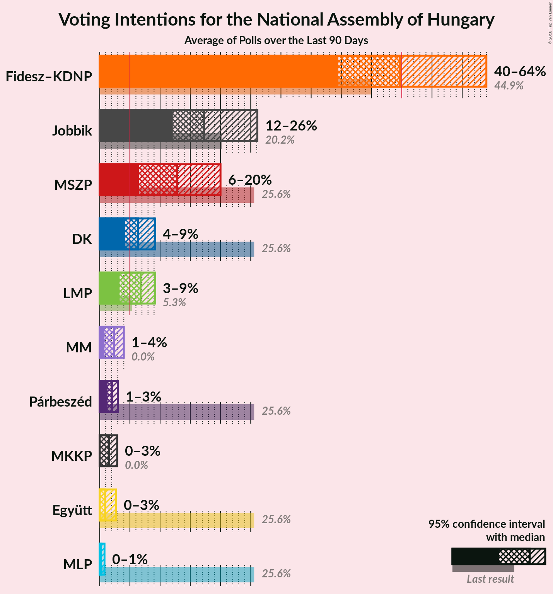

# Poll Average

<a href="#voting-intentions">Voting Intentions</a> | <a href="#seats">Seats</a> | <a href="#coalitions">Coalitions</a> | <a href="#technical-information">Technical Information</a>

## Summary

The table below lists the polls on which the average is based. They are the most recent polls (less than 90 days old) registered and analyzed so far.

| Period     | Polling firm/Commissioner(s) | Fidesz–KDNP | MSZP | DK | Együtt | MLP | Párbeszéd | Jobbik | LMP | MKKP | MM |
|:----------:|:----------------------------:|:--:|:--:|:--:|:--:|:--:|:--:|:--:|:--:|:--:|:--:|
| 6 April 2014 | General Election | 44.9%   133 | 25.6%   29 | 25.6%   4 | 25.6%   3 | 25.6%   1 | 25.6%   1 | 20.2%   23 | 5.3%   5 | 0.0%   0 | 0.0%   0 |
| N/A | Poll Average | 46–58%   153–167 | 8–16%   8–16 | 4–11%   0–11 | 1–3%   0 | 0–2%   0 | 1–2%   0 | 12–20%   12–20 | 5–9%   0–9 | 0–2%   0 | 0–5%   0 |
| [18–30 November 2017](2017-11-30-RepublikonIntézet.html) | Republikon Intézet   24.hu | 53–59%   161–169 | 9–13%   9–13 | 5–8%   0–7 | 1–3%   0 | 1–2%   0 | N/A   N/A | 11–15%   11–15 | 5–8%   0–7 | 0–1%   0 | 2–4%   0 |
| [20–28 November 2017](2017-11-28-SzázadvégAlapítvány.html) | Századvég Alapítvány | 47–54%   152–160 | 12–16%   11–16 | 4–7%   0–5 | 1–2%   0 | 0–1%   0 | N/A   N/A | 13–17%   12–17 | 6–10%   6–9 | 0–1%   0 | 0–1%   0 |
| [1–19 November 2017](2017-11-19-NézőpontIntézet.html) | Nézőpont Intézet | 46–50%   154–159 | 8–10%   8–11 | 7–9%   7–9 | 1–3%   0 | 1–2%   0 | 1–2%   0 | 14–18%   15–19 | 7–9%   7–9 | 1–3%   0 | 3–5%   0 |
| [11–15 November 2017](2017-11-15-PublicusResearch.html) | Publicus Research | 48–54%   154–162 | 12–17%   12–16 | 4–7%   0–6 | 1–2%   0 | 0–1%   0 | N/A   N/A | 15–20%   15–20 | 6–9%   5–9 | 1–2%   0 | 1–2%   0 |
| [6–14 November 2017](2017-11-14-ZRIZáveczResearch.html) | ZRI Závecz Research | 46–52%   151–158 | 10–14%   10–14 | 8–12%   8–12 | 1–2%   0 | 1–2%   0 | N/A   N/A | 16–21%   15–20 | 5–8%   0–7 | 1–2%   0 | 1–3%   0 |
| 6 April 2014 | General Election | 44.9%   133 | 25.6%   29 | 25.6%   4 | 25.6%   3 | 25.6%   1 | 25.6%   1 | 20.2%   23 | 5.3%   5 | 0.0%   0 | 0.0%   0 |

Only polls for which at least the sample size has been published are included in the table above.

**Legend:**
+ **Top half of each row:** Voting intentions (95% confidence interval)
+ **Bottom half of each row:** Seat projections for the National Assembly of Hungary (95% confidence interval)
+ **Fidesz–KDNP:** Fidesz–KDNP
+ **MSZP:** MSZP
+ **DK:** DK
+ **Együtt:** Együtt
+ **MLP:** MLP
+ **Párbeszéd:** Párbeszéd
+ **Jobbik:** Jobbik
+ **LMP:** LMP
+ **MKKP:** MKKP
+ **MM:** MM
+ **N/A (single party):** Party not included the published results
+ **N/A (entire row):** Calculation for this opinion poll not started yet

## Voting Intentions

### Confidence Intervals

| Party | Last Result | Median | 80% Confidence Interval | 90% Confidence Interval | 95% Confidence Interval | 99% Confidence Interval |
|:-----:|:-----------:|:------:|:-----------------------:|:-----------------------:|:-----------------------:|:-----------------------:|
| <a href="#fidesz–kdnp">Fidesz–KDNP</a> | 44.9% | 50.2% | 47.4–56.3% |46.8–57.3% | 46.4–58.1% | 45.5–59.3% |
| <a href="#mszp">MSZP</a> | 25.6% | 12.2% | 9.0–14.9% |8.6–15.5% | 8.3–15.9% | 7.8–16.8% |
| <a href="#dk">DK</a> | 25.6% | 6.2% | 4.6–10.1% |4.3–10.7% | 4.1–11.2% | 3.7–12.0% |
| <a href="#együtt">Együtt</a> | 25.6% | 1.4% | 0.8–2.3% |0.7–2.5% | 0.6–2.7% | 0.5–3.1% |
| <a href="#mlp">MLP</a> | 25.6% | 0.8% | 0.2–1.4% |0.1–1.5% | 0.1–1.7% | 0.1–2.0% |
| <a href="#párbeszéd">Párbeszéd</a> | 25.6% | 1.0% | 0.8–1.3% |0.7–1.5% | 0.6–1.5% | 0.6–1.7% |
| <a href="#jobbik">Jobbik</a> | 20.2% | 16.0% | 12.8–18.5% |12.1–19.2% | 11.7–19.7% | 10.9–20.6% |
| <a href="#lmp">LMP</a> | 5.3% | 7.1% | 5.5–8.6% |5.2–8.9% | 4.9–9.2% | 4.5–9.8% |
| <a href="#mkkp">MKKP</a> | 0.0% | 0.9% | 0.2–2.1% |0.1–2.3% | 0.1–2.4% | 0.1–2.7% |
| <a href="#mm">MM</a> | 0.0% | 2.1% | 0.3–4.1% |0.2–4.4% | 0.1–4.6% | 0.1–5.0% |

### Fidesz–KDNP

*For a full overview of the results for this party, see the [Fidesz–KDNP](party-fidesz–kdnp.html) page.*

| Voting Intentions | Probability | Accumulated | Special Marks |
|:-----------------:|:-----------:|:-----------:|:-------------:|
| 42.5–43.5% | 0% | 100% |  |
| 43.5–44.5% | 0.1% | 100% |  |
| 44.5–45.5% | 0.5% | 99.9% | Last Result |
| 45.5–46.5% | 3% | 99.4% |  |
| 46.5–47.5% | 8% | 97% |  |
| 47.5–48.5% | 13% | 89% |  |
| 48.5–49.5% | 15% | 75% |  |
| 49.5–50.5% | 15% | 60% | Median |
| 50.5–51.5% | 12% | 45% |  |
| 51.5–52.5% | 8% | 33% |  |
| 52.5–53.5% | 4% | 25% |  |
| 53.5–54.5% | 3% | 21% |  |
| 54.5–55.5% | 4% | 18% |  |
| 55.5–56.5% | 5% | 14% |  |
| 56.5–57.5% | 5% | 9% |  |
| 57.5–58.5% | 3% | 4% |  |
| 58.5–59.5% | 1.1% | 1.5% |  |
| 59.5–60.5% | 0.3% | 0.4% |  |
| 60.5–61.5% | 0.1% | 0.1% |  |
| 61.5–62.5% | 0% | 0% |  |

### MSZP

*For a full overview of the results for this party, see the [MSZP](party-mszp.html) page.*

| Voting Intentions | Probability | Accumulated | Special Marks |
|:-----------------:|:-----------:|:-----------:|:-------------:|
| 5.5–6.5% | 0% | 100% |  |
| 6.5–7.5% | 0.1% | 100% |  |
| 7.5–8.5% | 4% | 99.9% |  |
| 8.5–9.5% | 13% | 95% |  |
| 9.5–10.5% | 11% | 83% |  |
| 10.5–11.5% | 13% | 72% |  |
| 11.5–12.5% | 14% | 59% | Median |
| 12.5–13.5% | 15% | 45% |  |
| 13.5–14.5% | 15% | 30% |  |
| 14.5–15.5% | 10% | 14% |  |
| 15.5–16.5% | 4% | 4% |  |
| 16.5–17.5% | 0.7% | 0.8% |  |
| 17.5–18.5% | 0.1% | 0.1% |  |
| 18.5–19.5% | 0% | 0% |  |
| 19.5–20.5% | 0% | 0% |  |
| 20.5–21.5% | 0% | 0% |  |
| 21.5–22.5% | 0% | 0% |  |
| 22.5–23.5% | 0% | 0% |  |
| 23.5–24.5% | 0% | 0% |  |
| 24.5–25.5% | 0% | 0% |  |
| 25.5–26.5% | 0% | 0% | Last Result |

### DK

*For a full overview of the results for this party, see the [DK](party-dk.html) page.*

| Voting Intentions | Probability | Accumulated | Special Marks |
|:-----------------:|:-----------:|:-----------:|:-------------:|
| 1.5–2.5% | 0% | 100% |  |
| 2.5–3.5% | 0.3% | 100% |  |
| 3.5–4.5% | 8% | 99.7% |  |
| 4.5–5.5% | 26% | 91% |  |
| 5.5–6.5% | 20% | 65% | Median |
| 6.5–7.5% | 9% | 45% |  |
| 7.5–8.5% | 13% | 36% |  |
| 8.5–9.5% | 9% | 23% |  |
| 9.5–10.5% | 8% | 14% |  |
| 10.5–11.5% | 5% | 6% |  |
| 11.5–12.5% | 1.2% | 1.3% |  |
| 12.5–13.5% | 0.1% | 0.1% |  |
| 13.5–14.5% | 0% | 0% |  |
| 14.5–15.5% | 0% | 0% |  |
| 15.5–16.5% | 0% | 0% |  |
| 16.5–17.5% | 0% | 0% |  |
| 17.5–18.5% | 0% | 0% |  |
| 18.5–19.5% | 0% | 0% |  |
| 19.5–20.5% | 0% | 0% |  |
| 20.5–21.5% | 0% | 0% |  |
| 21.5–22.5% | 0% | 0% |  |
| 22.5–23.5% | 0% | 0% |  |
| 23.5–24.5% | 0% | 0% |  |
| 24.5–25.5% | 0% | 0% |  |
| 25.5–26.5% | 0% | 0% | Last Result |

### Együtt

*For a full overview of the results for this party, see the [Együtt](party-együtt.html) page.*

| Voting Intentions | Probability | Accumulated | Special Marks |
|:-----------------:|:-----------:|:-----------:|:-------------:|
| 0.0–0.5% | 1.5% | 100% |  |
| 0.5–1.5% | 56% | 98.5% | Median |
| 1.5–2.5% | 38% | 42% |  |
| 2.5–3.5% | 4% | 4% |  |
| 3.5–4.5% | 0.1% | 0.1% |  |
| 4.5–5.5% | 0% | 0% |  |
| 5.5–6.5% | 0% | 0% |  |
| 6.5–7.5% | 0% | 0% |  |
| 7.5–8.5% | 0% | 0% |  |
| 8.5–9.5% | 0% | 0% |  |
| 9.5–10.5% | 0% | 0% |  |
| 10.5–11.5% | 0% | 0% |  |
| 11.5–12.5% | 0% | 0% |  |
| 12.5–13.5% | 0% | 0% |  |
| 13.5–14.5% | 0% | 0% |  |
| 14.5–15.5% | 0% | 0% |  |
| 15.5–16.5% | 0% | 0% |  |
| 16.5–17.5% | 0% | 0% |  |
| 17.5–18.5% | 0% | 0% |  |
| 18.5–19.5% | 0% | 0% |  |
| 19.5–20.5% | 0% | 0% |  |
| 20.5–21.5% | 0% | 0% |  |
| 21.5–22.5% | 0% | 0% |  |
| 22.5–23.5% | 0% | 0% |  |
| 23.5–24.5% | 0% | 0% |  |
| 24.5–25.5% | 0% | 0% |  |
| 25.5–26.5% | 0% | 0% | Last Result |

### MLP

*For a full overview of the results for this party, see the [MLP](party-mlp.html) page.*

| Voting Intentions | Probability | Accumulated | Special Marks |
|:-----------------:|:-----------:|:-----------:|:-------------:|
| 0.0–0.5% | 35% | 100% |  |
| 0.5–1.5% | 61% | 65% | Median |
| 1.5–2.5% | 4% | 4% |  |
| 2.5–3.5% | 0% | 0% |  |
| 3.5–4.5% | 0% | 0% |  |
| 4.5–5.5% | 0% | 0% |  |
| 5.5–6.5% | 0% | 0% |  |
| 6.5–7.5% | 0% | 0% |  |
| 7.5–8.5% | 0% | 0% |  |
| 8.5–9.5% | 0% | 0% |  |
| 9.5–10.5% | 0% | 0% |  |
| 10.5–11.5% | 0% | 0% |  |
| 11.5–12.5% | 0% | 0% |  |
| 12.5–13.5% | 0% | 0% |  |
| 13.5–14.5% | 0% | 0% |  |
| 14.5–15.5% | 0% | 0% |  |
| 15.5–16.5% | 0% | 0% |  |
| 16.5–17.5% | 0% | 0% |  |
| 17.5–18.5% | 0% | 0% |  |
| 18.5–19.5% | 0% | 0% |  |
| 19.5–20.5% | 0% | 0% |  |
| 20.5–21.5% | 0% | 0% |  |
| 21.5–22.5% | 0% | 0% |  |
| 22.5–23.5% | 0% | 0% |  |
| 23.5–24.5% | 0% | 0% |  |
| 24.5–25.5% | 0% | 0% |  |
| 25.5–26.5% | 0% | 0% | Last Result |

### Párbeszéd

*For a full overview of the results for this party, see the [Párbeszéd](party-párbeszéd.html) page.*

| Voting Intentions | Probability | Accumulated | Special Marks |
|:-----------------:|:-----------:|:-----------:|:-------------:|
| 0.0–0.5% | 0.4% | 100% |  |
| 0.5–1.5% | 97% | 99.6% | Median |
| 1.5–2.5% | 2% | 2% |  |
| 2.5–3.5% | 0% | 0% |  |
| 3.5–4.5% | 0% | 0% |  |
| 4.5–5.5% | 0% | 0% |  |
| 5.5–6.5% | 0% | 0% |  |
| 6.5–7.5% | 0% | 0% |  |
| 7.5–8.5% | 0% | 0% |  |
| 8.5–9.5% | 0% | 0% |  |
| 9.5–10.5% | 0% | 0% |  |
| 10.5–11.5% | 0% | 0% |  |
| 11.5–12.5% | 0% | 0% |  |
| 12.5–13.5% | 0% | 0% |  |
| 13.5–14.5% | 0% | 0% |  |
| 14.5–15.5% | 0% | 0% |  |
| 15.5–16.5% | 0% | 0% |  |
| 16.5–17.5% | 0% | 0% |  |
| 17.5–18.5% | 0% | 0% |  |
| 18.5–19.5% | 0% | 0% |  |
| 19.5–20.5% | 0% | 0% |  |
| 20.5–21.5% | 0% | 0% |  |
| 21.5–22.5% | 0% | 0% |  |
| 22.5–23.5% | 0% | 0% |  |
| 23.5–24.5% | 0% | 0% |  |
| 24.5–25.5% | 0% | 0% |  |
| 25.5–26.5% | 0% | 0% | Last Result |

### Jobbik

*For a full overview of the results for this party, see the [Jobbik](party-jobbik.html) page.*

| Voting Intentions | Probability | Accumulated | Special Marks |
|:-----------------:|:-----------:|:-----------:|:-------------:|
| 8.5–9.5% | 0% | 100% |  |
| 9.5–10.5% | 0.2% | 100% |  |
| 10.5–11.5% | 2% | 99.8% |  |
| 11.5–12.5% | 6% | 98% |  |
| 12.5–13.5% | 9% | 92% |  |
| 13.5–14.5% | 10% | 83% |  |
| 14.5–15.5% | 14% | 73% |  |
| 15.5–16.5% | 19% | 59% | Median |
| 16.5–17.5% | 17% | 40% |  |
| 17.5–18.5% | 13% | 23% |  |
| 18.5–19.5% | 7% | 10% |  |
| 19.5–20.5% | 2% | 3% | Last Result |
| 20.5–21.5% | 0.5% | 0.6% |  |
| 21.5–22.5% | 0.1% | 0.1% |  |
| 22.5–23.5% | 0% | 0% |  |

### LMP

*For a full overview of the results for this party, see the [LMP](party-lmp.html) page.*

| Voting Intentions | Probability | Accumulated | Special Marks |
|:-----------------:|:-----------:|:-----------:|:-------------:|
| 2.5–3.5% | 0% | 100% |  |
| 3.5–4.5% | 0.7% | 100% |  |
| 4.5–5.5% | 10% | 99.3% | Last Result |
| 5.5–6.5% | 25% | 89% |  |
| 6.5–7.5% | 27% | 64% | Median |
| 7.5–8.5% | 27% | 37% |  |
| 8.5–9.5% | 9% | 10% |  |
| 9.5–10.5% | 0.9% | 1.0% |  |
| 10.5–11.5% | 0.1% | 0.1% |  |
| 11.5–12.5% | 0% | 0% |  |

### MKKP

*For a full overview of the results for this party, see the [MKKP](party-mkkp.html) page.*

| Voting Intentions | Probability | Accumulated | Special Marks |
|:-----------------:|:-----------:|:-----------:|:-------------:|
| 0.0–0.5% | 37% | 100% | Last Result |
| 0.5–1.5% | 40% | 63% | Median |
| 1.5–2.5% | 21% | 23% |  |
| 2.5–3.5% | 1.3% | 1.3% |  |
| 3.5–4.5% | 0% | 0% |  |

### MM

*For a full overview of the results for this party, see the [MM](party-mm.html) page.*

| Voting Intentions | Probability | Accumulated | Special Marks |
|:-----------------:|:-----------:|:-----------:|:-------------:|
| 0.0–0.5% | 19% | 100% | Last Result |
| 0.5–1.5% | 22% | 81% |  |
| 1.5–2.5% | 20% | 60% | Median |
| 2.5–3.5% | 19% | 40% |  |
| 3.5–4.5% | 19% | 21% |  |
| 4.5–5.5% | 3% | 3% |  |
| 5.5–6.5% | 0% | 0% |  |

## Seats

### Confidence Intervals

| Party | Last Result | Median | 80% Confidence Interval | 90% Confidence Interval | 95% Confidence Interval | 99% Confidence Interval |
|:-----:|:-----------:|:------:|:-----------------------:|:-----------------------:|:-----------------------:|:-----------------------:|
| <a href="#fidesz–kdnp">Fidesz–KDNP</a> | 133 | 157 | 154–164 |154–165 | 153–167 | 151–169 |
| <a href="#mszp">MSZP</a> | 29 | 12 | 9–15 |8–15 | 8–16 | 8–16 |
| <a href="#dk">DK</a> | 4 | 6 | 0–9 |0–10 | 0–11 | 0–12 |
| <a href="#együtt">Együtt</a> | 3 | 0 | 0 |0 | 0 | 0 |
| <a href="#mlp">MLP</a> | 1 | 0 | 0 |0 | 0 | 0 |
| <a href="#párbeszéd">Párbeszéd</a> | 1 | 0 | 0 |0 | 0 | 0 |
| <a href="#jobbik">Jobbik</a> | 23 | 16 | 13–18 |12–19 | 12–20 | 11–21 |
| <a href="#lmp">LMP</a> | 5 | 7 | 5–9 |5–9 | 0–9 | 0–10 |
| <a href="#mkkp">MKKP</a> | 0 | 0 | 0 |0 | 0 | 0 |
| <a href="#mm">MM</a> | 0 | 0 | 0 |0 | 0 | 0 |

### Fidesz–KDNP

*For a full overview of the results for this party, see the [Fidesz–KDNP](party-fidesz–kdnp.html) page.*

| Number of Seats | Probability | Accumulated | Special Marks |
|:---------------:|:-----------:|:-----------:|:-------------:|
| 133 | 0% | 100% | Last Result |
| 134 | 0% | 100% |  |
| 135 | 0% | 100% |  |
| 136 | 0% | 100% |  |
| 137 | 0% | 100% |  |
| 138 | 0% | 100% |  |
| 139 | 0% | 100% |  |
| 140 | 0% | 100% |  |
| 141 | 0% | 100% |  |
| 142 | 0% | 100% |  |
| 143 | 0% | 100% |  |
| 144 | 0% | 100% |  |
| 145 | 0% | 100% |  |
| 146 | 0% | 100% |  |
| 147 | 0% | 100% |  |
| 148 | 0% | 100% |  |
| 149 | 0% | 100% |  |
| 150 | 0.1% | 100% |  |
| 151 | 0.7% | 99.8% |  |
| 152 | 1.3% | 99.1% |  |
| 153 | 2% | 98% |  |
| 154 | 7% | 96% |  |
| 155 | 15% | 88% |  |
| 156 | 12% | 73% |  |
| 157 | 20% | 61% | Median |
| 158 | 9% | 41% |  |
| 159 | 7% | 32% |  |
| 160 | 3% | 25% |  |
| 161 | 2% | 22% |  |
| 162 | 3% | 20% |  |
| 163 | 4% | 17% |  |
| 164 | 6% | 13% |  |
| 165 | 2% | 7% |  |
| 166 | 1.3% | 4% |  |
| 167 | 2% | 3% |  |
| 168 | 0.8% | 2% |  |
| 169 | 0.3% | 0.7% |  |
| 170 | 0.2% | 0.4% |  |
| 171 | 0.1% | 0.2% |  |
| 172 | 0% | 0.1% |  |
| 173 | 0% | 0% |  |

### MSZP

*For a full overview of the results for this party, see the [MSZP](party-mszp.html) page.*

| Number of Seats | Probability | Accumulated | Special Marks |
|:---------------:|:-----------:|:-----------:|:-------------:|
| 7 | 0.1% | 100% |  |
| 8 | 8% | 99.9% |  |
| 9 | 8% | 92% |  |
| 10 | 16% | 84% |  |
| 11 | 14% | 68% |  |
| 12 | 9% | 54% | Median |
| 13 | 18% | 45% |  |
| 14 | 16% | 27% |  |
| 15 | 8% | 11% |  |
| 16 | 3% | 3% |  |
| 17 | 0.4% | 0.5% |  |
| 18 | 0.1% | 0.1% |  |
| 19 | 0% | 0% |  |
| 20 | 0% | 0% |  |
| 21 | 0% | 0% |  |
| 22 | 0% | 0% |  |
| 23 | 0% | 0% |  |
| 24 | 0% | 0% |  |
| 25 | 0% | 0% |  |
| 26 | 0% | 0% |  |
| 27 | 0% | 0% |  |
| 28 | 0% | 0% |  |
| 29 | 0% | 0% | Last Result |

### DK

*For a full overview of the results for this party, see the [DK](party-dk.html) page.*

| Number of Seats | Probability | Accumulated | Special Marks |
|:---------------:|:-----------:|:-----------:|:-------------:|
| 0 | 22% | 100% |  |
| 1 | 0% | 78% |  |
| 2 | 0% | 78% |  |
| 3 | 0% | 78% |  |
| 4 | 2% | 78% | Last Result |
| 5 | 19% | 76% |  |
| 6 | 14% | 57% | Median |
| 7 | 6% | 43% |  |
| 8 | 19% | 38% |  |
| 9 | 10% | 19% |  |
| 10 | 5% | 9% |  |
| 11 | 2% | 4% |  |
| 12 | 2% | 2% |  |
| 13 | 0.3% | 0.3% |  |
| 14 | 0% | 0% |  |

### Együtt

*For a full overview of the results for this party, see the [Együtt](party-együtt.html) page.*

| Number of Seats | Probability | Accumulated | Special Marks |
|:---------------:|:-----------:|:-----------:|:-------------:|
| 0 | 100% | 100% | Median |
| 1 | 0% | 0% |  |
| 2 | 0% | 0% |  |
| 3 | 0% | 0% | Last Result |

### MLP

*For a full overview of the results for this party, see the [MLP](party-mlp.html) page.*

| Number of Seats | Probability | Accumulated | Special Marks |
|:---------------:|:-----------:|:-----------:|:-------------:|
| 0 | 100% | 100% | Median |
| 1 | 0% | 0% | Last Result |

### Párbeszéd

*For a full overview of the results for this party, see the [Párbeszéd](party-párbeszéd.html) page.*

| Number of Seats | Probability | Accumulated | Special Marks |
|:---------------:|:-----------:|:-----------:|:-------------:|
| 0 | 100% | 100% | Median |
| 1 | 0% | 0% | Last Result |

### Jobbik

*For a full overview of the results for this party, see the [Jobbik](party-jobbik.html) page.*

| Number of Seats | Probability | Accumulated | Special Marks |
|:---------------:|:-----------:|:-----------:|:-------------:|
| 10 | 0.2% | 100% |  |
| 11 | 1.3% | 99.8% |  |
| 12 | 5% | 98% |  |
| 13 | 12% | 93% |  |
| 14 | 11% | 82% |  |
| 15 | 12% | 71% |  |
| 16 | 16% | 59% | Median |
| 17 | 19% | 43% |  |
| 18 | 15% | 24% |  |
| 19 | 5% | 9% |  |
| 20 | 3% | 4% |  |
| 21 | 0.5% | 0.7% |  |
| 22 | 0.1% | 0.2% |  |
| 23 | 0% | 0% | Last Result |

### LMP

*For a full overview of the results for this party, see the [LMP](party-lmp.html) page.*

| Number of Seats | Probability | Accumulated | Special Marks |
|:---------------:|:-----------:|:-----------:|:-------------:|
| 0 | 5% | 100% |  |
| 1 | 0% | 95% |  |
| 2 | 0% | 95% |  |
| 3 | 0% | 95% |  |
| 4 | 0% | 95% |  |
| 5 | 12% | 95% | Last Result |
| 6 | 26% | 84% |  |
| 7 | 26% | 58% | Median |
| 8 | 21% | 32% |  |
| 9 | 10% | 10% |  |
| 10 | 0.6% | 0.6% |  |
| 11 | 0% | 0% |  |

### MKKP

*For a full overview of the results for this party, see the [MKKP](party-mkkp.html) page.*

| Number of Seats | Probability | Accumulated | Special Marks |
|:---------------:|:-----------:|:-----------:|:-------------:|
| 0 | 100% | 100% | Last Result, Median |

### MM

*For a full overview of the results for this party, see the [MM](party-mm.html) page.*

| Number of Seats | Probability | Accumulated | Special Marks |
|:---------------:|:-----------:|:-----------:|:-------------:|
| 0 | 99.7% | 100% | Last Result, Median |
| 1 | 0% | 0.3% |  |
| 2 | 0% | 0.3% |  |
| 3 | 0% | 0.3% |  |
| 4 | 0% | 0.3% |  |
| 5 | 0.3% | 0.3% |  |
| 6 | 0% | 0% |  |

## Coalitions

### Confidence Intervals

| Coalition | Last Result | Median | Majority? | 80% Confidence Interval | 90% Confidence Interval | 95% Confidence Interval | 99% Confidence Interval |
|:---------:|:-----------:|:------:|:---------:|:-----------------------:|:-----------------------:|:-----------------------:|:-----------------------:|
| Fidesz–KDNP | 133 | 157 | 100% | 154–164 | 154–165 | 153–167 | 151–169 |
| DK – Együtt – MLP – MSZP – Párbeszéd | 38 | 17 | 0% | 14–21 | 13–22 | 12–23 | 11–25 |

### Fidesz–KDNP

| Number of Seats | Probability | Accumulated | Special Marks |
|:---------------:|:-----------:|:-----------:|:-------------:|
| 133 | 0% | 100% | Last Result |
| 134 | 0% | 100% |  |
| 135 | 0% | 100% |  |
| 136 | 0% | 100% |  |
| 137 | 0% | 100% |  |
| 138 | 0% | 100% |  |
| 139 | 0% | 100% |  |
| 140 | 0% | 100% |  |
| 141 | 0% | 100% |  |
| 142 | 0% | 100% |  |
| 143 | 0% | 100% |  |
| 144 | 0% | 100% |  |
| 145 | 0% | 100% |  |
| 146 | 0% | 100% |  |
| 147 | 0% | 100% |  |
| 148 | 0% | 100% |  |
| 149 | 0% | 100% |  |
| 150 | 0.1% | 100% |  |
| 151 | 0.7% | 99.8% |  |
| 152 | 1.3% | 99.1% |  |
| 153 | 2% | 98% |  |
| 154 | 7% | 96% |  |
| 155 | 15% | 88% |  |
| 156 | 12% | 73% |  |
| 157 | 20% | 61% | Median |
| 158 | 9% | 41% |  |
| 159 | 7% | 32% |  |
| 160 | 3% | 25% |  |
| 161 | 2% | 22% |  |
| 162 | 3% | 20% |  |
| 163 | 4% | 17% |  |
| 164 | 6% | 13% |  |
| 165 | 2% | 7% |  |
| 166 | 1.3% | 4% |  |
| 167 | 2% | 3% |  |
| 168 | 0.8% | 2% |  |
| 169 | 0.3% | 0.7% |  |
| 170 | 0.2% | 0.4% |  |
| 171 | 0.1% | 0.2% |  |
| 172 | 0% | 0.1% |  |
| 173 | 0% | 0% |  |

### DK – Együtt – MLP – MSZP – Párbeszéd

| Number of Seats | Probability | Accumulated | Special Marks |
|:---------------:|:-----------:|:-----------:|:-------------:|
| 10 | 0.1% | 100% |  |
| 11 | 0.6% | 99.8% |  |
| 12 | 2% | 99.3% |  |
| 13 | 5% | 97% |  |
| 14 | 7% | 92% |  |
| 15 | 7% | 85% |  |
| 16 | 15% | 78% |  |
| 17 | 16% | 62% |  |
| 18 | 10% | 46% | Median |
| 19 | 15% | 36% |  |
| 20 | 9% | 21% |  |
| 21 | 5% | 13% |  |
| 22 | 4% | 8% |  |
| 23 | 1.3% | 4% |  |
| 24 | 0.9% | 2% |  |
| 25 | 1.3% | 1.5% |  |
| 26 | 0.1% | 0.2% |  |
| 27 | 0% | 0% |  |
| 28 | 0% | 0% |  |
| 29 | 0% | 0% |  |
| 30 | 0% | 0% |  |
| 31 | 0% | 0% |  |
| 32 | 0% | 0% |  |
| 33 | 0% | 0% |  |
| 34 | 0% | 0% |  |
| 35 | 0% | 0% |  |
| 36 | 0% | 0% |  |
| 37 | 0% | 0% |  |
| 38 | 0% | 0% | Last Result |

## Technical Information

