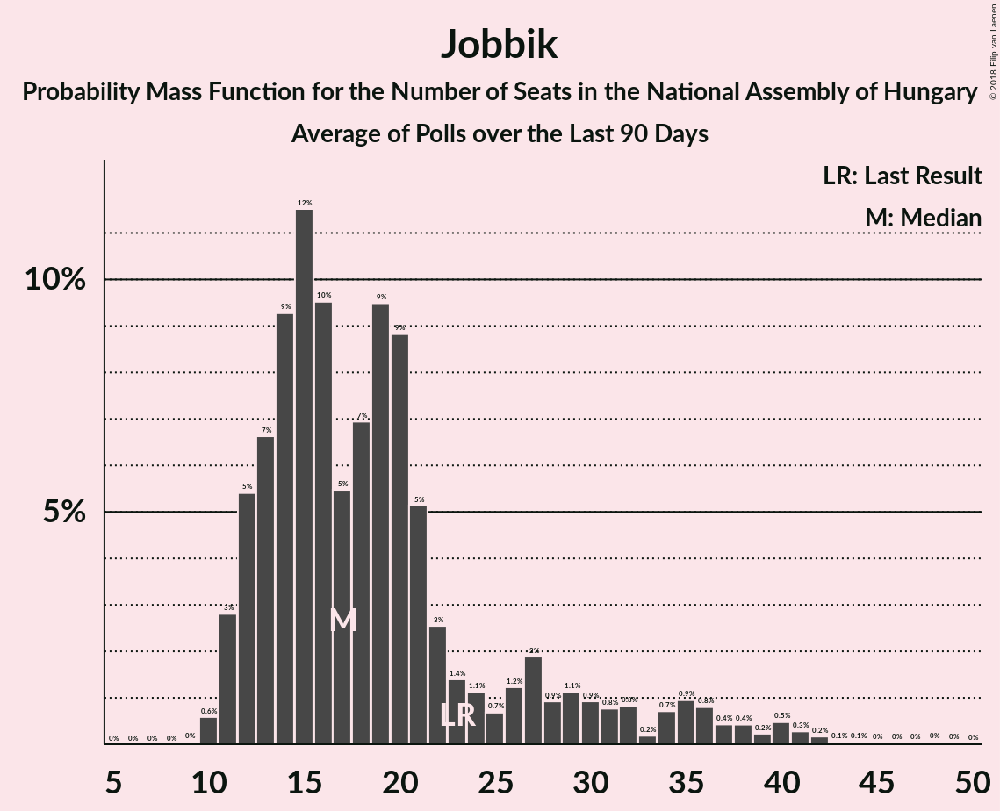

# Poll Average

<a href="#voting-intentions">Voting Intentions</a> | <a href="#seats">Seats</a> | <a href="#coalitions">Coalitions</a> | <a href="#technical-information">Technical Information</a>

## Summary

The table below lists the polls on which the average is based. They are the most recent polls (less than 90 days old) registered and analyzed so far.

| Period     | Polling firm/Commissioner(s) | Fidesz–KDNP | MSZP | DK | Együtt | MLP | Párbeszéd | Jobbik | LMP | MKKP | MM |
|:----------:|:----------------------------:|:--:|:--:|:--:|:--:|:--:|:--:|:--:|:--:|:--:|:--:|
| 6 April 2014 | General Election | 44.9%   133 | 25.6%   29 | 25.6%   4 | 25.6%   3 | 25.6%   1 | 25.6%   1 | 20.2%   23 | 5.3%   5 | 0.0%   0 | 0.0%   0 |
| N/A | Poll Average | 46–64%   151–173 | 6–19%   6–20 | 4–10%   0–9 | 0–3%   0 | 0–1%   0 | 0–3%   0 | 12–23%   12–26 | 3–11%   0–10 | 0–3%   0 | 0–4%   0 |
| [3–21 February 2018](2018-02-21-NézőpontIntézet.html) | Nézőpont Intézet | 52–56%   158–163 | 9–11%   9–11 | 7–9%   6–9 | 1–2%   0 | 1–2%   0 | N/A   N/A | 12–14%   11–14 | 7–9%   7–9 | 1–3%   0 | 2–4%   0 |
| [7–15 February 2018](2018-02-15-ZRIZáveczResearch.html) | ZRI Závecz Research | 48–55%   154–161 | 11–15%   10–15 | 7–10%   6–9 | 1–2%   0 | 0–1%   0 | N/A   N/A | 15–20%   14–19 | 5–8%   0–7 | 0–1%   0 | 1–3%   0 |
| [9–14 February 2018](2018-02-14-PublicusResearch.html) | Publicus Research | 45–51%   149–159 | 16–20%   16–22 | 4–7%   0–6 | 0–1%   0 | 0–1%   0 | 0–1%   0 | 14–18%   14–18 | 6–10%   6–10 | 1–3%   0 | 1–2%   0 |
| [6–13 February 2018](2018-02-13-SzázadvégAlapítvány.html) | Századvég Alapítvány | 47–54%   152–158 | 8–12%   8–11 | 5–9%   5–8 | 1–2%   0 | 0–1%   0 | N/A   N/A | 12–16%   11–15 | 8–12%   7–11 | 0–1%   0 | 0–1%   0 |
| [1–31 January 2018](2018-01-31-RepublikonIntézet.html) | Republikon Intézet   24.hu | 50–56%   158–168 | 11–15%   11–16 | 4–7%   0–6 | 1–3%   0 | 1–2%   0 | N/A   N/A | 16–21%   16–22 | 3–5%   0–5 | 0–1%   0 | 2–4%   0 |
| [11–23 January 2018](2018-01-23-TÁRKI.html) | TÁRKI | 60–66%   167–176 | 6–9%   5–9 | 5–8%   0–7 | 1–3%   0 | 0–1%   0 | 1–3%   0 | 12–16%   12–17 | 3–5%   0–5 | 0–1%   0 | 1–2%   0 |
| [19–23 January 2018](2018-01-23-Medián.html) | Medián   hvg.hu | 50–56%   155–161 | 9–13%   9–12 | 7–11%   7–10 | 1–2%   0 | 0–1%   0 | N/A   N/A | 16–20%   15–20 | 5–7%   0–7 | 0–1%   0 | 1–2%   0 |
| [5–9 January 2018](2018-01-09-IránytűIntézet.html) | Iránytű Intézet | 45–51%   149–158 | 6–10%   6–10 | 6–9%   5–9 | 1–3%   0 | 0–1%   0 | 1–2%   0 | 19–25%   20–28 | 6–9%   5–9 | 1–3%   0 | 2–4%   0 |
| 6 April 2014 | General Election | 44.9%   133 | 25.6%   29 | 25.6%   4 | 25.6%   3 | 25.6%   1 | 25.6%   1 | 20.2%   23 | 5.3%   5 | 0.0%   0 | 0.0%   0 |

Only polls for which at least the sample size has been published are included in the table above.

**Legend:**
+ **Top half of each row:** Voting intentions (95% confidence interval)
+ **Bottom half of each row:** Seat projections for the National Assembly of Hungary (95% confidence interval)
+ **Fidesz–KDNP:** Fidesz–KDNP
+ **MSZP:** MSZP
+ **DK:** DK
+ **Együtt:** Együtt
+ **MLP:** MLP
+ **Párbeszéd:** Párbeszéd
+ **Jobbik:** Jobbik
+ **LMP:** LMP
+ **MKKP:** MKKP
+ **MM:** MM
+ **N/A (single party):** Party not included the published results
+ **N/A (entire row):** Calculation for this opinion poll not started yet

## Voting Intentions

### Confidence Intervals

| Party | Last Result | Median | 80% Confidence Interval | 90% Confidence Interval | 95% Confidence Interval | 99% Confidence Interval |
|:-----:|:-----------:|:------:|:-----------------------:|:-----------------------:|:-----------------------:|:-----------------------:|
| <a href="#fidesz–kdnp">Fidesz–KDNP</a> | 44.9% | 52.1% | 47.3–61.4% |46.4–63.1% | 45.7–64.0% | 44.5–65.4% |
| <a href="#mszp">MSZP</a> | 25.6% | 10.7% | 7.4–16.9% |6.8–18.2% | 6.4–18.9% | 5.8–20.1% |
| <a href="#dk">DK</a> | 25.6% | 7.0% | 4.8–9.0% |4.5–9.5% | 4.2–9.9% | 3.8–10.6% |
| <a href="#együtt">Együtt</a> | 25.6% | 1.2% | 0.4–2.4% |0.2–2.6% | 0.2–2.8% | 0.1–3.2% |
| <a href="#mlp">MLP</a> | 25.6% | 0.4% | 0.1–1.1% |0.1–1.3% | 0.1–1.4% | 0.1–1.8% |
| <a href="#párbeszéd">Párbeszéd</a> | 25.6% | 1.1% | 0.2–2.3% |0.1–2.5% | 0.1–2.8% | 0.1–3.1% |
| <a href="#jobbik">Jobbik</a> | 20.2% | 16.4% | 13.0–20.9% |12.5–22.3% | 12.1–23.1% | 11.5–24.3% |
| <a href="#lmp">LMP</a> | 5.3% | 6.7% | 3.9–9.4% |3.6–10.2% | 3.3–10.8% | 2.9–11.7% |
| <a href="#mkkp">MKKP</a> | 0.0% | 0.5% | 0.2–2.3% |0.1–2.5% | 0.1–2.7% | 0.1–3.1% |
| <a href="#mm">MM</a> | 0.0% | 1.6% | 0.4–3.4% |0.2–3.6% | 0.2–3.9% | 0.1–4.3% |

### Fidesz–KDNP

*For a full overview of the results for this party, see the [Fidesz–KDNP](party-fidesz–kdnp.html) page.*

| Voting Intentions | Probability | Accumulated | Special Marks |
|:-----------------:|:-----------:|:-----------:|:-------------:|
| 41.5–42.5% | 0% | 100% |  |
| 42.5–43.5% | 0.1% | 100% |  |
| 43.5–44.5% | 0.5% | 99.9% |  |
| 44.5–45.5% | 2% | 99.4% | Last Result |
| 45.5–46.5% | 4% | 98% |  |
| 46.5–47.5% | 6% | 94% |  |
| 47.5–48.5% | 7% | 88% |  |
| 48.5–49.5% | 7% | 81% |  |
| 49.5–50.5% | 8% | 73% |  |
| 50.5–51.5% | 10% | 65% |  |
| 51.5–52.5% | 12% | 56% | Median |
| 52.5–53.5% | 13% | 44% |  |
| 53.5–54.5% | 11% | 31% |  |
| 54.5–55.5% | 6% | 20% |  |
| 55.5–56.5% | 2% | 15% |  |
| 56.5–57.5% | 0.3% | 13% |  |
| 57.5–58.5% | 0.1% | 13% |  |
| 58.5–59.5% | 0.2% | 12% |  |
| 59.5–60.5% | 0.7% | 12% |  |
| 60.5–61.5% | 2% | 12% |  |
| 61.5–62.5% | 3% | 10% |  |
| 62.5–63.5% | 3% | 7% |  |
| 63.5–64.5% | 2% | 4% |  |
| 64.5–65.5% | 1.0% | 1.4% |  |
| 65.5–66.5% | 0.3% | 0.4% |  |
| 66.5–67.5% | 0.1% | 0.1% |  |
| 67.5–68.5% | 0% | 0% |  |

### MSZP

*For a full overview of the results for this party, see the [MSZP](party-mszp.html) page.*

| Voting Intentions | Probability | Accumulated | Special Marks |
|:-----------------:|:-----------:|:-----------:|:-------------:|
| 3.5–4.5% | 0% | 100% |  |
| 4.5–5.5% | 0.2% | 100% |  |
| 5.5–6.5% | 3% | 99.8% |  |
| 6.5–7.5% | 9% | 97% |  |
| 7.5–8.5% | 10% | 88% |  |
| 8.5–9.5% | 10% | 78% |  |
| 9.5–10.5% | 15% | 68% |  |
| 10.5–11.5% | 12% | 52% | Median |
| 11.5–12.5% | 9% | 40% |  |
| 12.5–13.5% | 10% | 31% |  |
| 13.5–14.5% | 6% | 21% |  |
| 14.5–15.5% | 2% | 15% |  |
| 15.5–16.5% | 2% | 13% |  |
| 16.5–17.5% | 3% | 11% |  |
| 17.5–18.5% | 4% | 8% |  |
| 18.5–19.5% | 3% | 4% |  |
| 19.5–20.5% | 0.9% | 1.1% |  |
| 20.5–21.5% | 0.2% | 0.2% |  |
| 21.5–22.5% | 0% | 0% |  |
| 22.5–23.5% | 0% | 0% |  |
| 23.5–24.5% | 0% | 0% |  |
| 24.5–25.5% | 0% | 0% |  |
| 25.5–26.5% | 0% | 0% | Last Result |

### DK

*For a full overview of the results for this party, see the [DK](party-dk.html) page.*

| Voting Intentions | Probability | Accumulated | Special Marks |
|:-----------------:|:-----------:|:-----------:|:-------------:|
| 1.5–2.5% | 0% | 100% |  |
| 2.5–3.5% | 0.2% | 100% |  |
| 3.5–4.5% | 6% | 99.8% |  |
| 4.5–5.5% | 17% | 94% |  |
| 5.5–6.5% | 19% | 78% |  |
| 6.5–7.5% | 21% | 59% | Median |
| 7.5–8.5% | 22% | 39% |  |
| 8.5–9.5% | 12% | 17% |  |
| 9.5–10.5% | 4% | 4% |  |
| 10.5–11.5% | 0.6% | 0.6% |  |
| 11.5–12.5% | 0% | 0% |  |
| 12.5–13.5% | 0% | 0% |  |
| 13.5–14.5% | 0% | 0% |  |
| 14.5–15.5% | 0% | 0% |  |
| 15.5–16.5% | 0% | 0% |  |
| 16.5–17.5% | 0% | 0% |  |
| 17.5–18.5% | 0% | 0% |  |
| 18.5–19.5% | 0% | 0% |  |
| 19.5–20.5% | 0% | 0% |  |
| 20.5–21.5% | 0% | 0% |  |
| 21.5–22.5% | 0% | 0% |  |
| 22.5–23.5% | 0% | 0% |  |
| 23.5–24.5% | 0% | 0% |  |
| 24.5–25.5% | 0% | 0% |  |
| 25.5–26.5% | 0% | 0% | Last Result |

### Együtt

*For a full overview of the results for this party, see the [Együtt](party-együtt.html) page.*

| Voting Intentions | Probability | Accumulated | Special Marks |
|:-----------------:|:-----------:|:-----------:|:-------------:|
| 0.0–0.5% | 12% | 100% |  |
| 0.5–1.5% | 51% | 88% | Median |
| 1.5–2.5% | 31% | 37% |  |
| 2.5–3.5% | 6% | 6% |  |
| 3.5–4.5% | 0.1% | 0.1% |  |
| 4.5–5.5% | 0% | 0% |  |
| 5.5–6.5% | 0% | 0% |  |
| 6.5–7.5% | 0% | 0% |  |
| 7.5–8.5% | 0% | 0% |  |
| 8.5–9.5% | 0% | 0% |  |
| 9.5–10.5% | 0% | 0% |  |
| 10.5–11.5% | 0% | 0% |  |
| 11.5–12.5% | 0% | 0% |  |
| 12.5–13.5% | 0% | 0% |  |
| 13.5–14.5% | 0% | 0% |  |
| 14.5–15.5% | 0% | 0% |  |
| 15.5–16.5% | 0% | 0% |  |
| 16.5–17.5% | 0% | 0% |  |
| 17.5–18.5% | 0% | 0% |  |
| 18.5–19.5% | 0% | 0% |  |
| 19.5–20.5% | 0% | 0% |  |
| 20.5–21.5% | 0% | 0% |  |
| 21.5–22.5% | 0% | 0% |  |
| 22.5–23.5% | 0% | 0% |  |
| 23.5–24.5% | 0% | 0% |  |
| 24.5–25.5% | 0% | 0% |  |
| 25.5–26.5% | 0% | 0% | Last Result |

### MLP

*For a full overview of the results for this party, see the [MLP](party-mlp.html) page.*

| Voting Intentions | Probability | Accumulated | Special Marks |
|:-----------------:|:-----------:|:-----------:|:-------------:|
| 0.0–0.5% | 66% | 100% | Median |
| 0.5–1.5% | 33% | 34% |  |
| 1.5–2.5% | 1.4% | 1.4% |  |
| 2.5–3.5% | 0% | 0% |  |
| 3.5–4.5% | 0% | 0% |  |
| 4.5–5.5% | 0% | 0% |  |
| 5.5–6.5% | 0% | 0% |  |
| 6.5–7.5% | 0% | 0% |  |
| 7.5–8.5% | 0% | 0% |  |
| 8.5–9.5% | 0% | 0% |  |
| 9.5–10.5% | 0% | 0% |  |
| 10.5–11.5% | 0% | 0% |  |
| 11.5–12.5% | 0% | 0% |  |
| 12.5–13.5% | 0% | 0% |  |
| 13.5–14.5% | 0% | 0% |  |
| 14.5–15.5% | 0% | 0% |  |
| 15.5–16.5% | 0% | 0% |  |
| 16.5–17.5% | 0% | 0% |  |
| 17.5–18.5% | 0% | 0% |  |
| 18.5–19.5% | 0% | 0% |  |
| 19.5–20.5% | 0% | 0% |  |
| 20.5–21.5% | 0% | 0% |  |
| 21.5–22.5% | 0% | 0% |  |
| 22.5–23.5% | 0% | 0% |  |
| 23.5–24.5% | 0% | 0% |  |
| 24.5–25.5% | 0% | 0% |  |
| 25.5–26.5% | 0% | 0% | Last Result |

### Párbeszéd

*For a full overview of the results for this party, see the [Párbeszéd](party-párbeszéd.html) page.*

| Voting Intentions | Probability | Accumulated | Special Marks |
|:-----------------:|:-----------:|:-----------:|:-------------:|
| 0.0–0.5% | 31% | 100% |  |
| 0.5–1.5% | 36% | 69% | Median |
| 1.5–2.5% | 28% | 33% |  |
| 2.5–3.5% | 5% | 5% |  |
| 3.5–4.5% | 0.1% | 0.1% |  |
| 4.5–5.5% | 0% | 0% |  |
| 5.5–6.5% | 0% | 0% |  |
| 6.5–7.5% | 0% | 0% |  |
| 7.5–8.5% | 0% | 0% |  |
| 8.5–9.5% | 0% | 0% |  |
| 9.5–10.5% | 0% | 0% |  |
| 10.5–11.5% | 0% | 0% |  |
| 11.5–12.5% | 0% | 0% |  |
| 12.5–13.5% | 0% | 0% |  |
| 13.5–14.5% | 0% | 0% |  |
| 14.5–15.5% | 0% | 0% |  |
| 15.5–16.5% | 0% | 0% |  |
| 16.5–17.5% | 0% | 0% |  |
| 17.5–18.5% | 0% | 0% |  |
| 18.5–19.5% | 0% | 0% |  |
| 19.5–20.5% | 0% | 0% |  |
| 20.5–21.5% | 0% | 0% |  |
| 21.5–22.5% | 0% | 0% |  |
| 22.5–23.5% | 0% | 0% |  |
| 23.5–24.5% | 0% | 0% |  |
| 24.5–25.5% | 0% | 0% |  |
| 25.5–26.5% | 0% | 0% | Last Result |

### Jobbik

*For a full overview of the results for this party, see the [Jobbik](party-jobbik.html) page.*

| Voting Intentions | Probability | Accumulated | Special Marks |
|:-----------------:|:-----------:|:-----------:|:-------------:|
| 9.5–10.5% | 0% | 100% |  |
| 10.5–11.5% | 0.5% | 100% |  |
| 11.5–12.5% | 5% | 99.5% |  |
| 12.5–13.5% | 12% | 95% |  |
| 13.5–14.5% | 13% | 82% |  |
| 14.5–15.5% | 10% | 69% |  |
| 15.5–16.5% | 11% | 59% | Median |
| 16.5–17.5% | 13% | 48% |  |
| 17.5–18.5% | 13% | 36% |  |
| 18.5–19.5% | 8% | 23% |  |
| 19.5–20.5% | 4% | 15% | Last Result |
| 20.5–21.5% | 4% | 11% |  |
| 21.5–22.5% | 4% | 8% |  |
| 22.5–23.5% | 3% | 4% |  |
| 23.5–24.5% | 1.1% | 1.4% |  |
| 24.5–25.5% | 0.3% | 0.3% |  |
| 25.5–26.5% | 0% | 0% |  |
| 26.5–27.5% | 0% | 0% |  |

### LMP

*For a full overview of the results for this party, see the [LMP](party-lmp.html) page.*

| Voting Intentions | Probability | Accumulated | Special Marks |
|:-----------------:|:-----------:|:-----------:|:-------------:|
| 1.5–2.5% | 0.1% | 100% |  |
| 2.5–3.5% | 5% | 99.9% |  |
| 3.5–4.5% | 15% | 95% |  |
| 4.5–5.5% | 11% | 81% | Last Result |
| 5.5–6.5% | 17% | 70% |  |
| 6.5–7.5% | 17% | 53% | Median |
| 7.5–8.5% | 17% | 36% |  |
| 8.5–9.5% | 9% | 18% |  |
| 9.5–10.5% | 6% | 9% |  |
| 10.5–11.5% | 3% | 3% |  |
| 11.5–12.5% | 0.6% | 0.7% |  |
| 12.5–13.5% | 0.1% | 0.1% |  |
| 13.5–14.5% | 0% | 0% |  |

### MKKP

*For a full overview of the results for this party, see the [MKKP](party-mkkp.html) page.*

| Voting Intentions | Probability | Accumulated | Special Marks |
|:-----------------:|:-----------:|:-----------:|:-------------:|
| 0.0–0.5% | 54% | 100% | Last Result, Median |
| 0.5–1.5% | 12% | 46% |  |
| 1.5–2.5% | 29% | 34% |  |
| 2.5–3.5% | 5% | 5% |  |
| 3.5–4.5% | 0.1% | 0.1% |  |
| 4.5–5.5% | 0% | 0% |  |

### MM

*For a full overview of the results for this party, see the [MM](party-mm.html) page.*

| Voting Intentions | Probability | Accumulated | Special Marks |
|:-----------------:|:-----------:|:-----------:|:-------------:|
| 0.0–0.5% | 12% | 100% | Last Result |
| 0.5–1.5% | 36% | 88% |  |
| 1.5–2.5% | 17% | 52% | Median |
| 2.5–3.5% | 28% | 34% |  |
| 3.5–4.5% | 6% | 6% |  |
| 4.5–5.5% | 0.2% | 0.2% |  |
| 5.5–6.5% | 0% | 0% |  |

## Seats

### Confidence Intervals

| Party | Last Result | Median | 80% Confidence Interval | 90% Confidence Interval | 95% Confidence Interval | 99% Confidence Interval |
|:-----:|:-----------:|:------:|:-----------------------:|:-----------------------:|:-----------------------:|:-----------------------:|
| <a href="#fidesz–kdnp">Fidesz–KDNP</a> | 133 | 158 | 153–170 |151–172 | 151–173 | 149–175 |
| <a href="#mszp">MSZP</a> | 29 | 10 | 7–17 |7–20 | 6–20 | 6–21 |
| <a href="#dk">DK</a> | 4 | 7 | 0–9 |0–9 | 0–9 | 0–10 |
| <a href="#együtt">Együtt</a> | 3 | 0 | 0 |0 | 0 | 0 |
| <a href="#mlp">MLP</a> | 1 | 0 | 0 |0 | 0 | 0 |
| <a href="#párbeszéd">Párbeszéd</a> | 1 | 0 | 0 |0 | 0 | 0 |
| <a href="#jobbik">Jobbik</a> | 23 | 16 | 13–21 |12–24 | 12–26 | 11–27 |
| <a href="#lmp">LMP</a> | 5 | 6 | 0–9 |0–10 | 0–10 | 0–11 |
| <a href="#mkkp">MKKP</a> | 0 | 0 | 0 |0 | 0 | 0 |
| <a href="#mm">MM</a> | 0 | 0 | 0 |0 | 0 | 0 |

### Fidesz–KDNP

*For a full overview of the results for this party, see the [Fidesz–KDNP](party-fidesz–kdnp.html) page.*

| Number of Seats | Probability | Accumulated | Special Marks |
|:---------------:|:-----------:|:-----------:|:-------------:|
| 133 | 0% | 100% | Last Result |
| 134 | 0% | 100% |  |
| 135 | 0% | 100% |  |
| 136 | 0% | 100% |  |
| 137 | 0% | 100% |  |
| 138 | 0% | 100% |  |
| 139 | 0% | 100% |  |
| 140 | 0% | 100% |  |
| 141 | 0% | 100% |  |
| 142 | 0% | 100% |  |
| 143 | 0% | 100% |  |
| 144 | 0% | 100% |  |
| 145 | 0% | 100% |  |
| 146 | 0% | 100% |  |
| 147 | 0% | 100% |  |
| 148 | 0.2% | 100% |  |
| 149 | 0.6% | 99.8% |  |
| 150 | 1.0% | 99.2% |  |
| 151 | 3% | 98% |  |
| 152 | 4% | 95% |  |
| 153 | 6% | 91% |  |
| 154 | 6% | 85% |  |
| 155 | 11% | 79% |  |
| 156 | 8% | 68% |  |
| 157 | 8% | 60% |  |
| 158 | 8% | 51% | Median |
| 159 | 5% | 43% |  |
| 160 | 7% | 38% |  |
| 161 | 7% | 31% |  |
| 162 | 4% | 24% |  |
| 163 | 2% | 20% |  |
| 164 | 2% | 18% |  |
| 165 | 2% | 16% |  |
| 166 | 1.3% | 15% |  |
| 167 | 1.0% | 13% |  |
| 168 | 0.7% | 12% |  |
| 169 | 0.8% | 12% |  |
| 170 | 2% | 11% |  |
| 171 | 4% | 9% |  |
| 172 | 2% | 5% |  |
| 173 | 2% | 3% |  |
| 174 | 0.8% | 1.4% |  |
| 175 | 0.3% | 0.7% |  |
| 176 | 0.1% | 0.4% |  |
| 177 | 0.2% | 0.2% |  |
| 178 | 0.1% | 0.1% |  |
| 179 | 0% | 0% |  |

### MSZP

*For a full overview of the results for this party, see the [MSZP](party-mszp.html) page.*

| Number of Seats | Probability | Accumulated | Special Marks |
|:---------------:|:-----------:|:-----------:|:-------------:|
| 5 | 0.3% | 100% |  |
| 6 | 3% | 99.7% |  |
| 7 | 9% | 96% |  |
| 8 | 12% | 87% |  |
| 9 | 14% | 75% |  |
| 10 | 15% | 62% | Median |
| 11 | 10% | 46% |  |
| 12 | 7% | 37% |  |
| 13 | 8% | 30% |  |
| 14 | 6% | 22% |  |
| 15 | 3% | 17% |  |
| 16 | 2% | 13% |  |
| 17 | 2% | 11% |  |
| 18 | 1.4% | 9% |  |
| 19 | 2% | 8% |  |
| 20 | 4% | 5% |  |
| 21 | 1.2% | 2% |  |
| 22 | 0.3% | 0.4% |  |
| 23 | 0.1% | 0.1% |  |
| 24 | 0% | 0% |  |
| 25 | 0% | 0% |  |
| 26 | 0% | 0% |  |
| 27 | 0% | 0% |  |
| 28 | 0% | 0% |  |
| 29 | 0% | 0% | Last Result |

### DK

*For a full overview of the results for this party, see the [DK](party-dk.html) page.*

| Number of Seats | Probability | Accumulated | Special Marks |
|:---------------:|:-----------:|:-----------:|:-------------:|
| 0 | 14% | 100% |  |
| 1 | 0% | 86% |  |
| 2 | 0% | 86% |  |
| 3 | 0% | 86% |  |
| 4 | 0% | 86% | Last Result |
| 5 | 13% | 86% |  |
| 6 | 20% | 73% |  |
| 7 | 22% | 53% | Median |
| 8 | 21% | 32% |  |
| 9 | 9% | 10% |  |
| 10 | 1.5% | 2% |  |
| 11 | 0.2% | 0.2% |  |
| 12 | 0% | 0% |  |

### Együtt

*For a full overview of the results for this party, see the [Együtt](party-együtt.html) page.*

| Number of Seats | Probability | Accumulated | Special Marks |
|:---------------:|:-----------:|:-----------:|:-------------:|
| 0 | 100% | 100% | Median |
| 1 | 0% | 0% |  |
| 2 | 0% | 0% |  |
| 3 | 0% | 0% | Last Result |

### MLP

*For a full overview of the results for this party, see the [MLP](party-mlp.html) page.*

| Number of Seats | Probability | Accumulated | Special Marks |
|:---------------:|:-----------:|:-----------:|:-------------:|
| 0 | 100% | 100% | Median |
| 1 | 0% | 0% | Last Result |

### Párbeszéd

*For a full overview of the results for this party, see the [Párbeszéd](party-párbeszéd.html) page.*

| Number of Seats | Probability | Accumulated | Special Marks |
|:---------------:|:-----------:|:-----------:|:-------------:|
| 0 | 100% | 100% | Median |
| 1 | 0% | 0% | Last Result |

### Jobbik

*For a full overview of the results for this party, see the [Jobbik](party-jobbik.html) page.*

| Number of Seats | Probability | Accumulated | Special Marks |
|:---------------:|:-----------:|:-----------:|:-------------:|
| 10 | 0.1% | 100% |  |
| 11 | 2% | 99.9% |  |
| 12 | 7% | 98% |  |
| 13 | 12% | 91% |  |
| 14 | 11% | 79% |  |
| 15 | 11% | 69% |  |
| 16 | 12% | 58% | Median |
| 17 | 13% | 46% |  |
| 18 | 9% | 33% |  |
| 19 | 6% | 24% |  |
| 20 | 4% | 18% |  |
| 21 | 4% | 14% |  |
| 22 | 2% | 10% |  |
| 23 | 2% | 7% | Last Result |
| 24 | 1.3% | 6% |  |
| 25 | 2% | 4% |  |
| 26 | 2% | 3% |  |
| 27 | 0.7% | 1.1% |  |
| 28 | 0.3% | 0.4% |  |
| 29 | 0.1% | 0.1% |  |
| 30 | 0% | 0% |  |

### LMP

*For a full overview of the results for this party, see the [LMP](party-lmp.html) page.*

| Number of Seats | Probability | Accumulated | Special Marks |
|:---------------:|:-----------:|:-----------:|:-------------:|
| 0 | 25% | 100% |  |
| 1 | 0% | 75% |  |
| 2 | 0% | 75% |  |
| 3 | 0% | 75% |  |
| 4 | 0.3% | 75% |  |
| 5 | 12% | 75% | Last Result |
| 6 | 16% | 63% | Median |
| 7 | 17% | 47% |  |
| 8 | 15% | 30% |  |
| 9 | 10% | 15% |  |
| 10 | 4% | 5% |  |
| 11 | 0.9% | 1.1% |  |
| 12 | 0.1% | 0.1% |  |
| 13 | 0% | 0% |  |

### MKKP

*For a full overview of the results for this party, see the [MKKP](party-mkkp.html) page.*

| Number of Seats | Probability | Accumulated | Special Marks |
|:---------------:|:-----------:|:-----------:|:-------------:|
| 0 | 100% | 100% | Last Result, Median |

### MM

*For a full overview of the results for this party, see the [MM](party-mm.html) page.*

| Number of Seats | Probability | Accumulated | Special Marks |
|:---------------:|:-----------:|:-----------:|:-------------:|
| 0 | 100% | 100% | Last Result, Median |

## Coalitions

### Confidence Intervals

| Coalition | Last Result | Median | Majority? | 80% Confidence Interval | 90% Confidence Interval | 95% Confidence Interval | 99% Confidence Interval |
|:---------:|:-----------:|:------:|:---------:|:-----------------------:|:-----------------------:|:-----------------------:|:-----------------------:|
| Fidesz–KDNP | 133 | 158 | 100% | 153–170 | 151–172 | 151–173 | 149–175 |
| DK – Együtt – MLP – MSZP – Párbeszéd | 38 | 17 | 0% | 13–21 | 13–23 | 12–25 | 8–26 |

### Fidesz–KDNP

| Number of Seats | Probability | Accumulated | Special Marks |
|:---------------:|:-----------:|:-----------:|:-------------:|
| 133 | 0% | 100% | Last Result |
| 134 | 0% | 100% |  |
| 135 | 0% | 100% |  |
| 136 | 0% | 100% |  |
| 137 | 0% | 100% |  |
| 138 | 0% | 100% |  |
| 139 | 0% | 100% |  |
| 140 | 0% | 100% |  |
| 141 | 0% | 100% |  |
| 142 | 0% | 100% |  |
| 143 | 0% | 100% |  |
| 144 | 0% | 100% |  |
| 145 | 0% | 100% |  |
| 146 | 0% | 100% |  |
| 147 | 0% | 100% |  |
| 148 | 0.2% | 100% |  |
| 149 | 0.6% | 99.8% |  |
| 150 | 1.0% | 99.2% |  |
| 151 | 3% | 98% |  |
| 152 | 4% | 95% |  |
| 153 | 6% | 91% |  |
| 154 | 6% | 85% |  |
| 155 | 11% | 79% |  |
| 156 | 8% | 68% |  |
| 157 | 8% | 60% |  |
| 158 | 8% | 51% | Median |
| 159 | 5% | 43% |  |
| 160 | 7% | 38% |  |
| 161 | 7% | 31% |  |
| 162 | 4% | 24% |  |
| 163 | 2% | 20% |  |
| 164 | 2% | 18% |  |
| 165 | 2% | 16% |  |
| 166 | 1.3% | 15% |  |
| 167 | 1.0% | 13% |  |
| 168 | 0.7% | 12% |  |
| 169 | 0.8% | 12% |  |
| 170 | 2% | 11% |  |
| 171 | 4% | 9% |  |
| 172 | 2% | 5% |  |
| 173 | 2% | 3% |  |
| 174 | 0.8% | 1.4% |  |
| 175 | 0.3% | 0.7% |  |
| 176 | 0.1% | 0.4% |  |
| 177 | 0.2% | 0.2% |  |
| 178 | 0.1% | 0.1% |  |
| 179 | 0% | 0% |  |

### DK – Együtt – MLP – MSZP – Párbeszéd

| Number of Seats | Probability | Accumulated | Special Marks |
|:---------------:|:-----------:|:-----------:|:-------------:|
| 6 | 0.1% | 100% |  |
| 7 | 0.3% | 99.9% |  |
| 8 | 0.3% | 99.7% |  |
| 9 | 0.1% | 99.3% |  |
| 10 | 0.1% | 99.2% |  |
| 11 | 1.5% | 99.1% |  |
| 12 | 2% | 98% |  |
| 13 | 8% | 95% |  |
| 14 | 10% | 87% |  |
| 15 | 10% | 77% |  |
| 16 | 9% | 68% |  |
| 17 | 12% | 59% | Median |
| 18 | 12% | 47% |  |
| 19 | 13% | 35% |  |
| 20 | 9% | 23% |  |
| 21 | 6% | 13% |  |
| 22 | 2% | 7% |  |
| 23 | 2% | 5% |  |
| 24 | 0.8% | 3% |  |
| 25 | 2% | 3% |  |
| 26 | 0.7% | 0.8% |  |
| 27 | 0.1% | 0.1% |  |
| 28 | 0% | 0% |  |
| 29 | 0% | 0% |  |
| 30 | 0% | 0% |  |
| 31 | 0% | 0% |  |
| 32 | 0% | 0% |  |
| 33 | 0% | 0% |  |
| 34 | 0% | 0% |  |
| 35 | 0% | 0% |  |
| 36 | 0% | 0% |  |
| 37 | 0% | 0% |  |
| 38 | 0% | 0% | Last Result |

## Technical Information

