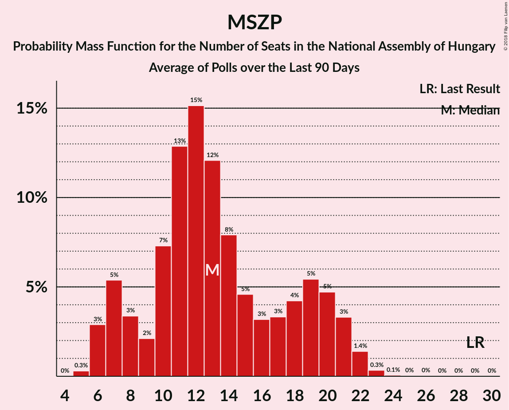
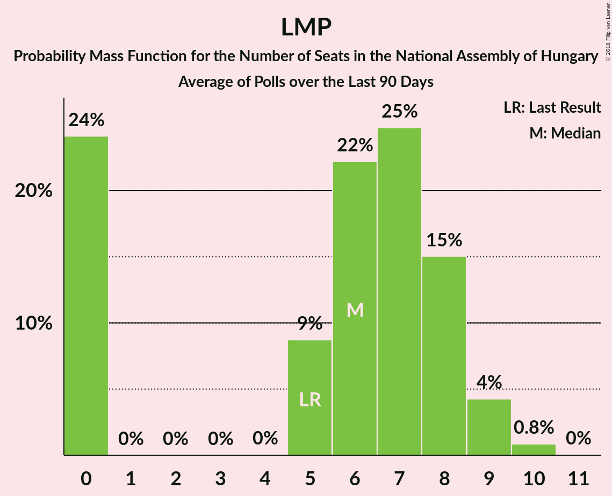

# Poll Average

<a href="#voting-intentions">Voting Intentions</a> | <a href="#seats">Seats</a> | <a href="#coalitions">Coalitions</a> | <a href="#technical-information">Technical Information</a>

## Summary

The table below lists the polls on which the average is based. They are the most recent polls (less than 90 days old) registered and analyzed so far.

| Period     | Polling firm/Commissioner(s) | Fidesz–KDNP | MSZP | DK | Együtt | MLP | Párbeszéd | Jobbik | LMP | MKKP | MM |
|:----------:|:----------------------------:|:--:|:--:|:--:|:--:|:--:|:--:|:--:|:--:|:--:|:--:|
| 6 April 2014 | General Election | 44.9%   133 | 25.6%   29 | 25.6%   4 | 25.6%   3 | 25.6%   1 | 25.6%   1 | 20.2%   23 | 5.3%   5 | 0.0%   0 | 0.0%   0 |
| N/A | Poll Average | 43–64%   144–173 | 6–19%   6–20 | 4–10%   0–9 | 0–2%   0 | 0–1%   0 | 0–3%   0 | 10–25%   9–29 | 4–10%   0–9 | 0–3%   0 | 0–5%   0 |
| [1–5 March 2018](2018-03-05-NézőpontIntézet.html) | Nézőpont Intézet | 49–55%   155–158 | 8–12%   9–10 | 5–8%   6–7 | 0–1%   0 | N/A   N/A | N/A   N/A | 15–19%   16–18 | 7–11%   9 | 1–3%   0 | 3–5%   0 |
| [26–28 February 2018](2018-02-28-SzázadvégAlapítvány.html) | Századvég Alapítvány | 50–56%   154–161 | 12–16%   11–15 | 5–8%   0–7 | 1–2%   0 | N/A   N/A | N/A   N/A | 9–13%   8–12 | 6–10%   6–9 | 0–1%   0 | 0–1%   0 |
| [1–28 February 2018](2018-02-28-IránytűIntézet.html) | Iránytű Intézet   Magyar Nemzet | 41–47%   143–151 | 9–13%   8–12 | 6–10%   6–9 | 0–1%   0 | 0–1%   0 | 0–1%   0 | 21–27%   23–29 | 6–10%   6–10 | 0–1%   0 | 3–5%   0–5 |
| [26–28 February 2018](2018-02-28-IDEAIntézet.html) | IDEA Intézet | N/A   N/A | N/A   N/A | N/A   N/A | N/A   N/A | N/A   N/A | N/A   N/A | N/A   N/A | N/A   N/A | N/A   N/A | N/A   N/A |
| [9–22 February 2018](2018-02-22-RepublikonIntézet.html) | Republikon Intézet   24.hu | 47–53%   149–159 | 15–20%   14–20 | 5–8%   0–7 | 0–1%   0 | N/A   N/A | N/A   N/A | 17–22%   16–22 | 4–7%   0–6 | 0–1%   0 | 0–1%   0 |
| [7–15 February 2018](2018-02-15-ZRIZáveczResearch.html) | ZRI Závecz Research | 48–55%   153–160 | 11–15%   11–15 | 7–10%   6–9 | 1–2%   0 | 0–1%   0 | N/A   N/A | 15–20%   14–19 | 5–8%   0–7 | 0–1%   0 | 1–3%   0 |
| [9–14 February 2018](2018-02-14-PublicusResearch.html) | Publicus Research | 45–51%   150–159 | 16–20%   16–22 | 4–7%   0–6 | 0–1%   0 | 0–1%   0 | 0–1%   0 | 14–18%   14–19 | 6–10%   6–10 | 1–3%   0 | 1–2%   0 |
| [11–23 January 2018](2018-01-23-TÁRKI.html) | TÁRKI | 60–66%   167–176 | 6–9%   5–9 | 5–8%   0–7 | 1–3%   0 | 0–1%   0 | 1–3%   0 | 12–16%   12–17 | 3–5%   0–5 | 0–1%   0 | 1–2%   0 |
| [19–23 January 2018](2018-01-23-Medián.html) | Medián   hvg.hu | 50–56%   155–161 | 9–13%   9–12 | 7–11%   7–10 | 1–2%   0 | 0–1%   0 | N/A   N/A | 16–20%   15–20 | 5–7%   0–7 | 0–1%   0 | 1–2%   0 |
| 6 April 2014 | General Election | 44.9%   133 | 25.6%   29 | 25.6%   4 | 25.6%   3 | 25.6%   1 | 25.6%   1 | 20.2%   23 | 5.3%   5 | 0.0%   0 | 0.0%   0 |

Only polls for which at least the sample size has been published are included in the table above.

**Legend:**
+ **Top half of each row:** Voting intentions (95% confidence interval)
+ **Bottom half of each row:** Seat projections for the National Assembly of Hungary (95% confidence interval)
+ **Fidesz–KDNP:** Fidesz–KDNP
+ **MSZP:** MSZP
+ **DK:** DK
+ **Együtt:** Együtt
+ **MLP:** MLP
+ **Párbeszéd:** Párbeszéd
+ **Jobbik:** Jobbik
+ **LMP:** LMP
+ **MKKP:** MKKP
+ **MM:** MM
+ **N/A (single party):** Party not included the published results
+ **N/A (entire row):** Calculation for this opinion poll not started yet

## Voting Intentions

### Confidence Intervals

| Party | Last Result | Median | 80% Confidence Interval | 90% Confidence Interval | 95% Confidence Interval | 99% Confidence Interval |
|:-----:|:-----------:|:------:|:-----------------------:|:-----------------------:|:-----------------------:|:-----------------------:|
| <a href="#fidesz–kdnp">Fidesz–KDNP</a> | 44.9% | 51.4% | 45.0–61.4% |43.5–63.1% | 42.6–64.0% | 41.2–65.4% |
| <a href="#mszp">MSZP</a> | 25.6% | 12.3% | 7.9–18.1% |7.0–18.9% | 6.5–19.4% | 5.8–20.4% |
| <a href="#dk">DK</a> | 25.6% | 6.6% | 5.1–9.0% |4.7–9.5% | 4.4–9.9% | 3.9–10.6% |
| <a href="#együtt">Együtt</a> | 25.6% | 0.7% | 0.2–1.8% |0.1–2.2% | 0.1–2.4% | 0.1–2.9% |
| <a href="#mlp">MLP</a> | 25.6% | 0.3% | 0.1–0.6% |0.1–0.7% | 0.1–0.8% | 0.0–1.0% |
| <a href="#párbeszéd">Párbeszéd</a> | 25.6% | 0.4% | 0.1–2.3% |0.1–2.5% | 0.1–2.8% | 0.0–3.1% |
| <a href="#jobbik">Jobbik</a> | 20.2% | 17.1% | 11.8–22.9% |10.7–24.3% | 10.1–25.1% | 9.3–26.3% |
| <a href="#lmp">LMP</a> | 5.3% | 6.9% | 4.4–9.1% |3.9–9.6% | 3.6–10.0% | 3.1–10.8% |
| <a href="#mkkp">MKKP</a> | 0.0% | 0.4% | 0.2–2.2% |0.1–2.5% | 0.1–2.7% | 0.1–3.1% |
| <a href="#mm">MM</a> | 0.0% | 1.2% | 0.3–4.2% |0.2–4.6% | 0.1–4.9% | 0.1–5.5% |

### Fidesz–KDNP

*For a full overview of the results for this party, see the [Fidesz–KDNP](party-fidesz–kdnp.html) page.*

| Voting Intentions | Probability | Accumulated | Special Marks |
|:-----------------:|:-----------:|:-----------:|:-------------:|
| 38.5–39.5% | 0% | 100% |  |
| 39.5–40.5% | 0.2% | 100% |  |
| 40.5–41.5% | 0.6% | 99.8% |  |
| 41.5–42.5% | 2% | 99.2% |  |
| 42.5–43.5% | 3% | 98% |  |
| 43.5–44.5% | 3% | 95% |  |
| 44.5–45.5% | 3% | 91% | Last Result |
| 45.5–46.5% | 3% | 88% |  |
| 46.5–47.5% | 4% | 85% |  |
| 47.5–48.5% | 5% | 81% |  |
| 48.5–49.5% | 7% | 76% |  |
| 49.5–50.5% | 9% | 69% |  |
| 50.5–51.5% | 12% | 60% | Median |
| 51.5–52.5% | 13% | 48% |  |
| 52.5–53.5% | 11% | 35% |  |
| 53.5–54.5% | 7% | 24% |  |
| 54.5–55.5% | 3% | 17% |  |
| 55.5–56.5% | 1.0% | 14% |  |
| 56.5–57.5% | 0.2% | 13% |  |
| 57.5–58.5% | 0.1% | 13% |  |
| 58.5–59.5% | 0.2% | 12% |  |
| 59.5–60.5% | 0.7% | 12% |  |
| 60.5–61.5% | 2% | 12% |  |
| 61.5–62.5% | 3% | 10% |  |
| 62.5–63.5% | 3% | 7% |  |
| 63.5–64.5% | 2% | 4% |  |
| 64.5–65.5% | 1.0% | 1.4% |  |
| 65.5–66.5% | 0.3% | 0.4% |  |
| 66.5–67.5% | 0.1% | 0.1% |  |
| 67.5–68.5% | 0% | 0% |  |

### MSZP

*For a full overview of the results for this party, see the [MSZP](party-mszp.html) page.*

| Voting Intentions | Probability | Accumulated | Special Marks |
|:-----------------:|:-----------:|:-----------:|:-------------:|
| 3.5–4.5% | 0% | 100% |  |
| 4.5–5.5% | 0.2% | 100% |  |
| 5.5–6.5% | 3% | 99.8% |  |
| 6.5–7.5% | 6% | 97% |  |
| 7.5–8.5% | 4% | 92% |  |
| 8.5–9.5% | 5% | 88% |  |
| 9.5–10.5% | 11% | 83% |  |
| 10.5–11.5% | 14% | 71% |  |
| 11.5–12.5% | 10% | 58% | Median |
| 12.5–13.5% | 9% | 47% |  |
| 13.5–14.5% | 8% | 38% |  |
| 14.5–15.5% | 4% | 30% |  |
| 15.5–16.5% | 4% | 26% |  |
| 16.5–17.5% | 7% | 22% |  |
| 17.5–18.5% | 8% | 15% |  |
| 18.5–19.5% | 5% | 7% |  |
| 19.5–20.5% | 2% | 2% |  |
| 20.5–21.5% | 0.3% | 0.4% |  |
| 21.5–22.5% | 0% | 0% |  |
| 22.5–23.5% | 0% | 0% |  |
| 23.5–24.5% | 0% | 0% |  |
| 24.5–25.5% | 0% | 0% |  |
| 25.5–26.5% | 0% | 0% | Last Result |

### DK

*For a full overview of the results for this party, see the [DK](party-dk.html) page.*

| Voting Intentions | Probability | Accumulated | Special Marks |
|:-----------------:|:-----------:|:-----------:|:-------------:|
| 1.5–2.5% | 0% | 100% |  |
| 2.5–3.5% | 0.1% | 100% |  |
| 3.5–4.5% | 3% | 99.9% |  |
| 4.5–5.5% | 17% | 97% |  |
| 5.5–6.5% | 28% | 80% |  |
| 6.5–7.5% | 19% | 52% | Median |
| 7.5–8.5% | 16% | 33% |  |
| 8.5–9.5% | 12% | 17% |  |
| 9.5–10.5% | 4% | 5% |  |
| 10.5–11.5% | 0.6% | 0.6% |  |
| 11.5–12.5% | 0% | 0% |  |
| 12.5–13.5% | 0% | 0% |  |
| 13.5–14.5% | 0% | 0% |  |
| 14.5–15.5% | 0% | 0% |  |
| 15.5–16.5% | 0% | 0% |  |
| 16.5–17.5% | 0% | 0% |  |
| 17.5–18.5% | 0% | 0% |  |
| 18.5–19.5% | 0% | 0% |  |
| 19.5–20.5% | 0% | 0% |  |
| 20.5–21.5% | 0% | 0% |  |
| 21.5–22.5% | 0% | 0% |  |
| 22.5–23.5% | 0% | 0% |  |
| 23.5–24.5% | 0% | 0% |  |
| 24.5–25.5% | 0% | 0% |  |
| 25.5–26.5% | 0% | 0% | Last Result |

### Együtt

*For a full overview of the results for this party, see the [Együtt](party-együtt.html) page.*

| Voting Intentions | Probability | Accumulated | Special Marks |
|:-----------------:|:-----------:|:-----------:|:-------------:|
| 0.0–0.5% | 45% | 100% |  |
| 0.5–1.5% | 41% | 55% | Median |
| 1.5–2.5% | 12% | 14% |  |
| 2.5–3.5% | 2% | 2% |  |
| 3.5–4.5% | 0% | 0% |  |
| 4.5–5.5% | 0% | 0% |  |
| 5.5–6.5% | 0% | 0% |  |
| 6.5–7.5% | 0% | 0% |  |
| 7.5–8.5% | 0% | 0% |  |
| 8.5–9.5% | 0% | 0% |  |
| 9.5–10.5% | 0% | 0% |  |
| 10.5–11.5% | 0% | 0% |  |
| 11.5–12.5% | 0% | 0% |  |
| 12.5–13.5% | 0% | 0% |  |
| 13.5–14.5% | 0% | 0% |  |
| 14.5–15.5% | 0% | 0% |  |
| 15.5–16.5% | 0% | 0% |  |
| 16.5–17.5% | 0% | 0% |  |
| 17.5–18.5% | 0% | 0% |  |
| 18.5–19.5% | 0% | 0% |  |
| 19.5–20.5% | 0% | 0% |  |
| 20.5–21.5% | 0% | 0% |  |
| 21.5–22.5% | 0% | 0% |  |
| 22.5–23.5% | 0% | 0% |  |
| 23.5–24.5% | 0% | 0% |  |
| 24.5–25.5% | 0% | 0% |  |
| 25.5–26.5% | 0% | 0% | Last Result |

### Párbeszéd

*For a full overview of the results for this party, see the [Párbeszéd](party-párbeszéd.html) page.*

| Voting Intentions | Probability | Accumulated | Special Marks |
|:-----------------:|:-----------:|:-----------:|:-------------:|
| 0.0–0.5% | 61% | 100% | Median |
| 0.5–1.5% | 10% | 39% |  |
| 1.5–2.5% | 25% | 29% |  |
| 2.5–3.5% | 5% | 5% |  |
| 3.5–4.5% | 0.1% | 0.1% |  |
| 4.5–5.5% | 0% | 0% |  |
| 5.5–6.5% | 0% | 0% |  |
| 6.5–7.5% | 0% | 0% |  |
| 7.5–8.5% | 0% | 0% |  |
| 8.5–9.5% | 0% | 0% |  |
| 9.5–10.5% | 0% | 0% |  |
| 10.5–11.5% | 0% | 0% |  |
| 11.5–12.5% | 0% | 0% |  |
| 12.5–13.5% | 0% | 0% |  |
| 13.5–14.5% | 0% | 0% |  |
| 14.5–15.5% | 0% | 0% |  |
| 15.5–16.5% | 0% | 0% |  |
| 16.5–17.5% | 0% | 0% |  |
| 17.5–18.5% | 0% | 0% |  |
| 18.5–19.5% | 0% | 0% |  |
| 19.5–20.5% | 0% | 0% |  |
| 20.5–21.5% | 0% | 0% |  |
| 21.5–22.5% | 0% | 0% |  |
| 22.5–23.5% | 0% | 0% |  |
| 23.5–24.5% | 0% | 0% |  |
| 24.5–25.5% | 0% | 0% |  |
| 25.5–26.5% | 0% | 0% | Last Result |

### MLP

*For a full overview of the results for this party, see the [MLP](party-mlp.html) page.*

| Voting Intentions | Probability | Accumulated | Special Marks |
|:-----------------:|:-----------:|:-----------:|:-------------:|
| 0.0–0.5% | 86% | 100% | Median |
| 0.5–1.5% | 14% | 14% |  |
| 1.5–2.5% | 0% | 0% |  |
| 2.5–3.5% | 0% | 0% |  |
| 3.5–4.5% | 0% | 0% |  |
| 4.5–5.5% | 0% | 0% |  |
| 5.5–6.5% | 0% | 0% |  |
| 6.5–7.5% | 0% | 0% |  |
| 7.5–8.5% | 0% | 0% |  |
| 8.5–9.5% | 0% | 0% |  |
| 9.5–10.5% | 0% | 0% |  |
| 10.5–11.5% | 0% | 0% |  |
| 11.5–12.5% | 0% | 0% |  |
| 12.5–13.5% | 0% | 0% |  |
| 13.5–14.5% | 0% | 0% |  |
| 14.5–15.5% | 0% | 0% |  |
| 15.5–16.5% | 0% | 0% |  |
| 16.5–17.5% | 0% | 0% |  |
| 17.5–18.5% | 0% | 0% |  |
| 18.5–19.5% | 0% | 0% |  |
| 19.5–20.5% | 0% | 0% |  |
| 20.5–21.5% | 0% | 0% |  |
| 21.5–22.5% | 0% | 0% |  |
| 22.5–23.5% | 0% | 0% |  |
| 23.5–24.5% | 0% | 0% |  |
| 24.5–25.5% | 0% | 0% |  |
| 25.5–26.5% | 0% | 0% | Last Result |

### Jobbik

*For a full overview of the results for this party, see the [Jobbik](party-jobbik.html) page.*

| Voting Intentions | Probability | Accumulated | Special Marks |
|:-----------------:|:-----------:|:-----------:|:-------------:|
| 7.5–8.5% | 0.1% | 100% |  |
| 8.5–9.5% | 0.8% | 99.9% |  |
| 9.5–10.5% | 3% | 99.1% |  |
| 10.5–11.5% | 5% | 96% |  |
| 11.5–12.5% | 3% | 91% |  |
| 12.5–13.5% | 4% | 87% |  |
| 13.5–14.5% | 6% | 84% |  |
| 14.5–15.5% | 9% | 78% |  |
| 15.5–16.5% | 12% | 69% |  |
| 16.5–17.5% | 14% | 57% | Median |
| 17.5–18.5% | 13% | 43% |  |
| 18.5–19.5% | 9% | 31% |  |
| 19.5–20.5% | 5% | 22% | Last Result |
| 20.5–21.5% | 3% | 16% |  |
| 21.5–22.5% | 2% | 13% |  |
| 22.5–23.5% | 3% | 11% |  |
| 23.5–24.5% | 4% | 8% |  |
| 24.5–25.5% | 3% | 4% |  |
| 25.5–26.5% | 1.1% | 1.5% |  |
| 26.5–27.5% | 0.3% | 0.4% |  |
| 27.5–28.5% | 0.1% | 0.1% |  |
| 28.5–29.5% | 0% | 0% |  |

### LMP

*For a full overview of the results for this party, see the [LMP](party-lmp.html) page.*

| Voting Intentions | Probability | Accumulated | Special Marks |
|:-----------------:|:-----------:|:-----------:|:-------------:|
| 1.5–2.5% | 0% | 100% |  |
| 2.5–3.5% | 2% | 100% |  |
| 3.5–4.5% | 9% | 98% |  |
| 4.5–5.5% | 14% | 88% | Last Result |
| 5.5–6.5% | 18% | 74% |  |
| 6.5–7.5% | 16% | 56% | Median |
| 7.5–8.5% | 20% | 40% |  |
| 8.5–9.5% | 14% | 20% |  |
| 9.5–10.5% | 5% | 5% |  |
| 10.5–11.5% | 0.8% | 0.9% |  |
| 11.5–12.5% | 0.1% | 0.1% |  |
| 12.5–13.5% | 0% | 0% |  |

### MKKP

*For a full overview of the results for this party, see the [MKKP](party-mkkp.html) page.*

| Voting Intentions | Probability | Accumulated | Special Marks |
|:-----------------:|:-----------:|:-----------:|:-------------:|
| 0.0–0.5% | 64% | 100% | Last Result, Median |
| 0.5–1.5% | 14% | 36% |  |
| 1.5–2.5% | 18% | 22% |  |
| 2.5–3.5% | 4% | 4% |  |
| 3.5–4.5% | 0.1% | 0.1% |  |
| 4.5–5.5% | 0% | 0% |  |

### MM

*For a full overview of the results for this party, see the [MM](party-mm.html) page.*

| Voting Intentions | Probability | Accumulated | Special Marks |
|:-----------------:|:-----------:|:-----------:|:-------------:|
| 0.0–0.5% | 22% | 100% | Last Result |
| 0.5–1.5% | 39% | 78% | Median |
| 1.5–2.5% | 12% | 39% |  |
| 2.5–3.5% | 7% | 27% |  |
| 3.5–4.5% | 15% | 20% |  |
| 4.5–5.5% | 5% | 6% |  |
| 5.5–6.5% | 0.4% | 0.4% |  |
| 6.5–7.5% | 0% | 0% |  |

## Seats

### Confidence Intervals

| Party | Last Result | Median | 80% Confidence Interval | 90% Confidence Interval | 95% Confidence Interval | 99% Confidence Interval |
|:-----:|:-----------:|:------:|:-----------------------:|:-----------------------:|:-----------------------:|:-----------------------:|
| <a href="#fidesz–kdnp">Fidesz–KDNP</a> | 133 | 157 | 148–170 |147–172 | 144–173 | 143–175 |
| <a href="#mszp">MSZP</a> | 29 | 12 | 8–19 |7–19 | 6–20 | 6–22 |
| <a href="#dk">DK</a> | 4 | 7 | 5–8 |0–9 | 0–9 | 0–10 |
| <a href="#együtt">Együtt</a> | 3 | 0 | 0 |0 | 0 | 0 |
| <a href="#mlp">MLP</a> | 1 | 0 | 0 |0 | 0 | 0 |
| <a href="#párbeszéd">Párbeszéd</a> | 1 | 0 | 0 |0 | 0 | 0 |
| <a href="#jobbik">Jobbik</a> | 23 | 16 | 11–25 |10–26 | 9–29 | 8–29 |
| <a href="#lmp">LMP</a> | 5 | 6 | 0–9 |0–9 | 0–9 | 0–10 |
| <a href="#mkkp">MKKP</a> | 0 | 0 | 0 |0 | 0 | 0 |
| <a href="#mm">MM</a> | 0 | 0 | 0 |0 | 0 | 0–4 |

### Fidesz–KDNP

*For a full overview of the results for this party, see the [Fidesz–KDNP](party-fidesz–kdnp.html) page.*

| Number of Seats | Probability | Accumulated | Special Marks |
|:---------------:|:-----------:|:-----------:|:-------------:|
| 133 | 0% | 100% | Last Result |
| 134 | 0% | 99.9% |  |
| 135 | 0% | 99.9% |  |
| 136 | 0% | 99.9% |  |
| 137 | 0% | 99.9% |  |
| 138 | 0% | 99.9% |  |
| 139 | 0.1% | 99.9% |  |
| 140 | 0.1% | 99.8% |  |
| 141 | 0% | 99.8% |  |
| 142 | 0% | 99.8% |  |
| 143 | 0.2% | 99.7% |  |
| 144 | 2% | 99.5% |  |
| 145 | 0.6% | 97% |  |
| 146 | 0.9% | 97% |  |
| 147 | 1.4% | 96% |  |
| 148 | 5% | 95% |  |
| 149 | 2% | 89% |  |
| 150 | 1.2% | 87% |  |
| 151 | 2% | 86% |  |
| 152 | 3% | 84% |  |
| 153 | 5% | 81% |  |
| 154 | 7% | 76% |  |
| 155 | 8% | 69% |  |
| 156 | 10% | 62% |  |
| 157 | 11% | 51% | Median |
| 158 | 21% | 40% |  |
| 159 | 4% | 20% |  |
| 160 | 2% | 16% |  |
| 161 | 0.8% | 14% |  |
| 162 | 0.3% | 13% |  |
| 163 | 0.1% | 13% |  |
| 164 | 0% | 13% |  |
| 165 | 0% | 12% |  |
| 166 | 0.1% | 12% |  |
| 167 | 0.3% | 12% |  |
| 168 | 0.4% | 12% |  |
| 169 | 0.8% | 12% |  |
| 170 | 2% | 11% |  |
| 171 | 4% | 9% |  |
| 172 | 2% | 5% |  |
| 173 | 2% | 3% |  |
| 174 | 0.8% | 1.4% |  |
| 175 | 0.3% | 0.7% |  |
| 176 | 0.1% | 0.4% |  |
| 177 | 0.2% | 0.2% |  |
| 178 | 0.1% | 0.1% |  |
| 179 | 0% | 0% |  |

### MSZP

*For a full overview of the results for this party, see the [MSZP](party-mszp.html) page.*

| Number of Seats | Probability | Accumulated | Special Marks |
|:---------------:|:-----------:|:-----------:|:-------------:|
| 5 | 0.3% | 100% |  |
| 6 | 3% | 99.7% |  |
| 7 | 5% | 97% |  |
| 8 | 4% | 91% |  |
| 9 | 15% | 88% |  |
| 10 | 7% | 73% |  |
| 11 | 14% | 66% |  |
| 12 | 10% | 52% | Median |
| 13 | 10% | 42% |  |
| 14 | 6% | 32% |  |
| 15 | 3% | 27% |  |
| 16 | 5% | 23% |  |
| 17 | 4% | 19% |  |
| 18 | 4% | 15% |  |
| 19 | 6% | 11% |  |
| 20 | 3% | 5% |  |
| 21 | 1.4% | 2% |  |
| 22 | 0.4% | 0.5% |  |
| 23 | 0.1% | 0.1% |  |
| 24 | 0% | 0% |  |
| 25 | 0% | 0% |  |
| 26 | 0% | 0% |  |
| 27 | 0% | 0% |  |
| 28 | 0% | 0% |  |
| 29 | 0% | 0% | Last Result |

### DK

*For a full overview of the results for this party, see the [DK](party-dk.html) page.*

| Number of Seats | Probability | Accumulated | Special Marks |
|:---------------:|:-----------:|:-----------:|:-------------:|
| 0 | 8% | 100% |  |
| 1 | 0% | 92% |  |
| 2 | 0% | 92% |  |
| 3 | 0% | 92% |  |
| 4 | 0.5% | 92% | Last Result |
| 5 | 18% | 92% |  |
| 6 | 20% | 73% |  |
| 7 | 30% | 53% | Median |
| 8 | 15% | 23% |  |
| 9 | 7% | 9% |  |
| 10 | 2% | 2% |  |
| 11 | 0.1% | 0.1% |  |
| 12 | 0% | 0% |  |

### Együtt

*For a full overview of the results for this party, see the [Együtt](party-együtt.html) page.*

| Number of Seats | Probability | Accumulated | Special Marks |
|:---------------:|:-----------:|:-----------:|:-------------:|
| 0 | 100% | 100% | Median |
| 1 | 0% | 0% |  |
| 2 | 0% | 0% |  |
| 3 | 0% | 0% | Last Result |

### Párbeszéd

*For a full overview of the results for this party, see the [Párbeszéd](party-párbeszéd.html) page.*

| Number of Seats | Probability | Accumulated | Special Marks |
|:---------------:|:-----------:|:-----------:|:-------------:|
| 0 | 100% | 100% | Median |
| 1 | 0% | 0% | Last Result |

### MLP

*For a full overview of the results for this party, see the [MLP](party-mlp.html) page.*

| Number of Seats | Probability | Accumulated | Special Marks |
|:---------------:|:-----------:|:-----------:|:-------------:|
| 0 | 100% | 100% | Median |
| 1 | 0% | 0% | Last Result |

### Jobbik

*For a full overview of the results for this party, see the [Jobbik](party-jobbik.html) page.*

| Number of Seats | Probability | Accumulated | Special Marks |
|:---------------:|:-----------:|:-----------:|:-------------:|
| 8 | 0.5% | 100% |  |
| 9 | 3% | 99.5% |  |
| 10 | 5% | 97% |  |
| 11 | 4% | 92% |  |
| 12 | 2% | 89% |  |
| 13 | 2% | 87% |  |
| 14 | 6% | 85% |  |
| 15 | 11% | 79% |  |
| 16 | 23% | 68% | Median |
| 17 | 12% | 45% |  |
| 18 | 10% | 33% |  |
| 19 | 6% | 24% |  |
| 20 | 3% | 17% |  |
| 21 | 1.1% | 14% |  |
| 22 | 0.3% | 13% |  |
| 23 | 0.8% | 13% | Last Result |
| 24 | 2% | 12% |  |
| 25 | 1.1% | 10% |  |
| 26 | 5% | 9% |  |
| 27 | 0.7% | 4% |  |
| 28 | 0.5% | 3% |  |
| 29 | 2% | 3% |  |
| 30 | 0% | 0.2% |  |
| 31 | 0% | 0.2% |  |
| 32 | 0% | 0.2% |  |
| 33 | 0% | 0.2% |  |
| 34 | 0% | 0.1% |  |
| 35 | 0% | 0.1% |  |
| 36 | 0% | 0.1% |  |
| 37 | 0% | 0.1% |  |
| 38 | 0% | 0.1% |  |
| 39 | 0% | 0.1% |  |
| 40 | 0.1% | 0.1% |  |
| 41 | 0% | 0% |  |

### LMP

*For a full overview of the results for this party, see the [LMP](party-lmp.html) page.*

| Number of Seats | Probability | Accumulated | Special Marks |
|:---------------:|:-----------:|:-----------:|:-------------:|
| 0 | 18% | 100% |  |
| 1 | 0% | 82% |  |
| 2 | 0% | 82% |  |
| 3 | 0% | 82% |  |
| 4 | 2% | 82% |  |
| 5 | 17% | 81% | Last Result |
| 6 | 16% | 64% | Median |
| 7 | 19% | 48% |  |
| 8 | 12% | 30% |  |
| 9 | 16% | 17% |  |
| 10 | 1.3% | 1.4% |  |
| 11 | 0.1% | 0.1% |  |
| 12 | 0% | 0% |  |

### MKKP

*For a full overview of the results for this party, see the [MKKP](party-mkkp.html) page.*

| Number of Seats | Probability | Accumulated | Special Marks |
|:---------------:|:-----------:|:-----------:|:-------------:|
| 0 | 100% | 100% | Last Result, Median |

### MM

*For a full overview of the results for this party, see the [MM](party-mm.html) page.*

| Number of Seats | Probability | Accumulated | Special Marks |
|:---------------:|:-----------:|:-----------:|:-------------:|
| 0 | 99.4% | 100% | Last Result, Median |
| 1 | 0% | 0.6% |  |
| 2 | 0% | 0.6% |  |
| 3 | 0% | 0.6% |  |
| 4 | 0.1% | 0.6% |  |
| 5 | 0.4% | 0.5% |  |
| 6 | 0% | 0% |  |

## Coalitions

### Confidence Intervals

| Coalition | Last Result | Median | Majority? | 80% Confidence Interval | 90% Confidence Interval | 95% Confidence Interval | 99% Confidence Interval |
|:---------:|:-----------:|:------:|:---------:|:-----------------------:|:-----------------------:|:-----------------------:|:-----------------------:|
| Fidesz–KDNP | 133 | 157 | 100% | 148–170 | 147–172 | 144–173 | 143–175 |
| DK – Együtt – MLP – MSZP – Párbeszéd | 38 | 19 | 0% | 14–23 | 13–24 | 12–25 | 8–26 |

### Fidesz–KDNP

| Number of Seats | Probability | Accumulated | Special Marks |
|:---------------:|:-----------:|:-----------:|:-------------:|
| 133 | 0% | 100% | Last Result |
| 134 | 0% | 99.9% |  |
| 135 | 0% | 99.9% |  |
| 136 | 0% | 99.9% |  |
| 137 | 0% | 99.9% |  |
| 138 | 0% | 99.9% |  |
| 139 | 0.1% | 99.9% |  |
| 140 | 0.1% | 99.8% |  |
| 141 | 0% | 99.8% |  |
| 142 | 0% | 99.8% |  |
| 143 | 0.2% | 99.7% |  |
| 144 | 2% | 99.5% |  |
| 145 | 0.6% | 97% |  |
| 146 | 0.9% | 97% |  |
| 147 | 1.4% | 96% |  |
| 148 | 5% | 95% |  |
| 149 | 2% | 89% |  |
| 150 | 1.2% | 87% |  |
| 151 | 2% | 86% |  |
| 152 | 3% | 84% |  |
| 153 | 5% | 81% |  |
| 154 | 7% | 76% |  |
| 155 | 8% | 69% |  |
| 156 | 10% | 62% |  |
| 157 | 11% | 51% | Median |
| 158 | 21% | 40% |  |
| 159 | 4% | 20% |  |
| 160 | 2% | 16% |  |
| 161 | 0.8% | 14% |  |
| 162 | 0.3% | 13% |  |
| 163 | 0.1% | 13% |  |
| 164 | 0% | 13% |  |
| 165 | 0% | 12% |  |
| 166 | 0.1% | 12% |  |
| 167 | 0.3% | 12% |  |
| 168 | 0.4% | 12% |  |
| 169 | 0.8% | 12% |  |
| 170 | 2% | 11% |  |
| 171 | 4% | 9% |  |
| 172 | 2% | 5% |  |
| 173 | 2% | 3% |  |
| 174 | 0.8% | 1.4% |  |
| 175 | 0.3% | 0.7% |  |
| 176 | 0.1% | 0.4% |  |
| 177 | 0.2% | 0.2% |  |
| 178 | 0.1% | 0.1% |  |
| 179 | 0% | 0% |  |

### DK – Együtt – MLP – MSZP – Párbeszéd

| Number of Seats | Probability | Accumulated | Special Marks |
|:---------------:|:-----------:|:-----------:|:-------------:|
| 6 | 0.1% | 100% |  |
| 7 | 0.3% | 99.9% |  |
| 8 | 0.3% | 99.7% |  |
| 9 | 0.1% | 99.4% |  |
| 10 | 0.1% | 99.3% |  |
| 11 | 1.4% | 99.2% |  |
| 12 | 2% | 98% |  |
| 13 | 5% | 96% |  |
| 14 | 3% | 91% |  |
| 15 | 1.3% | 88% |  |
| 16 | 14% | 87% |  |
| 17 | 5% | 72% |  |
| 18 | 17% | 67% |  |
| 19 | 11% | 51% | Median |
| 20 | 12% | 40% |  |
| 21 | 9% | 27% |  |
| 22 | 5% | 18% |  |
| 23 | 4% | 13% |  |
| 24 | 4% | 9% |  |
| 25 | 3% | 5% |  |
| 26 | 1.3% | 2% |  |
| 27 | 0.4% | 0.4% |  |
| 28 | 0.1% | 0.1% |  |
| 29 | 0% | 0% |  |
| 30 | 0% | 0% |  |
| 31 | 0% | 0% |  |
| 32 | 0% | 0% |  |
| 33 | 0% | 0% |  |
| 34 | 0% | 0% |  |
| 35 | 0% | 0% |  |
| 36 | 0% | 0% |  |
| 37 | 0% | 0% |  |
| 38 | 0% | 0% | Last Result |

## Technical Information

