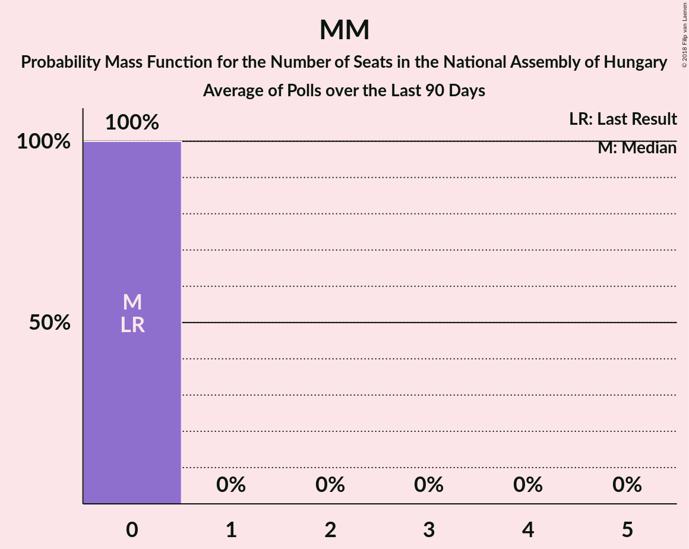

# MM

<a href="#voting-intentions">Voting Intentions</a> | <a href="#seats">Seats</a>

## Voting Intentions

Last result: **0.0%** (General Election of 6 April 2014)

### Confidence Intervals

| Period     | Polling firm/Commissioner(s) | Median | 80% Confidence Interval | 90% Confidence Interval | 95% Confidence Interval | 99% Confidence Interval |
|:----------:|:----------------:|:-----------:|:-----------------------:|:-----------------------:|:-----------------------:|:-----------------------:|
| N/A | [Poll Average](average.html) | 1.5% | 0.2–4.1% | 0.2–4.4% | 0.1–4.6% | 0.1–5.0% |
| [20–28 November 2017](2017-11-28-SzázadvégAlapítvány.html) | Századvég Alapítvány | 0.2% | 0.1–0.5% | 0.1–0.6% | 0.1–0.7% | 0.0–0.9% |
| [1–19 November 2017](2017-11-19-NézőpontIntézet.html) | Nézőpont Intézet | 4.0% | 3.5–4.6% | 3.3–4.8% | 3.2–5.0% | 3.0–5.3% |
| [11–15 November 2017](2017-11-15-PublicusResearch.html) | Publicus Research | 1.0% | 0.7–1.5% | 0.6–1.7% | 0.5–1.8% | 0.4–2.1% |
| [6–14 November 2017](2017-11-14-ZRIZáveczResearch.html) | ZRI Závecz Research | 2.0% | 1.5–2.7% | 1.4–2.9% | 1.3–3.1% | 1.1–3.4% |

### Probability Mass Function

The following table shows the probability mass function per percentage block of voting intentions for the [poll average](average.html) for MM.

| Voting Intentions | Probability | Accumulated | Special Marks |
|:-----------------:|:-----------:|:-----------:|:-------------:|
| 0.0–0.5% | 23% | 100% | Last Result |
| 0.5–1.5% | 27% | 77% |  |
| 1.5–2.5% | 21% | 50% | Median |
| 2.5–3.5% | 7% | 29% |  |
| 3.5–4.5% | 19% | 22% |  |
| 4.5–5.5% | 3% | 3% |  |
| 5.5–6.5% | 0% | 0% |  |

## Seats

Last result: **0** seats (General Election of 6 April 2014)

### Confidence Intervals

| Period     | Polling firm/Commissioner(s) | Median | 80% Confidence Interval | 90% Confidence Interval | 95% Confidence Interval | 99% Confidence Interval |
|:----------:|:----------------:|:------:|:-----------------------:|:-----------------------:|:-----------------------:|:-----------------------:|
| N/A | [Poll Average](average.html) | 0 | 0 | 0 | 0 | 0 |
| [20–28 November 2017](2017-11-28-SzázadvégAlapítvány.html) | Századvég Alapítvány | 0 | 0 | 0 | 0 | 0 |
| [1–19 November 2017](2017-11-19-NézőpontIntézet.html) | Nézőpont Intézet | 0 | 0 | 0 | 0 | 0–5 |
| [11–15 November 2017](2017-11-15-PublicusResearch.html) | Publicus Research | 0 | 0 | 0 | 0 | 0 |
| [6–14 November 2017](2017-11-14-ZRIZáveczResearch.html) | ZRI Závecz Research | 0 | 0 | 0 | 0 | 0 |

### Probability Mass Function

The following table shows the probability mass function per seat for the [poll average](average.html) for MM.

| Number of Seats | Probability | Accumulated | Special Marks |
|:---------------:|:-----------:|:-----------:|:-------------:|
| 0 | 99.7% | 100% | Last Result, Median |
| 1 | 0% | 0.3% |  |
| 2 | 0% | 0.3% |  |
| 3 | 0% | 0.3% |  |
| 4 | 0% | 0.3% |  |
| 5 | 0.3% | 0.3% |  |
| 6 | 0% | 0% |  |

